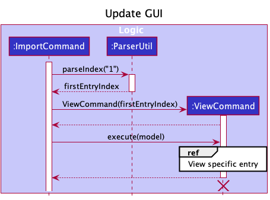

* Table of Contents
{:toc}

--------------------------------------------------------------------------------------------------------------------

## **Acknowledgements**

### Third-Party Libraries Used
* [Opencsv](http://opencsv.sourceforge.net/)

--------------------------------------------------------------------------------------------------------------------

## **Setting up, getting started**

Refer to the guide [_Setting up and getting started_](SettingUp.md).

--------------------------------------------------------------------------------------------------------------------

## **Design**

:bulb: **Tip:** The `.puml` files used to create diagrams in this document can be found in the [diagrams](https://github.com/se-edu/addressbook-level3/tree/master/docs/diagrams/) folder. Refer to the [_PlantUML Tutorial_ at se-edu/guides](https://se-education.org/guides/tutorials/plantUml.html) to learn how to create and edit diagrams.

### Architecture

The ***Architecture Diagram*** given above explains the high-level design of the App.

Given below is a quick overview of main components and how they interact with each other.

**Main components of the architecture**

**`Main`** has two classes called [`Main`](https://github.com/se-edu/addressbook-level3/tree/master/src/main/java/seedu/address/Main.java) and [`MainApp`](https://github.com/se-edu/addressbook-level3/tree/master/src/main/java/seedu/address/MainApp.java). It is responsible for,
* At app launch: Initializes the components in the correct sequence, and connects them up with each other.
* At shut down: Shuts down the components and invokes cleanup methods where necessary.

[**`Commons`**](#common-classes) represents a collection of classes used by multiple other components.

The rest of the App consists of four components.

* [**`UI`**](#ui-component): The UI of the App.
* [**`Logic`**](#logic-component): The command executor.
* [**`Model`**](#model-component): Holds the data of the App in memory.
* [**`Storage`**](#storage-component): Reads data from, and writes data to, the hard disk.

**How the architecture components interact with each other**

The *Sequence Diagram* below shows how the components interact with each other for the scenario where the user issues the command `delete 1`.

Each of the four main components (also shown in the diagram above),

* defines its *API* in an `interface` with the same name as the Component.
* implements its functionality using a concrete `{Component Name}Manager` class (which follows the corresponding API `interface` mentioned in the previous point.

For example, the `Logic` component defines its API in the `Logic.java` interface and implements its functionality using the `LogicManager.java` class which follows the `Logic` interface. Other components interact with a given component through its interface rather than the concrete class (reason: to prevent outside component's being coupled to the implementation of a component), as illustrated in the (partial) class diagram below.

The sections below give more details of each component.

### UI component

The **API** of this component is specified in [`Ui.java`](https://github.com/se-edu/addressbook-level3/tree/master/src/main/java/seedu/address/ui/Ui.java)

The UI consists of a `MainWindow` that is made up of parts e.g.`CommandBox`, `ResultDisplay`, `PersonListPanel`, `StatusBarFooter` etc. All these, including the `MainWindow`, inherit from the abstract `UiPart` class which captures the commonalities between classes that represent parts of the visible GUI.

The `UI` component uses the JavaFx UI framework. The layout of these UI parts are defined in matching `.fxml` files that are in the `src/main/resources/view` folder. For example, the layout of the [`MainWindow`](https://github.com/se-edu/addressbook-level3/tree/master/src/main/java/seedu/address/ui/MainWindow.java) is specified in [`MainWindow.fxml`](https://github.com/se-edu/addressbook-level3/tree/master/src/main/resources/view/MainWindow.fxml)

The `UI` component,

* executes user commands using the `Logic` component.
* listens for changes to `Model` data so that the UI can be updated with the modified data.
* keeps a reference to the `Logic` component, because the `UI` relies on the `Logic` to execute commands.
* depends on some classes in the `Model` component, as it displays `Person` object residing in the `Model`.

### Logic component

**API** : [`Logic.java`](https://github.com/se-edu/addressbook-level3/tree/master/src/main/java/seedu/address/logic/Logic.java)

Here's a (partial) class diagram of the `Logic` component:

How the `Logic` component works:
1. When `Logic` is called upon to execute a command, it uses the `AddressBookParser` class to parse the user command.
1. This results in a `Command` object (more precisely, an object of one of its subclasses e.g., `AddCommand`) which is executed by the `LogicManager`.
1. The command can communicate with the `Model` when it is executed (e.g. to add a person).
1. The result of the command execution is encapsulated as a `CommandResult` object which is returned back from `Logic`.

The Sequence Diagram below illustrates the interactions within the `Logic` component for the `execute("delete 1")` API call.

:information_source: **Note:** The lifeline for `DeleteCommandParser` should end at the destroy marker (X) but due to a limitation of PlantUML, the lifeline reaches the end of diagram.

Here are the other classes in `Logic` (omitted from the class diagram above) that are used for parsing a user command:

How the parsing works:
* When called upon to parse a user command, the `AddressBookParser` class creates an `XYZCommandParser` (`XYZ` is a placeholder for the specific command name e.g., `AddCommandParser`) which uses the other classes shown above to parse the user command and create a `XYZCommand` object (e.g., `AddCommand`) which the `AddressBookParser` returns back as a `Command` object.
* All `XYZCommandParser` classes (e.g., `AddCommandParser`, `DeleteCommandParser`, ...) inherit from the `Parser` interface so that they can be treated similarly where possible e.g, during testing.

### Model component
**API** : [`Model.java`](https://github.com/se-edu/addressbook-level3/tree/master/src/main/java/seedu/address/model/Model.java)

The `Model` component,

* stores the address book data i.e., all `Person` objects (which are contained in a `UniquePersonList` object).
* stores the currently 'selected' `Person` objects (e.g., results of a search query) as a separate _filtered_ list which is exposed to outsiders as an unmodifiable `ObservableList<Person>` that can be 'observed' e.g. the UI can be bound to this list so that the UI automatically updates when the data in the list change.
* stores a `UserPref` object that represents the user’s preferences. This is exposed to the outside as a `ReadOnlyUserPref` objects.
* does not depend on any of the other three components (as the `Model` represents data entities of the domain, they should make sense on their own without depending on other components)

:information_source: **Note:** An alternative (arguably, a more OOP) model is given below. It has a `Tag` list in the `AddressBook`, which `Person` references. This allows `AddressBook` to only require one `Tag` object per unique tag, instead of each `Person` needing their own `Tag` objects. 

### Storage component

**API** : [`Storage.java`](https://github.com/se-edu/addressbook-level3/tree/master/src/main/java/seedu/address/storage/Storage.java)

The `Storage` component,
* can save both address book data and user preference data in json format, and read them back into corresponding objects.
* inherits from both `AddressBookStorage` and `UserPrefStorage`, which means it can be treated as either one (if only the functionality of only one is needed).
* depends on some classes in the `Model` component (because the `Storage` component's job is to save/retrieve objects that belong to the `Model`)

### Common classes

Classes used by multiple components are in the `seedu.addressbook.commons` package.

--------------------------------------------------------------------------------------------------------------------

## **Implementation**

This section describes some noteworthy details on how certain features are implemented.

### \[Implemented\] Import feature

#### Feature Implementation

The implemented import feature mechanism is facilitated that `ImportCommandParser`, `ImportCommand` and `PersonInput`. `ImportCommandParser` implements the interface `Parser`.`ImportCommand` extends abstract class `Command`, and implements the following additional operations:
* `ImportCommand#processcsv(String)` Takes a String represented filepath and processes the data in the specified file.

`PersonInput` is a class which stores the various field inputs for a Person entry as a String, and implements getter and setter methods for all fields as required by the 3rd-party library opencsv.

Currently, the fields `name`,`phone`, `address`, `email` and `role` must be present in all entries before the data can be imported successfully. This is to prevent junk data from being imported. These fields were selected as they were most likely to be already existing in organizations intending to use this program.

The program detects the fields using column titles (taken as the first row of the csv file). The naming convention (case-insensitive) of the following fields must be followed for HeRon to detect the field, as per opencsv library requirements.
* `name` as Name
* `phone` as Contact Number
* `address` as Residential Address
* `email` as Email
* `role` as Role

Given below is an example usage scenario and how the import mechanism behaves at each step.

Step 1. The user launches the application. The `AddressBook` initializes with the initial address book state or loaded with data from the previous session (if any).

Step 2. The user executes `import /toBeImported.csv` command to import the .csv file in the specified directory, which in this case, refers to the file `toBeImported.csv` in the root directory.

:information_source: **Note:** If the specified directory is not valid, the command fails to complete and an error message is returned. There will be no changes made to the current `AddressBook`.

Step 3. Program processes the .csv file, and creates a new `AddressBook`, and updates it with the entries in the file. The current existing `AddressBook` is replaced with the newly created one. The display panel is updated to show the first entry present in the csv file.

:information_source: **Note:** If there are entries with missing values in the required fields, the command fails to complete and an error message indicating the location of the error is returned. There will be no changes made to the current `AddressBook`.

Step 4. The updated `AddressBook` would be saved as per the process after the execution of a command.

The following sequence diagram shows how the import feature works:

:information_source: **Note:** The lifeline for `AddressBookParser`, `ImportCommandParser`, `ImportCommand` and `CommandResult` should end at the destroy marker (X) but due to a limitation of PlantUML, the lifeline reaches the end of diagram.

The following activity diagram summarizes what happens when a user uses the `import` command:

#### Design considerations:

**Aspect: How the imported file is processed:**

* **Alternative 1 (current choice): Uses a header row to determine the data used**
    * Pros: No need to follow specific column ordering.
    * Cons: The names of the headers for the specific columns must be the exact name used (less case-sensitivity), and a header row must be present.

* **Alternative 2: Uses positioning of columns to import data**
    * Pros: No need for header rows.
    * Cons: Unable to ensure that the data is formatted in the correct order.

**Aspect: Making fields compulsory for import:**

* **Alternative 1 (current choice): Only fields `Name`, `Contact Number`, `Residential Address`, `Email` and `Role` are compulsory**
    * Pros: Ensures that imported data have the minimum fields required before being imported, which most organizations should have.
    * Cons: Files cannot be imported if any entry has any of the compulsory fields missing.

* **Alternative 2: No compulsory fields**
    * Pros: Allows for multiple names for the fields in the header row, albeit still fixed. Files can be imported even if there are missing entries.
    * Cons:  Files can be imported regardless of any formatting issues or missing fields in entries, thus data can be imported even without any cleaning, making it harder to be used in the program.

* **Alternative 3 : All fields are compulsory**
    * Pros: Ensures data imported have all the required fields to utilise all the functionality of the program.
    * Cons: Files cannot be imported if any entry has any fields missing.

### \[Proposed\] Undo/redo feature

#### Proposed Implementation

The proposed undo/redo mechanism is facilitated by `VersionedAddressBook`. It extends `AddressBook` with an undo/redo history, stored internally as an `addressBookStateList` and `currentStatePointer`. Additionally, it implements the following operations:

* `VersionedAddressBook#commit()` — Saves the current address book state in its history.
* `VersionedAddressBook#undo()` — Restores the previous address book state from its history.
* `VersionedAddressBook#redo()` — Restores a previously undone address book state from its history.

These operations are exposed in the `Model` interface as `Model#commitAddressBook()`, `Model#undoAddressBook()` and `Model#redoAddressBook()` respectively.

Given below is an example usage scenario and how the undo/redo mechanism behaves at each step.

Step 1. The user launches the application for the first time. The `VersionedAddressBook` will be initialized with the initial address book state, and the `currentStatePointer` pointing to that single address book state.

Step 2. The user executes `delete 5` command to delete the 5th person in the address book. The `delete` command calls `Model#commitAddressBook()`, causing the modified state of the address book after the `delete 5` command executes to be saved in the `addressBookStateList`, and the `currentStatePointer` is shifted to the newly inserted address book state.

Step 3. The user executes `add n/David …​` to add a new person. The `add` command also calls `Model#commitAddressBook()`, causing another modified address book state to be saved into the `addressBookStateList`.

:information_source: **Note:** If a command fails its execution, it will not call `Model#commitAddressBook()`, so the address book state will not be saved into the `addressBookStateList`.

Step 4. The user now decides that adding the person was a mistake, and decides to undo that action by executing the `undo` command. The `undo` command will call `Model#undoAddressBook()`, which will shift the `currentStatePointer` once to the left, pointing it to the previous address book state, and restores the address book to that state.

:information_source: **Note:** If the `currentStatePointer` is at index 0, pointing to the initial AddressBook state, then there are no previous AddressBook states to restore. The `undo` command uses `Model#canUndoAddressBook()` to check if this is the case. If so, it will return an error to the user rather
than attempting to perform the undo.

The following sequence diagram shows how the undo operation works:

:information_source: **Note:** The lifeline for `UndoCommand` should end at the destroy marker (X) but due to a limitation of PlantUML, the lifeline reaches the end of diagram.

The `redo` command does the opposite — it calls `Model#redoAddressBook()`, which shifts the `currentStatePointer` once to the right, pointing to the previously undone state, and restores the address book to that state.

:information_source: **Note:** If the `currentStatePointer` is at index `addressBookStateList.size() - 1`, pointing to the latest address book state, then there are no undone AddressBook states to restore. The `redo` command uses `Model#canRedoAddressBook()` to check if this is the case. If so, it will return an error to the user rather than attempting to perform the redo.

Step 5. The user then decides to execute the command `list`. Commands that do not modify the address book, such as `list`, will usually not call `Model#commitAddressBook()`, `Model#undoAddressBook()` or `Model#redoAddressBook()`. Thus, the `addressBookStateList` remains unchanged.

Step 6. The user executes `clear`, which calls `Model#commitAddressBook()`. Since the `currentStatePointer` is not pointing at the end of the `addressBookStateList`, all address book states after the `currentStatePointer` will be purged. Reason: It no longer makes sense to redo the `add n/David …​` command. This is the behavior that most modern desktop applications follow.

The following activity diagram summarizes what happens when a user executes a new command:

#### Design considerations:

**Aspect: How undo & redo executes:**

* **Alternative 1 (current choice):** Saves the entire address book.
  * Pros: Easy to implement.
  * Cons: May have performance issues in terms of memory usage.

* **Alternative 2:** Individual command knows how to undo/redo by
  itself.
  * Pros: Will use less memory (e.g. for `delete`, just save the person being deleted).
  * Cons: We must ensure that the implementation of each individual command are correct.

_{more aspects and alternatives to be added}_

### \[Proposed\] Data archiving

_{Explain here how the data archiving feature will be implemented}_

--------------------------------------------------------------------------------------------------------------------

## **Documentation, logging, testing, configuration, dev-ops**

* [Documentation guide](Documentation.md)
* [Testing guide](Testing.md)
* [Logging guide](Logging.md)
* [Configuration guide](Configuration.md)
* [DevOps guide](DevOps.md)

--------------------------------------------------------------------------------------------------------------------

## **Appendix: Requirements**

### Product scope

**Target user profile**:

* is a HR manager of a small company (10 - 50 employees)
* is the only one in charge of handling HR
* has a need to manage information on all employees
* prefers desktop apps over other types
* can type fast
* prefers typing to mouse interactions
* is reasonably comfortable using CLI apps

**Value proposition**:
* More convenient to manage employees’ information than a typical mouse/GUI driven app.
* Able to quickly assess the balance of work between employees.

### User stories

Priorities: High (must have) - `* * *`, Medium (nice to have) - `* *`, Low (unlikely to have) - `*`

| Priority | As a …​                                    | I want to …​                                            | So that I can…​                                                     |
| -------- | ------------------------------------------ | --------------------------------------------------------------| ---------------------------------------------------------------------- |
| `* * *`  | user                                       | add a new employee                                                                                                    |                                                                                                                           |
| `* * *`  | user                                       | delete an employee                                                                                                    | remove entries that I no longer need.                                                                                     |
| `* * * ` | user                                       | edit an employee's data                                                                                               |                                                                                                                           |
| `* * *`  | user with many employees in the app        | search for an employee's data easily                                                                                  | locate details of employees without having to go through the entire list.                                                   |
| `* * *`  | user                                       | keep track of my employee's current leaves                                                                            | determine if a given employee's request for leave is valid.                                                               |
| `* * *`  | user                                       | update leaves for certain employees                                                                                   | have a more accurate count of their remaining leaves.                                                                     |
| `* * *`  | user                                       | keep track of an employee's unpaid leaves                                                                             | know how much to deduct from their monthly salary.                                                                        |
| `* * *`  | user                                       | get all the offs and leaves that every employee has                                                                   | get those with remaining leaves to clear them before the end of the year.                                                 |
| `* * *`  | user                                       | calculate the pay of all employees and view them easily                                                               | make it easier to complete administrative tasks.                                                                          |
| `* * *`  | user                                       | have an application to account for factors like unpaid leaves and overtime when calculating salary                     | reduce chances of errors by manual calculations.                                                                          |
| `* * *`  | user                                       | keep track of employees which I have not paid yet                                                                     | ensure all employees are paid.                                                                                            |
| `* * *`  | user                                       | get all the overtime that every employee has done for the month                                                       | keep track of each employee and analyze the amount of overtime being done in the company.                                 |
| `* * *`  | organized user                             | group up employees into specified groups                                                                              | sort through them easily with color coding and tags.                                                                      |
| `* *  `  | user                                       | input a schedule for an employee                                                                                      | keep track of how many hours he/she are intending to work.                                                                  |
| `* *  `  | user                                       | schedule employees and their work schedules                                                                           | ensure they hit the minimum work quota and all employees are working equally.                                             |
| `* *  `  | user in a company that does shift work     | see the schedule for the week                                                                                         | have a rough idea of how to assign people to shifts.                                                                      |
| `* *  `  | user                                       | generate a work schedule according to certain specified rules                                                         | do not have to make one manually while ensuring it abides by the rules.                                                   |
| `* *  `  | user                                       | keep track of any documents relating to my employees.                                                                 |                                                                                                                           |
| `* *  `  | user                                       | keep tack of any complaints lodged against employees                                                                  | address the employees accordingly.                                                                                        |
| `* *  `  | user                                       | have short and readable summaries of day-to-day statuses in the company                                               | access it at anytime for any potential tracking in the future.                                                            |
| `* *  `  | user                                       | get a summary of certain information of employees                                                                     | include it easily in monthly reports.                                                                                     |
| `* *  `  | organized user                             | group up employees into specified groups                                                                              | update information for the specific group without manually updating each member one by one.                               |
| `* *  `  | organized user                             | be able to easily archive/filter employees that are not relevant                                                      | ensure they do not distract me from doing my work.                                                                        |
| `* *  `  | user                                       | compute all the relevant information that I require in a short amount of time regardless of the number of employees   | ensure the workflow will take similar amounts of time regardless of company size.                                         |
| `* *  `  | expert user                                | have an automation system that handles tasks which have to be done periodically (eg. everyday)                        | do not have to do them manually and make the processing of data more efficient.                                           |
| `* *  `  | expert user                                | make the least effort to get the employee's information                                                               | be more efficient.                                                                                                        |
| `* *  `  | new user                                   | spend the least effort to learn how to use the application                                                            | spend more time focusing on my tasks.                                                                                     |
| `* *  `  | forgetful user                             | have a convenient way to access help while using the application                                                      | have an overview of how to execute certain commands if I forget.                                                          |
| `* *  `  | lazy user                                  | have customized shortcuts                                                                                             | reduce effort needed to complete my tasks, especially if they are done often.                                             |
| `* *  `  | user                                       | have different settings for different employees                                                                       | quickly do computations on all employees even if they are treated differently, such as having different pay calculations. |
| `* *  `  | user                                       | save certain employee settings and apply them to other employees                                                      | add new employees into the database with previously used settings.                                                        |
| `* *  `  | potential user                             | insert dummy data into the app                                                                                        | see how the interface looks.                                                                                              |
| `* *  `  | potential user                             | clear out all the dummy data inserted                                                                                 | immediately start using the app after testing it.                                                                         |
| `* *  `  | user                                       | can see everything                                                                                                    | feel like I am in charge.                                                                                                 |
| `* *  `  | user dealing with confidential information | have some form of authentication                                                                                      | ensure only authorized personnel are allowed to access the data.                                                          |
| `* *  `  | user                                       | mark important days such as payday                                                                                    | manage my work more effectively.                                                                                          |

### Use cases

(For all use cases below, the **System** is the `HeRon` and the **Actor** is the `user`, unless specified otherwise)

**Use case: Delete an employee**

**MSS**

1.  User requests to list employees
2.  HeRon shows a list of employees
3.  User requests to delete a specific employee in the list
4.  HeRon deletes the employee

    Use case ends.

**Extensions**

* 2a. The list is empty.

  Use case ends.

* 3a. The given index is invalid.

    * 3a1. HeRon shows an error message.

      Use case resumes at step 2.

**Use case: Add leaves to an employee**

**MSS**

1.  User requests to list employees
2.  HeRon shows a list of employees
3.  User requests to add a certain number of leaves to a specific employee in the list
4.  HeRon adds the leave to the employee

    Use case ends.

**Extensions**

* 2a. The list is empty.

  Use case ends.

* 3a. The given index is invalid.

    * 3a1. HeRon shows an error message.

      Use case resumes at step 2.

* 3b. The number of leaves to be added is invalid. (If the input is not a positive integer)

    * 3b1. HeRon shows an error message.

      Use case resumes at step 2.

**Use case: Remove leaves from an employee**

**MSS**

1.  User requests to list employees
2.  HeRon shows a list of employees
3.  User requests to remove a certain number of leaves from a specific employee in the list
4.  HeRon removes the leaves from the employee

    Use case ends.

**Extensions**

* 2a. The list is empty.

  Use case ends.

* 3a. The given index is invalid.

    * 3a1. HeRon shows an error message.

      Use case resumes at step 2.

* 3b. The number of leaves to be removed is invalid. (If the input is not a positive integer)

    * 3b1. HeRon shows an error message.

      Use case resumes at step 2.

* 3c. The number of leaves to be removed is greater than the amount of leaves the employee actually has.

    * 3c1. HeRon shows an error message.

      Use case resumes at step 2.

**Use Case: Finding an employee**

**MSS**

1.  User requests to list employees
2.  HeRon shows a list of employees
3.  User requests to find all employees with a given query (name, phone, tags, and other valid queries)
4.  HeRon shows a list of employees with that given name

**Extensions**

* 2a. The list is empty.

  Use case ends.

* 3a. The given query does not match any user in HeRon

    * 3a1. HeRon shows an error message

      Use case resumes at step 2.

* 3b. The given query is invalid (because it contains a tag that cannot be understood)

    * 3b1. HeRon shows an error message.

      Use case resumes at step 2.

**Use case: Edit an employee**

**MSS**

1. User requests to list employees
2. HeRon shows list of employees
3. User requests to edit a specific employee on the list
4. HeRon replaces the data of the employee based on the user's specified inputs
5. HeRon displays employee data of the edited employee to user

    Use case ends.

**Extensions**

* 2a. The list is empty.

  Use case ends.

* 3a. The given index is invalid.

    * 3a1. HeRon shows an error message.

        Use case resumes at step 2.

* 3b. No field has been provided

    * 3b1. HeRon shows an error message informing user about the lack of a field

        Use case resumes at step 2.

* 3c. Input into field is invalid

    * 3c1. HeRon shows an error message informing user about which field has invalid input and why it is invalid

        Use case resumes at step 2.

**Use case: Calculate an employee's salary**

**MSS**

1.  User requests to list employees
2.  HeRon shows a list of employees
3.  User requests to calculate the salary of a specific employee in the list
4.  HeRon calculates and displays the salary of that employee

    Use case ends.

**Extensions**

* 2a. The list is empty.

    Use case ends.

* 3a. The given index is invalid.

    * 3a1. HeRon shows an error message.

        Use case resumes at step 2.

**Use case: Adding a Tag to an employee**

**MSS**
1. User searches for a certain employee.
2. HeRon returns the results of the search.
3. User tags the specified employees with a specified tag.
4. Tag is added to the employee.

   Use case ends.

* 2a. The list is empty.

  Use case ends.

* 3a. The given index is invalid.

    * 3a1. HeRon shows an error message.

      Use case resumes at step 3.

* 3b. The given tag is invalid.

    * 3b1. HeRon shows an error message.

        Use case resumes at step 3.

**Use case: Updating details of group of employees with specified tag.**

**MSS**
1. User searches for employees with specified tag.
2. HeRon returns the results of the search.
3. User updates the details of the specified employees.
4. Employees in the group tag have their details updated.

   Use case ends.

**Extensions**

* 2a. The result list is empty.

  Use case ends.

* 3a. The given corresponding tag of the detail(s) to be updated is invalid.

    * 3a1. HeRon shows an error message.

      Use case resumes at step 3.

* 3b. The given detail(s) to be updated is invalid.

    * 3b1. HeRon shows an error message.

      Use case resumes at step 3.

**Use case: Importing an external .csv file.**

**MSS**
1. User specifies the filepath of the file to be imported.
2. File is found and data from the file is imported into HeRon.

    Use case ends.

**Extensions**

* 2a. File specified from the given filepath foes not exist.
    
    * 2a1. HeRon shows an error message. 
  
      Use case resumes at step 1.
  
* 2b. File specified exists, but the formatting of data in the given file is invalid.

    * 2a1. HeRon shows an error message.

      Use case resumes at step 1.

*{More to be added}*

### Non-Functional Requirements

1. Should work on any _mainstream OS_ as long as it has Java `11` or above installed.
2. Should be able to hold up to 1000 persons without a noticeable sluggishness in performance for typical usage.
3. A user with above average typing speed for regular English text (i.e. not code, not system admin commands) should be able to accomplish most of the tasks faster using commands than using the mouse.
4. User interface should be able to comfortably fit the information of at least 50 employees.
5. Should be usable offline.
6. Should respond within 2 seconds within the users’ command.
7. Should only allow authorized personnel to have access to the application’s data.
8. Should secure any files it produces.

### Glossary

* **Mainstream OS**: Windows, Linux, Unix, OS-X
* **Private contact detail**: A contact detail that is not meant to be shared with others
* **Salary**: Monthly hourlySalary payout to employees
* **Leave**: Refers to a day when an employee has permission to be absent from work

--------------------------------------------------------------------------------------------------------------------

## **Appendix: Instructions for manual testing**

Given below are instructions to test the app manually.

:information_source: **Note:** These instructions only provide a starting point for testers to work on;
testers are expected to do more *exploratory* testing.

### Launch and shutdown

1. Initial launch

   1. Download the jar file and copy into an empty folder

   1. Double-click the jar file Expected: Shows the GUI with a set of sample contacts. The window size may not be optimum.

1. Saving window preferences

   1. Resize the window to an optimum size. Move the window to a different location. Close the window.

   1. Re-launch the app by double-clicking the jar file. 
       Expected: The most recent window size and location is retained.

1. _{ more test cases …​ }_

### Deleting a person

1. Deleting a person while all persons are being shown

   1. Prerequisites: List all persons using the `list` command. Multiple persons in the list.

   1. Test case: `delete 1` 
      Expected: First contact is deleted from the list. Details of the deleted contact shown in the status message. Timestamp in the status bar is updated.

   1. Test case: `delete 0` 
      Expected: No person is deleted. Error details shown in the status message. Status bar remains the same.

   1. Other incorrect delete commands to try: `delete`, `delete x`, `...` (where x is larger than the list size) 
      Expected: Similar to previous.

2. _{ more test cases …​ }_

### Editing an employee

1. Editing an employee while list of employees are shown

    1. Prerequisites: List all persons using the `list` command. Multiple employees in the list.

    2. Test case: `edit 1 n/Tsang Wei Ooi` 
        Expected: First employee's name is updated with `Tsang Wei Ooi`. Details of the edited employee is shown in status message. Timestamp in the status bar is updated.

    3. Test case: `edit` 
        Expected: No data is being edited. Error details shown in status message. Status bar remains the same.

    4. Test case: `edit 1 p/91234567 s/9.50` 
        Expected: First employee's phone number and salary is updated as `91234567` and `9.50` respectively together. Details of edited contact shown in the status message. Timestamp in the status bar is updated.

    5. Other incorrect edit commands to try: `edit x` (where x is larger than list size), `edit 1 s/-2.00` (salary should not be negative) etc.  
        Expected: No employee data is being edited. Error details shown in the status message. Status bar remains the same.

2. _{ possibly more test cases? …​ }_

### Saving data

1. Dealing with missing/corrupted data files

   1. _{explain how to simulate a missing/corrupted file, and the expected behavior}_

1. _{ more test cases …​ }_
