* Table of Contents
{:toc}

## **Acknowledgements**

### Third-Party Libraries Used
* The Import Feature implemented uses [Opencsv](http://opencsv.sourceforge.net/).

--------------------------------------------------------------------------------------------------------------------

## **Setting up, getting started**
Refer to the guide [_Setting up and getting started_](SettingUp.md).

--------------------------------------------------------------------------------------------------------------------
## **Design**

:bulb: **Tip:** The `.puml` files used to create diagrams in this document can be found in the [diagrams](https://github.com/AY2122S1-CS2103T-F11-3/tp/tree/master/docs/diagrams) folder. Refer to the [_PlantUML Tutorial_ at se-edu/guides](https://se-education.org/guides/tutorials/plantUml.html) to learn how to create and edit diagrams.

### Architecture

The ***Architecture Diagram*** given above explains the high-level design of the App.

Given below is a quick overview of main components and how they interact with each other.

**Main components of the architecture**

**`Main`** has two classes called [`Main`](https://github.com/AY2122S1-CS2103T-F11-3/tp/blob/master/src/main/java/seedu/address/Main.java) and [`MainApp`](https://github.com/AY2122S1-CS2103T-F11-3/tp/blob/master/src/main/java/seedu/address/MainApp.java). It is responsible for,
* At app launch: Initializes the components in the correct sequence, and connects them up with each other.
* At shut down: Shuts down the components and invokes cleanup methods where necessary.

[**`Commons`**](#common-classes) represents a collection of classes used by multiple other components.

The rest of the App consists of four components.

* [**`UI`**](#ui-component): The UI of the App.
* [**`Logic`**](#logic-component): The command executor.
* [**`Model`**](#model-component): Holds the data of the App in memory.
* [**`Storage`**](#storage-component): Reads data from, and writes data to, the hard disk.

**How the architecture components interact with each other**

The *Sequence Diagram* below shows how the components interact with each other for the scenario where the user issues the command `delete 1`.

Each of the four main components (also shown in the diagram above),

* defines its *API* in an `interface` with the same name as the Component.
* implements its functionality using a concrete `{Component Name}Manager` class (which follows the corresponding API `interface` mentioned in the previous point.

For example, the `Logic` component defines its API in the `Logic.java` interface and implements its functionality using the `LogicManager.java` class which follows the `Logic` interface. Other components interact with a given component through its interface rather than the concrete class (reason: to prevent outside component's being coupled to the implementation of a component), as illustrated in the (partial) class diagram below.

The sections below give more details of each component.

### UI component

The **API** of this component is specified in [`Ui.java`](https://github.com/AY2122S1-CS2103T-F11-3/tp/blob/master/src/main/java/seedu/address/ui/Ui.java)

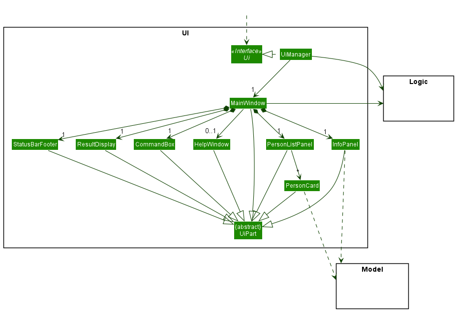

The UI consists of a `MainWindow` that is made up of parts e.g.`CommandBox`, `ResultDisplay`, `PersonListPanel`, `StatusBarFooter` etc. All these, including the `MainWindow`, inherit from the abstract `UiPart` class which captures the commonalities between classes that represent parts of the visible GUI.

The `UI` component uses the JavaFx UI framework. The layout of these UI parts are defined in matching `.fxml` files that are in the `src/main/resources/view` folder. For example, the layout of the [`MainWindow`](https://github.com/AY2122S1-CS2103T-F11-3/tp/blob/master/src/main/java/seedu/address/ui/MainWindow.java) is specified in [`MainWindow.fxml`](https://github.com/AY2122S1-CS2103T-F11-3/tp/blob/master/src/main/resources/view/MainWindow.fxml)

The `UI` component,

* executes user commands using the `Logic` component.
* listens for changes to `Model` data so that the UI can be updated with the modified data.
* keeps a reference to the `Logic` component, because the `UI` relies on the `Logic` to execute commands.
* depends on some classes in the `Model` component, as it displays `Person` object residing in the `Model`.

### Logic component

**API** : [`Logic.java`](https://github.com/AY2122S1-CS2103T-F11-3/tp/blob/master/src/main/java/seedu/address/logic/Logic.java)

Here's a (partial) class diagram of the `Logic` component:

How the `Logic` component works:
1. When `Logic` is called upon to execute a command, it uses the `AddressBookParser` class to parse the user command.
1. This results in a `Command` object (more precisely, an object of one of its subclasses e.g., `AddCommand`) which is executed by the `LogicManager`.
1. The command can communicate with the `Model` when it is executed (e.g. to add a person).
1. The result of the command execution is encapsulated as a `CommandResult` object which is returned back from `Logic`.

The Sequence Diagram below illustrates the interactions within the `Logic` component for the `execute("delete 1")` API call.

:information_source: **Note:** The lifeline for `DeleteCommandParser` should end at the destroy marker (X) but due to a limitation of PlantUML, the lifeline reaches the end of diagram.

Here are the other classes in `Logic` (omitted from the class diagram above) that are used for parsing a user command: 

How the parsing works:
* When called upon to parse a user command, the `AddressBookParser` class creates an `XYZCommandParser` (`XYZ` is a placeholder for the specific command name e.g., `AddCommandParser`) which uses the other classes shown above to parse the user command and create a `XYZCommand` object (e.g., `AddCommand`) which the `AddressBookParser` returns back as a `Command` object.
* All `XYZCommandParser` classes (e.g., `AddCommandParser`, `DeleteCommandParser`, ...) inherit from the `Parser` interface so that they can be treated similarly where possible e.g, during testing.

### Model component
**API** : [`Model.java`](https://github.com/AY2122S1-CS2103T-F11-3/tp/blob/master/src/main/java/seedu/address/model/Model.java)

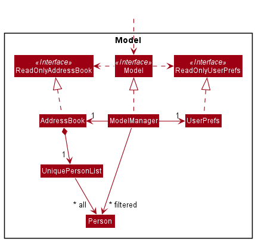

The `Model` component,
* stores the address book data i.e., all `Person` objects (which are contained in a `UniquePersonList` object).
* stores the currently 'selected' `Person` objects (e.g., results of a search query) as a separate _filtered_ list which is exposed to outsiders as an unmodifiable `ObservableList<Person>` that can be 'observed' e.g. the UI can be bound to this list so that the UI automatically updates when the data in the list change.
* stores a `UserPref` object that represents the user’s preferences. This is exposed to the outside as a `ReadOnlyUserPref` objects.
* does not depend on any of the other three components (as the `Model` represents data entities of the domain, they should make sense on their own without depending on other components)

:information_source: **Note:** An alternative (arguably, a more OOP) model is given below. 
It has a `Tag` and `Leave` list in the `AddressBook`, which `Person` references.
This allows `AddressBook` to only require one `Tag` object per unique tag, and one `Leave` object per unique date, 
instead of each `Person` needing their own `Tag` and `LeavesTaken` objects. More information on how leaves are currently implemented
can be found [here](#assigned-leaves). 
 
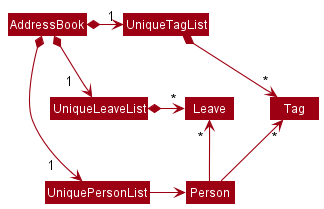

### Storage component

**API** : [`Storage.java`](https://github.com/AY2122S1-CS2103T-F11-3/tp/blob/master/src/main/java/seedu/address/storage/Storage.java)

The `Storage` component,
* can save both address book data and user preference data in json format, and read them back into corresponding objects.
* inherits from both `AddressBookStorage` and `UserPrefStorage`, which means it can be treated as either one (if only the functionality of only one is needed).
* depends on some classes in the `Model` component (because the `Storage` component's job is to save/retrieve objects that belong to the `Model`)

### Common classes

Classes used by multiple components are in the `seedu.addressbook.commons` package.

--------------------------------------------------------------------------------------------------------------------

## **Implementation**

This section describes some noteworthy details on how certain features are implemented.

### Find Command

**Current Implementation**

The find command allows a user to specify all the different fields which they want to search by.
It is implemented by parsing all the different fields that the user is searching with, and creating the relevant predicate for each field.
For example:
* Searching by name `n/NAME` will create a NameContainsKeywordsPredicate
* Searching by role `r/ROLE` will create a RoleContainsKeywordsPredicate
* Searching by overtime hours with a 'less than' comparison `o/<OVERTIME` will create a OvertimeLessThanPredicate

and so on.

Each field the user specifies is located and parsed with the `tokenize` function from ArgumentTokenizer.
The ArgumentTokenizer splits the user input into key-value pairs of the field's prefix and the values to query with, which can then be handled by the FindCommandParser.
Each predicate is then generated by passing the value found in the ArgumentMultimap created by ArgumentTokenizer.
In general, there are 2 main types of predicates.

1. Keyword matching predicates
    * These predicates check for a match between the user's query and the respective field in each `Person` in HeRon
    * The keywords are easily found from the ArgumentMultimap and are parsed using the `String#split()` method.

    One possible issue is that keywords containing spaces cannot be used. Therefore, a user input such as "Admin Assistant" will match "HR Assistant" and "IT Admin". 
    However, the current implementation allows for more flexible searching
   
2. Comparison based predicates
    * These predicates compare their given value with the respective field in each `Person` in HeRon.
        * For example, a LeaveLessThanPredicate will check if the `Person` has a number of leaves strictly less than the given value.
    * First, the respective method found in `FindCommandParser` for creating a comparison predicate is called.
        * For example, to get a `SalaryIsLessThanPredicate`, `FindCommandParser#getSalaryComparisonPredicate` is called with the user's input.
    * The comparison type is found using the `parseComparator()` method in FindCommandParser, which returns a CompareType, an enum found in FindCommandParser which has 5 values representing the different available comparisons: "more than", "more than or equal", "less than", "less than or equal", and "equal".
    * The value to compare to is then found using the `getComparisonValue()` method in FindCommandParser, which returns a String to be parsed.
        * This is done because the different fields take in different number types. For example, the HourlySalary field takes in a `double`, whereas the Leave field takes in an `int`.
    * Finally, the predicate is created by checking the CompareType and then passing the parsed value to the constructor.

After each predicate is generated, it is added to a list of filters in the parser, and after all predicates are added, they are combined into a single predicate using the `Predicate#reduce()` function, which is used to create the FindCommand.
This means that a Person must fulfill ALL predicates to be considered a match.
These predicates are combined into a single predicate so that it can be passed into the FindCommand, as it already takes in a single Predicate in its constructor.
This also means that the implementation of `FindCommand#execute()` does not need to be modified to account for multiple predicates at all, and it can be treated as a black box.

Below is the sequence diagram which shows a quick overview of how the FindCommand is created.
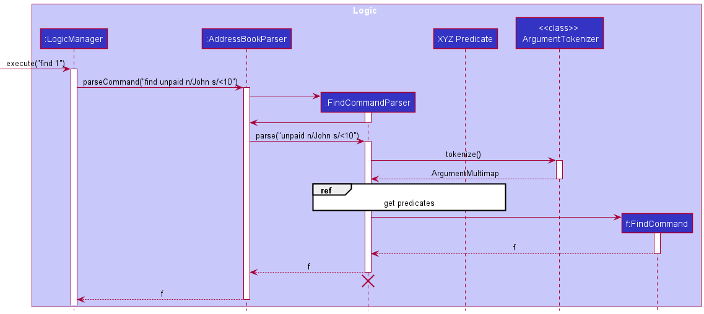

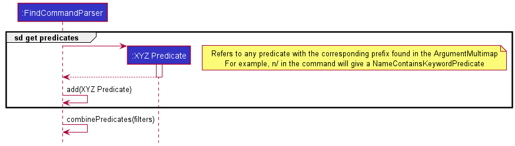

This allows multiple types of predicates to be chained together so that it is possible to handle a large query with multiple filters.
Therefore, it is also easy to extend this implementation to contain other predicates by following the below steps.

1. Define a new Predicate class that implements Predicate<Person> that tests a certain field of a person.
2. Add that field's prefix into `CliSyntax.java` if it does not exist yet.
3. Add that field's prefix into `ArgumentTokenizer#tokenize()` in `FindCommandParser#parse()`.
4. Within `FindCommandParser#parse()`, create the respective predicate and add it to the `filters` list in FindCommandParser.

**Alternatives considered** 
There are many alternatives for different parts of the FindCommandParser implementation.
The first alternative implementation concerns the predicate portion.

**Predicates** 
Modifying the code for `FindCommand#execute` to account for multiple predicates is very likely to cause errors. Therefore, it is much easier to find a way to combine predicates into a single one.
One alternative for combining predicates is to create a new `CombinedPredicate` class which contains all the possible fields to be compared with.

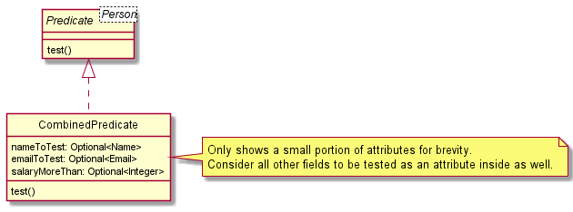
   
Using the `CombinedPredicate`, one can easily parse the user's command and create the appropriate `CombinedPredicate` to be passed into `FindCommand`.

Pros:
* Easier to test for equality by comparing each field. This means it is easier to test if the FindCommandParser has parsed the user input correctly.

Cons:
* Harder to write the implementation for `CombinedPredicate#test()` as it requires checking for null values if the user does not query with that field.
* Will require a new field to be added every time a new field is added to `Person`, so that a user can filter by that field. Not as extensible compared to creating a new predicate and adding it to the chain.

##### Creating the comparison based predicates
Another place for consideration of alternative implementation is the implementation of the comparison based predicates such as `SalaryIsLessThanPredicate`.

This alternative involves combining all 5 types of comparison predicates (more than, more than or equal, less than, less than or equal, equal) into a single predicate (e.g. SalaryComparisonPredicate).
Then, the predicate will contain information of the type of comparison to make, and the value to compare to.

Pros:
* Less classes are needed to completely account for all 5 scenarios. (and possibly less repeated code)

Cons:
* Testing becomes harder because there are many branches to account for, since the `test()` method will change its behaviour based on the comparison type passed into it.
* May become less flexible if more types of comparisons are needed. The current implementation allows each predicate to be responsible for only one type of comparison.

### Import Feature

**Current Implementation**  

The implemented import feature mechanism is facilitated by `ImportCommandParser`, `ImportCommand` and `PersonInput`. `ImportCommandParser` implements the interface `Parser`.`ImportCommand` extends abstract class `Command`, and implements the following additional operation:
* `ImportCommand#importData(Model)` Takes the filepath attributed to the ImportCommand and imports its content.

`PersonInput` is a class which stores the field inputs for a data entry as Strings, and implements getter and setter methods for all fields as required by the 3rd-party library opencsv. While parsing the csv file, `PersonInput` objects are created to consolidate all the information present, before being converted into `Person` objects and added into HeRon.

The fields `name`,`phone`, `address`, `email` and `role` must be present in all entries before the data can be imported successfully. This is to prevent junk data from being imported. These fields were selected as they are highly likely to be present in existing data to be used for import.

HeRon detects fields using column titles (first row of the csv file). Naming convention (case-insensitive) of the fields below must be followed to be detected, as per opencsv library requirements.
* `name` as Name
* `phone` as Contact Number
* `address` as Residential Address
* `email` as Email
* `role` as Role
   
Given below is an example usage scenario and how the import mechanism behaves at each step.

**Step 1.** The user launches the application. HeRon initializes with the initial address book state or loaded with data from the previous session (if any).

**Step 2.** The user executes `import /toBeImported.csv` command to import the .csv file in the specified directory, which in this case, refers to the file `toBeImported.csv` in the root directory.

:information_source: **Note:** If the specified directory is not valid, the command fails to complete and an error message is returned. There will be no changes made to the current AddressBook.

**Step 3.** Program processes the .csv file. The first row is identified as the header row, which is used to determine which field of the PersonInput class the column represents. The remaining rows are parsed and PersonInput objects are created and added into a List. Once done, the List of PersonInput objects will be used to create a separate List of Person objects used to update the address book.

:information_source: **Note:** If there are entries with missing values in the required fields, the command fails to complete and an error message indicating the location of the error is returned. There will be no changes made to the current AddressBook.

:information_source: **Note:** Data present in the imported file must adhere to respective requirements for each field. `Name`, `Email` and `Phone` fields cannot be the same as other entries. If duplicate values exist, the command fails to complete and an error message is returned. There will be no changes made to the current AddressBook.

   
**Step 4.** A new `AddressBook` is created, and updated it with the entries in the file. The current existing AddressBook is replaced with the newly created one. The display panel is updated to show the first entry present in the csv file.

**Step 5.** The updated AddressBook would be saved as per the process after the execution of a command.
The following sequence diagram shows how the import feature works:
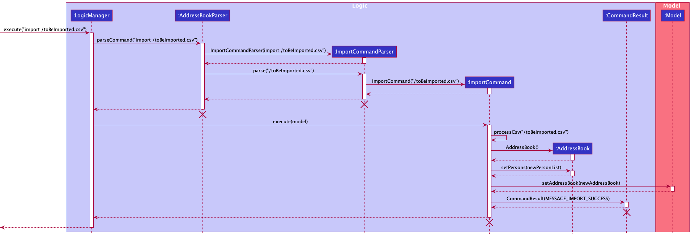
   

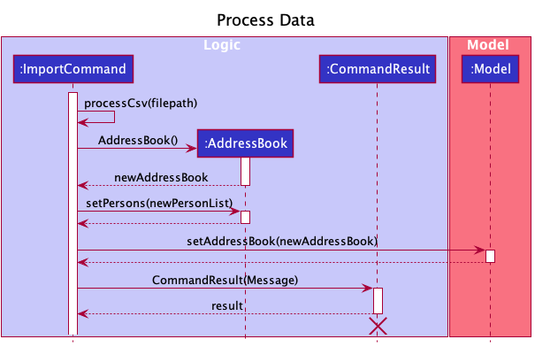

The reference frame for "Update GUI" is similar to the sequence diagram given in the section "Updating Info Panel Display", which can be found [here](#updating-info-panel-display).

The following activity diagram summarizes what happens when a user uses the `import` command:
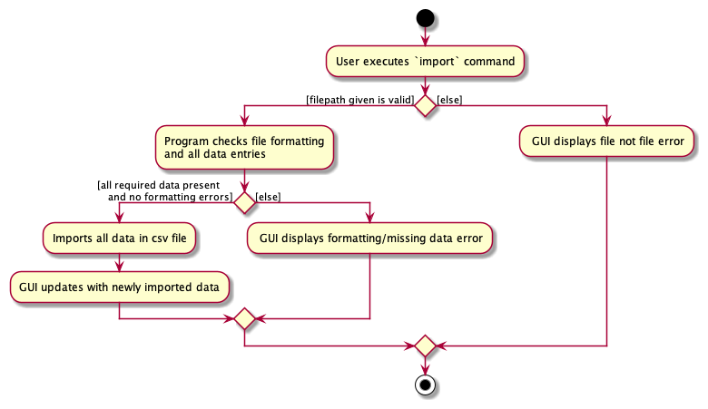

**Design considerations:**

**Aspect: How the imported file is processed:**

* **Alternative 1 (current choice): Uses a header row to determine the data used**
    * Pros: No need to follow specific column ordering.
    * Cons: The names of the headers for the specific columns must be the exact name used (less case-sensitivity), and a header row must be present.

* **Alternative 2: Uses positioning of columns to import data**
    * Pros: No need for header rows.
    * Cons: Unable to ensure that the data is formatted in the correct order.

**Aspect: Making fields compulsory for import:**

* **Alternative 1 (current choice): Only fields `Name`, `Contact Number`, `Residential Address`, `Email` and `Role` are compulsory**
    * Pros: Ensures that imported data have the minimum fields required before being imported, which most organizations should have.
    * Cons: Files cannot be imported if any entry has any of the compulsory fields missing.

* **Alternative 2: No compulsory fields**
    * Pros: Allows for multiple names for the fields in the header row, albeit still fixed. Files can be imported even if there are missing entries.
    * Cons:  Files can be imported regardless of any formatting issues or missing fields in entries, thus data can be imported even without any cleaning, making it harder to be used in the program.
   
* **Alternative 3 : All fields are compulsory**
    * Pros: Ensures data imported have all the required fields to utilise all the functionality of the program.
    * Cons: Files cannot be imported if any entry has any fields missing.

### Updating Info Panel display

**Current Implementation**  
`InfoPanel` class controls the content being displayed on the Info Panel. The information to be displayed is dependent
on the ObservablePerson object `viewingPerson` in the ModelManager class. `viewingPerson` contains the person to be viewed, as well as
a `uiObserverList` that contains `UiObserver` that wish to be notified when the person to be viewed has been changed.

When the `viewingPerson` is changed, `InfoPanel`
should get updated automatically to display the new information.

This automatic updating of information to display on the Info Panel is achieved through the Observer pattern.

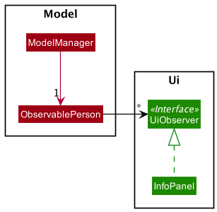

The following operations are implemented for the classes:
* `InfoPanel::updateInfoPanel(Person p)` - updates the content to be displayed on the Info panel with the new `Person`'s information.
* `ObservablePerson::addUiObserver(UiObserver observer)` - subscribes the `UiObserver` to the `ObservablePerson` to get updates when `ObservablePerson` changes
* `ObservablePerson::updateUi()` - updates the observers with the relevant `Person` information.

On initialization:
1. `ObservablePerson` is created, and `InfoPanel` is initialized with the ObservablePerson passed as argument to the constructor
2. On creation of `InfoPanel`, it adds itself to the `uiObserverList` of the ObservablePerson to be subscribed for updates using `ObservablePerson::addUiObserver(UiObserver observer)`
   
When the `ObservablePerson` changes:
1. `InfoPanel` in the `uiObserverList` is updated with `ObservablePerson::updateUi()`
2. `InfoPanel` and other `UiObserver` in the list can then update their own Ui with the updated viewingPerson information passed to it.
   
Below is an example of how `InfoPanel` updates with a view command:

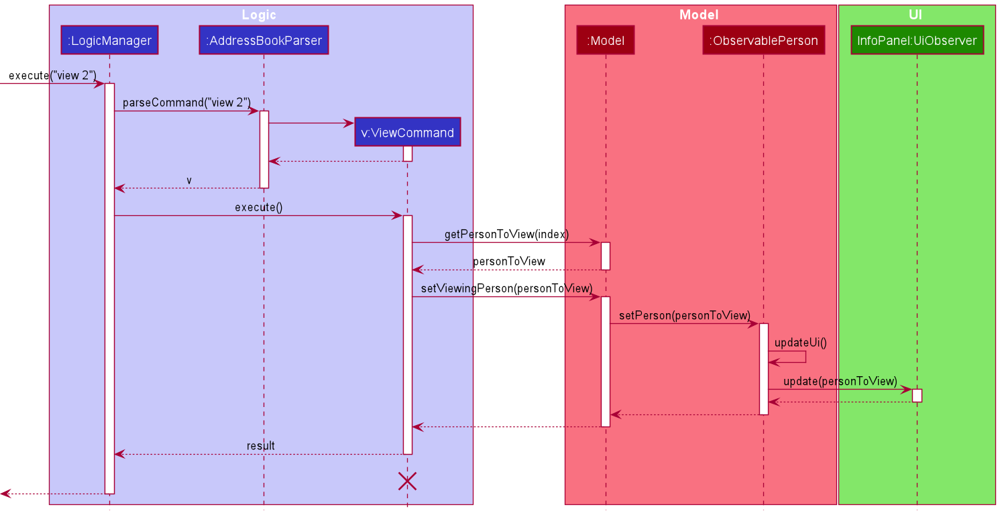

**Step 1.** User executes `view 2` to view the 2nd employee in the list, and after the command is parsed, `v:ViewCommand` is being created.

**Step 2.** On execution of `ViewCommand`, `getPersonToView(index)` is called to get the personToView, and then passed to call `setViewingPerson(personToView)` on `Model`.

**Step 3.** Model calls `setPerson(personToView)` on `ObservablePerson`, causing it to update the viewing person. In the process of updating,
it informs the other `InfoPanel` in the `uiObserverList` to update, passing the new updated personToView to `InfoPanel`.

**Step 4.** With the new data passed to `InfoPanel`, it can then update the content to be displayed in however its `update()` method is implemented.  

**Design Considerations:**

Use Observer pattern to track when to update InfoPanel (Current Implementation)

**Pros:** `InfoPanel` can update by itself without `Model` having a dependency on the UI.

**Cons:** Might be harder to figure out what is "observing" the observable just by looking at the source code since there is no direct dependency.

**Alternative:**

Constantly update Info Panel with every command executed.

**Pros:** Easy to update, ensures that Ui is constantly updated.

**Cons:** Unnecessarily updates even when there is no change to data to be viewed, increases runtime.

### Leave Balance

**Current Implementation**

Currently, leaves are represented by two attributes of `Person`: `LeaveBalance`, which represents the amount of leaves the employee has remaining, 
and `LeavesTaken`, which represents the leaves that the employee has taken on a given date.

`LeaveBalance` is internally represented as an integer value, and must have a value of at least 0 and at most 365.
The add to/deduct from leave balance features are implemented by the classes 
`AddLeaveBalanceCommand` and `DeductLeaveBalanceCommand` respectively.
Both classes extend `Command` with the following added method to get the updated person:
- `getUpdatedPerson(Person personToEdit)` - Returns a new `Person` object that is a copy of the input `personToEdit` object,
except with an updated `LeaveBalance` value.

Given below is an example of how `AddLeaveBalanceCommand` works.

**Step 1.** The user enters the command 'addLeaveBalance 2 l/1'. The `AddLeaveBalanceCommandParser` parses the input, creates a `AddLeaveBalanceCommand` object and executes it.
The command object contains two attributes: `index`, which corresponds to the input index of 2, and `leaveBalance` which corresponds to the input number of leaves, in this case 1.

**Step 2.** Inside `AddLeaveBalanceCommand#execute`, the list of all employees is retrieved by calling `Model#getFilteredPersonList()`.

**Step 3.** Using the input `Index` value, the second person from the filtered list is retrieved as the `personToEdit` object.

**Step 4.** `AddLeaveBalanceCommand#getUpdatedPerson` is called, with `personToEdit` as an input.

**Step 5.** Inside `getUpdatedPerson`, `LeaveBalance#addLeaves` is called with the input `LeaveBalance` value as a parameter.

**Step 6.** `getUpdatedPerson` returns a copy of the `personToEdit` object with an updated `LeaveBalance`.

**Step 7.** The old `Person` object in the `Model` is then replaced with its updated copy using `Model#setPerson()`.

**Step 8.** `AddLeaveBalanceCommand#execute` returns a `CommandResult` to signal a successful execution.

The following sequence diagram shows how `AddLeaveBalanceCommand` works:

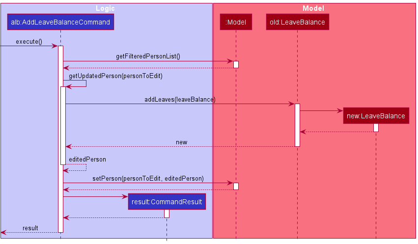

`DeductLeaveBalanceCommand` works similarly, except instead of calling `LeaveBalance#addLeaves` in step 5, `LeaveBalance#removeLeaves` is called.

### Assigned Leaves

**Current Implementation**

`LeavesTaken` is internally represented as a `PriorityQueue` of `LocalDate` values. A `PriorityQueue` was chosen as it would 
automatically sort the `LocalDate` values from least to most recent after each add/remove date operation. 
There may be multiple `LocalDate` objects representing the same date. For example, if two employees have a leave on 2021-11-10,
each of them will have a different `LocalDate` object corresponding to 2021-11-10 inside their `LeavesTaken` attribute object.

The assign leave feature is implemented by the class `AssignLeaveCommand`.
This class extends `Command` with the following added method to get the updated person:
- `getUpdatedPerson(Person personToEdit)` - Returns a new `Person` object that is a copy of the input `personToEdit` object,
  except with updated `LeavesTaken` and `LeaveBalance` values.
  
`AssignLeaveCommand` works similarly to `AddLeaveBalanceCommand`, 
except instead of calling `LeaveBalance#addLeaves` , `LeavesTaken#addDate` is called. In addition,
`LeaveBalance#removeLeaves` is called with a `LeaveBalance` object containing the value 1. 
(In other words, assigning a leave deducts 1 leave from the leave balance.)

The remove outdated leaves feature is implemented by the class `RemoveLeavesBeforeCommand`.
This class extends `Command` with the following added method to get the updated person:
- `getUpdatedPerson(Person personToEdit)` - Returns a new `Person` object that is a copy of the input `personToEdit` object,
  except with an updated `LeavesTaken` value.

`RemoveLeavesBeforeCommand` works similarly to `AddLeaveBalanceCommand`,
except instead of calling `LeaveBalance#addLeaves` , `LeavesTaken#removeDatesBefore` is called.
In addition, `LeavesTaken#removeDatesBefore` is called for all `Person` objects in the filtered list.

The following sequence diagram shows how `RemoveLeavesBeforeCommand` works:

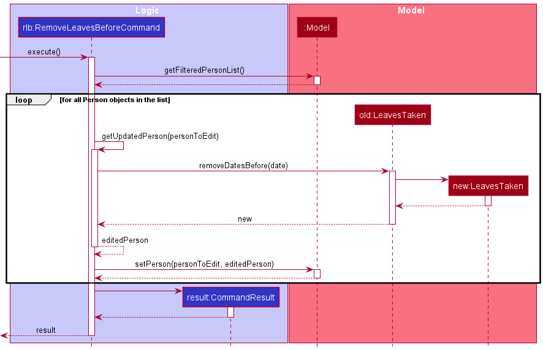

**Design considerations:**

**Aspect: How assigned leaves are represented**

* **Alternative 1 (current choice):** Each `Person` object has a `LeavesTaken` object that contains a set of `LocalDate` values that 
  corresponds to the employee's assigned leaves.
    * Pros: Easier to implement, able to delete individual `LocalDate` objects without needing to check other `Person` objects.
    * Cons: May have issues in regard to memory usage, as each unique date can potentially have many `LocalDate` objects that correspond to it.

* **Alternative 2:** Each unique date is represented by a `Leave` object.
    * Pros: Potentially more object-oriented, reduced memory usage as only one object is required for each date.
    * Cons: Need to keep track of how many `Person` objects are associated with each `Leave`, which might lead to increased coupling between `Leave` and `Person`.

**Aspect: How outdated assigned leaves are removed:**

* **Alternative 1 (current choice):** Manually clear outdated leaves via a command (`removeLeavesBefore`).
    * Pros: Easier to implement and test than an automated solution, gives more control to the user in which leaves they want to clear.
    * Cons: Less convenience for the user, could lead to accidental deletion of certain leaves if the user makes a typo with the input date.

* **Alternative 2:** Assigned leaves will automatically clear themselves once the date has passed.
    * Pros: More convenient for the user.
    * Cons: Harder to test, and it could lead to unexpected behaviour. (e.g. What happens if the user changes their timezone, or if the user's system clock fails)
      Also, the user might want to keep a full record of all assigned leaves.

### Start Payroll feature

**Current Implementation**

The start payroll feature is provided through `StartPayrollCommand`.
It extends `Command` with the following added methods to calculate the payroll for every employee:
- `StartPayrollCommand#calculatePay(HourlySalary salary, HoursWorked hoursWorked,
  Overtime overtime, OvertimePayRate overtimePayRate)` - Calculates the payroll based on the given parameters and
  returns a new `CalculatedPay` object.
- `StartPayrollCommand#createPersonWithCalculatedPay(Person personWithCalculatedPay,
  CalculatedPay newCalculatedPay)` - Creates a new `Person` that is a copy of the given `Person` parameter
  except with the updated `CalculatedPay` value.
- `StartPayrollCommand#createPersonWithZeroHoursWorkedAndOvertime(Person person)` - Creates a new `Person` that is a copy of the 
  given `Person` parameter except with the `HoursWorked` and `Overtime` values set to 0.

Given below is an example of how `StartPayrollCommand` works.

**Step 1.** The user enters the command word 'startPayroll'. The `addressBookParser` parses the input,
creates a `StartPayrollCommand` and executes it.

The following sequence diagram describes the operations in executing a `StartPayrollCommand`.

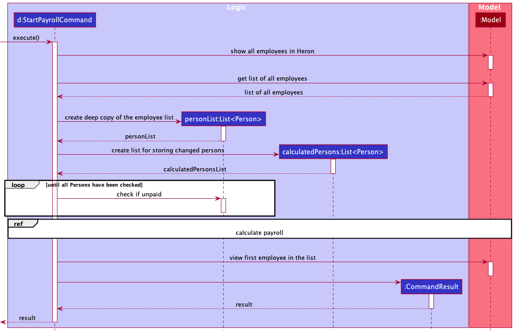

**Step 2.** In the new instance of `StartPayrollCommand`, upon starting execution,
the list of employees to be viewed in `Model` is set to be unfiltered using `Model#updateFilteredPersonList()`.
The list of all employees is then retrieved by calling `Model#getFilteredPersonList()`,
storing a deep copy in `personList`.

**Step 3.** Each employee in the list of employees are checked if they have any previously calculated payroll that have not
been paid yet by calling `Person#isPaid()` on the employee. If an employee is unpaid,
a `CommandException` will be thrown.
   
**Step 4.** If there are no employees who are unpaid, calculations of payroll will proceed through the following substeps:

--Start of Calculating Payroll--

The following sequence diagram describes how the payroll is calculated.

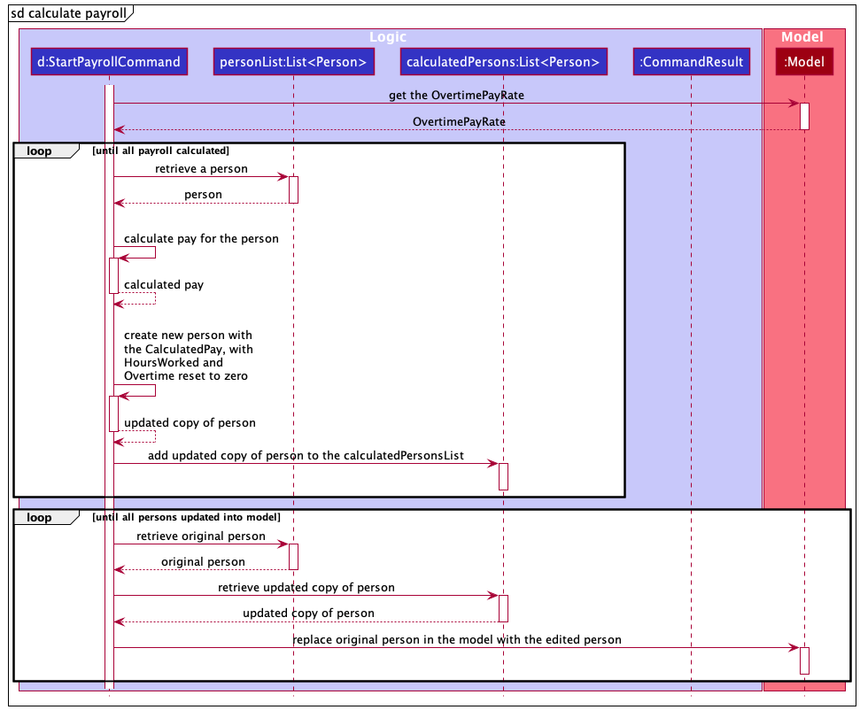

**Step 4.1.** Retrieve the current `overtimePayRate` in the application from the `Model`
using `Model#getOvertimePayRate()`.
   
**Step 4.2.** Retrieve an employee from `personList`.
Retrieve the following attributes from the employee `Person` object:
- `hourlySalary` - The employee's salary per hour.
- `hoursWorked` - How many hours the employee has worked for (excluding overtime).
- `overtime` - How many hours of overtime the employee has worked for.

The new `CalculatedPay` object representing the calculated employee's pay is created by calling
the `StartPayrollCommand#calculatePay()` method, with the earlier retrieved values (`overtimePayRate`, `hourlySalary`,
`hoursWorked`, `overtime`) as parameters.

**Step 4.3.** An updated copy of the employee `Person` object is created with the new `CalculatePay` attribute using
`StartPayrollCommand#createPersonWithCalculatedPay()`, and their `HoursWorked` and `Overtime` attributes reset to zero
using `StartPayrollCommand#createPersonWithZeroHoursWorkedAndOvertime()`. The updated copy of the employee is then
inserted into `calculatedPersonsList`.
   
Steps 4.2 and 4.3 are repeated for all employees in the `personList`.

**Step 4.4.** For every employee in `personList`, its corresponding `Person` object in the `Model` is then replaced 
with its updated copy in `calculatedPersonsList` using `Model#setPerson()`.

--End of Calculating Payroll--

**Step 5.** After every employee in the list has had their payroll calculated, HeRon is set to view the first employee 
in the list.

**Step 6.** Lastly, the `StartPayrollCommand` returns a `CommandResult` to signal successful execution.

**Design considerations:**

**Aspect: How the feature of calculating payroll is implemented:**

* **Alternative 1 (current choice):** One command for calculating payroll for all employees.
    * Pros: Easy to implement. Easy to test (little variations in use cases).
    * Cons: Less flexible for users.

* **Alternative 2:** Command that calculates payroll for a single employee or all employees.
    * Pros: Provides more flexibility for users.
    * Cons: We need to check for which use case the user intends to use. Can be harder/more tedious to test
    as more there are more variations in use cases.
--------------------------------------------------------------------------------------------------------------------

   
## **Documentation, logging, testing, configuration, dev-ops**

* [Documentation guide](Documentation.md)
* [Testing guide](Testing.md)
* [Logging guide](Logging.md)
* [Configuration guide](Configuration.md)
* [DevOps guide](DevOps.md)

--------------------------------------------------------------------------------------------------------------------
 
## **Appendix: Requirements**

### Product scope

**Target user profile**:

* is a HR manager of a small company (10 - 50 employees)
* is the only one in charge of handling HR
* has a need to manage information on all employees
* prefers desktop apps over other types
* can type fast
* prefers typing to mouse interactions
* is reasonably comfortable using CLI apps

**Value proposition**:
* More convenient to manage employees’ information than a typical mouse/GUI driven app.
* Able to quickly assess the balance of work between employees.
 

### User stories

Priorities: High (must have) - `* * *`, Medium (nice to have) - `* *`, Low (unlikely to have) - `*`

| Priority | As a …​                                    | I want to …​                                            | So that I can…​                                                     |
| -------- | ------------------------------------------ | --------------------------------------------------------------| ---------------------------------------------------------------------- |
| `* * *`  | user                                       | add a new employee                                                                                                    |                                                                                                                           |
| `* * *`  | user                                       | delete an employee                                                                                                    | remove entries that I no longer need.                                                                                     |
| `* * * ` | user                                       | edit an employee's data                                                                                               |                                                                                                                           |
| `* * *`  | user with many employees in the app        | search for an employee's data easily                                                                                  | locate details of employees without having to go through the entire list.                                                   |
| `* * *`  | user                                       | keep track of my employee's current leaves                                                                            | determine if a given employee's request for leave is valid.                                                               |
| `* * *`  | user                                       | update leaves for certain employees                                                                                   | have a more accurate count of their remaining leaves.                                                                     |
| `* * *`  | user                                       | keep track of an employee's unpaid leaves                                                                             | know how much to deduct from their monthly salary.                                                                        |
| `* * *`  | user                                       | get all the offs and leaves that every employee has                                                                   | get those with remaining leaves to clear them before the end of the year.                                                 |
| `* * *`  | user                                       | calculate the pay of all employees and view them easily                                                               | make it easier to complete administrative tasks.                                                                          |
| `* * *`  | user                                       | have an application to account for factors like unpaid leaves and overtime when calculating salary                     | reduce chances of errors by manual calculations.                                                                          |
| `* * *`  | user                                       | keep track of employees which I have not paid yet                                                                     | ensure all employees are paid.                                                                                            |
| `* * *`  | user                                       | get all the overtime that every employee has done for the month                                                       | keep track of each employee and analyze the amount of overtime being done in the company.                                 |
| `* * *`  | organized user                             | group up employees into specified groups                                                                              | sort through them easily with color coding and tags.                                                                      |
| `* *  `  | user                                       | input a schedule for an employee                                                                                      | keep track of how many hours he/she are intending to work.                                                                  |
| `* *  `  | user                                       | schedule employees and their work schedules                                                                           | ensure they hit the minimum work quota and all employees are working equally.                                             |
| `* *  `  | user in a company that does shift work     | see the schedule for the week                                                                                         | have a rough idea of how to assign people to shifts.                                                                      |
| `* *  `  | user                                       | generate a work schedule according to certain specified rules                                                         | do not have to make one manually while ensuring it abides by the rules.                                                   |
| `* *  `  | user                                       | keep track of any documents relating to my employees.                                                                 |                                                                                                                           |
| `* *  `  | user                                       | keep track of any complaints lodged against employees                                                                  | address the employees accordingly.                                                                                        |
| `* *  `  | user                                       | have short and readable summaries of day-to-day statuses in the company                                               | access it at anytime for any potential tracking in the future.                                                            |
| `* *  `  | user                                       | get a summary of certain information of employees                                                                     | include it easily in monthly reports.                                                                                     |
| `* *  `  | organized user                             | group up employees into specified groups                                                                              | update information for the specific group without manually updating each member one by one.                               |
| `* *  `  | organized user                             | be able to easily archive/filter employees that are not relevant                                                      | ensure they do not distract me from doing my work.                                                                        |
| `* *  `  | user                                       | compute all the relevant information that I require in a short amount of time regardless of the number of employees   | ensure the workflow will take similar amounts of time regardless of company size.                                         |
| `* *  `  | expert user                                | have an automation system that handles tasks which have to be done periodically (eg. everyday)                        | do not have to do them manually and make the processing of data more efficient.                                           |
| `* *  `  | expert user                                | make the least effort to get the employee's information                                                               | be more efficient.                                                                                                        |
| `* *  `  | new user                                   | spend the least effort to learn how to use the application                                                            | spend more time focusing on my tasks.                                                                                     |
| `* *  `  | forgetful user                             | have a convenient way to access help while using the application                                                      | have an overview of how to execute certain commands if I forget.                                                          |
| `* *  `  | lazy user                                  | have customized shortcuts                                                                                             | reduce effort needed to complete my tasks, especially if they are done often.                                             |
| `* *  `  | user                                       | have different settings for different employees                                                                       | quickly do computations on all employees even if they are treated differently, such as having different pay calculations. |
| `* *  `  | user                                       | save certain employee settings and apply them to other employees                                                      | add new employees into the database with previously used settings.                                                        |
| `* *  `  | potential user                             | insert dummy data into the app                                                                                        | see how the interface looks.                                                                                              |
| `* *  `  | potential user                             | clear out all the dummy data inserted                                                                                 | immediately start using the app after testing it.                                                                         |
| `* *  `  | user                                       | can see everything                                                                                                    | feel like I am in charge.                                                                                                 |
| `* *  `  | user dealing with confidential information | have some form of authentication                                                                                      | ensure only authorized personnel are allowed to access the data.                                                          |
| `* *  `  | user                                       | mark important days such as payday                                                                                    | manage my work more effectively.                                                                                          |

### Use cases

(For all use cases below, the **System** is the `HeRon` and the **Actor** is the `user`, unless specified otherwise)

**Use case: Delete an employee**

**MSS**

1.  User requests to list employees
2.  HeRon shows a list of employees
3.  User requests to delete a specific employee in the list
4.  HeRon deletes the employee

    Use case ends.

**Extensions**

* 2a. The list is empty.

  Use case ends.

* 3a. The given index is invalid.

    * 3a1. HeRon shows an error message.

      Use case resumes at step 2.

**Use case: Add leaves to an employee's leave balance**

**MSS**

1.  User requests to list employees
2.  HeRon shows a list of employees
3.  User requests to add a certain number of leaves to a specific employee in the list
4.  HeRon adds the leaves to the employee's leave balance

    Use case ends.

**Extensions**

* 2a. The list is empty.

  Use case ends.

* 3a. The given index is invalid.

    * 3a1. HeRon shows an error message.

      Use case resumes at step 2.

* 3b. The number of leaves to be added is invalid. (If the input is not a positive integer)

    * 3b1. HeRon shows an error message.

      Use case resumes at step 2.
   
**Use case: Remove leaves from an employee's leave balance**

Guarantees:
* The number of leaves of the employee after the operation will never be negative.

**MSS**

1.  User requests to list employees
2.  HeRon shows a list of employees
3.  User requests to remove a certain number of leaves from a specific employee in the list
4.  HeRon removes the leaves from the employee's leave balance

    Use case ends.

**Extensions**

* 2a. The list is empty.

  Use case ends.

* 3a. The given index is invalid.

    * 3a1. HeRon shows an error message.

      Use case resumes at step 2.

* 3b. The number of leaves to be removed is invalid. (If the input is not a positive integer)

    * 3b1. HeRon shows an error message.

      Use case resumes at step 2.

* 3c. The number of leaves to be removed is greater than the amount of leaves the employee actually has.

    * 3c1. HeRon shows an error message.

      Use case resumes at step 2.

**Use case: Assign a leave to an employee**

Guarantees:
* The number of leaves of the employee after the operation will never be negative.

**MSS**

1.  User requests to list employees
2.  HeRon shows a list of employees
3.  User requests to assign a leave to an employee with a date
4.  HeRon assigns the leave to the employee and subtracts a leave from the employee's leave balance

    Use case ends.

**Extensions**

* 2a. The list is empty.

  Use case ends.

* 3a. The given index is invalid.

    * 3a1. HeRon shows an error message.

      Use case resumes at step 2.

* 3b. The date associated with the leave is invalid.

    * 3b1. HeRon shows an error message.

      Use case resumes at step 2.

* 3c. The employee has no more leaves remaining in their leave balance.

    * 3c1. HeRon shows an error message.

      Use case resumes at step 2.

**Use case: Remove outdated assigned leaves from a list of employees**

**MSS**

1.  User requests to list employees
2.  HeRon shows a list of employees
3.  User requests to clear all leaves before a given date from all employees in the list 
4.  HeRon gets a list of leave dates from an employee
5.  HeRon removes all leave dates that occur before the given input date, and updates the employee's list accordingly
    Steps 4-5 are repeated for all employees in the list.
    
    Use case ends.

**Extensions**

* 2a. The list is empty.

  Use case ends.

**Use case: Add hours worked/overtime to an employee**

**MSS**

1.  User requests to list employees
2.  HeRon shows a list of employees
3.  User requests to add a certain number hours worked and/or overtime to a specific employee in the list
4.  HeRon adds the hours worked/overtime to the employee

    Use case ends.

**Extensions**

* 2a. The list is empty.

  Use case ends.

* 3a. The given index is invalid.

    * 3a1. HeRon shows an error message.

      Use case resumes at step 2.

* 3b. The number of hours worked/overtime to be added is invalid. (If the input is not a positive integer)

    * 3b1. HeRon shows an error message.

      Use case resumes at step 2.

**Use case: Remove hours worked/overtime from an employee**

Guarantees:
* The number of hours worked/overtime of the employee after the operation will never be negative.

**MSS**

1.  User requests to list employees
2.  HeRon shows a list of employees
3.  User requests to remove a certain number hours worked and/or overtime from a specific employee in the list
4.  HeRon removes the hours worked/overtime from the employee

    Use case ends.

**Extensions**

* 2a. The list is empty.

  Use case ends.

* 3a. The given index is invalid.

    * 3a1. HeRon shows an error message.

      Use case resumes at step 2.

* 3b. The hours worked/overtime to be removed is invalid. (If the input is not a positive integer)

    * 3b1. HeRon shows an error message.

      Use case resumes at step 2.

* 3c. The number of hours worked/overtime to be removed is greater than the number of hours worked/overtime the employee actually has.

    * 3c1. HeRon shows an error message.

      Use case resumes at step 2.

**Use Case: Finding an employee**

**MSS**

1.  User requests to list employees
2.  HeRon shows a list of employees
3.  User requests to find all employees with a given query (name, phone, tags, and other valid queries)
4.  HeRon shows a list of employees with that given name
   
   Use case ends.

**Extensions**

* 2a. The list is empty.

  Use case ends.

* 3a. The given query does not match any user in HeRon

    * 3a1. HeRon shows an error message

      Use case resumes at step 2.

* 3b. The given query is invalid (because it contains a tag that cannot be understood)

    * 3b1. HeRon shows an error message.

      Use case resumes at step 2.

**Use case: Edit an employee**

**MSS**

1. User requests to list employees
2. HeRon shows list of employees
3. User requests to edit a specific employee on the list
4. HeRon replaces the data of the employee based on the user's specified inputs
5. HeRon displays employee data of the edited employee to user

    Use case ends.

**Extensions**

* 2a. The list is empty.

  Use case ends.

* 3a. The given index is invalid.

    * 3a1. HeRon shows an error message.

        Use case resumes at step 2.

* 3b. No field has been provided

    * 3b1. HeRon shows an error message informing user about the lack of a field

        Use case resumes at step 2.

* 3c. Input into field is invalid

    * 3c1. HeRon shows an error message informing user about which field has invalid input and why it is invalid

        Use case resumes at step 2.
   
**Use case: Calculate payroll for all employees**

**MSS**

1.  User requests to list employees
2.  HeRon shows a list of employees
3.  User requests to calculate the payroll for all employees
4.  HeRon shows the list of all employees
5.  HeRon calculates the payroll and updates all employees' calculated pay information.
6.  HeRon sets the first employee on the list to be viewed in the InfoPanel.

    Use case ends.

**Extensions**

* 5a. There is an employee who has not yet been paid the previous calculated pay.

    * 5a1. HeRon shows an error message.

        Use case resumes at step 4.

**Use case: Adding a Tag to an employee**

**MSS**
1. User searches for a certain employee.
2. HeRon returns the results of the search.
3. User tags the specified employees with a specified tag.
4. Tag is added to the employee.

   Use case ends.
   
**Extensions**

* 2a. The list is empty.

  Use case ends.

* 3a. The given index is invalid.

    * 3a1. HeRon shows an error message.

      Use case resumes at step 3.

* 3b. The given tag is invalid.

    * 3b1. HeRon shows an error message.

        Use case resumes at step 3.

**Use case: Updating details of group of employees with specified tag.**

**MSS**
1. User searches for employees with specified tag.
2. HeRon returns the results of the search.
3. User updates the details of the specified employees.
4. Employees in the group tag have their details updated.

   Use case ends.

**Extensions**

* 2a. The result list is empty.

  Use case ends.

* 3a. The given corresponding tag of the detail(s) to be updated is invalid.

    * 3a1. HeRon shows an error message.

      Use case resumes at step 3.
   
* 3b. The given detail(s) to be updated is invalid.

    * 3b1. HeRon shows an error message.

      Use case resumes at step 3.

**Use case: Importing an external .csv file.**

**MSS**
1. User specifies the filepath of the file to be imported.
2. File is found and data from the file is imported into HeRon.

    Use case ends.

**Extensions**

* 2a. File specified from the given filepath foes not exist.
    
    * 2a1. HeRon shows an error message. 
  
      Use case resumes at step 1.
  
* 2b. File specified exists, but the formatting of data in the given file is invalid.

    * 2b1. HeRon shows an error message.

      Use case resumes at step 1.
   
* 2c. File specified exists, but the invalid data is present in the given file.

    * 2c1. HeRon shows an error message.

      Use case resumes at step 1.

### Non-Functional Requirements

1. Should work on any _mainstream OS_ as long as it has Java `11` or above installed.
2. Should be able to hold up to 1000 persons without a noticeable sluggishness in performance for typical usage.
3. A user with above average typing speed for regular English text (i.e. not code, not system admin commands) should be able to accomplish most of the tasks faster using commands than using the mouse.
4. User interface should be able to comfortably fit the information of at least 50 employees.
5. Should be usable offline.
6. Should respond within 2 seconds within the users’ command.
7. Should only allow authorized personnel to have access to the application’s data.

### Glossary

* **Mainstream OS**: Windows, Linux, Unix, OS-X
* **Private contact detail**: A contact detail that is not meant to be shared with others
* **Salary**: Hourly Salary payout to employees
* **Leave**: Refers to a day when an employee has permission to be absent from work

--------------------------------------------------------------------------------------------------------------------

## **Appendix: Instructions for manual testing**

Given below are instructions to test the app manually.

:information_source: **Note:** These instructions only provide a starting point for testers to work on;
testers are expected to do more *exploratory* testing.

### Launch and shutdown

1. Initial launch

   1. Download the jar file and copy into an empty folder

   1. Double-click the jar file   
      Expected: Shows the GUI with a set of sample contacts. The window size may not be optimum.

1. Saving window preferences

   1. Resize the window to an optimum size. Move the window to a different location. Close the window.

   1. Re-launch the app by double-clicking the jar file. 
      Expected: The most recent window size and location is retained.

### Finding a person

1. Finding a person with their name

    1. Prerequisites: Have at least one person in the list. Note down their name. For this example, we assume their name is `Alex Yeoh`. 
    
    1. Test case: `find n/Alex` 
       Expected: Alex appears in the list on the left side, while the rest of the people whose names do not contain `Alex` are not shown.

    1. Test case: `find n/Yeoh` 
       Expected: The same should happen as before, with the rest of the list containing all people with `Yeoh` in their name, if any.

     
### Deleting a person

1. Deleting a person while all persons are being shown

   1. Prerequisites: List all persons using the `list` command. Multiple persons in the list.

   1. Test case: `delete 1` 
      Expected: First contact is deleted from the list. Details of the deleted contact shown in the status message. Timestamp in the status bar is updated.

   1. Test case: `delete 0` 
      Expected: No person is deleted. Error details shown in the status message. Status bar remains the same.

   1. Other incorrect delete commands to try: `delete`, `delete x`, `...` (where x is larger than the list size) 
      Expected: Similar to previous.

### Editing an employee

1. Editing an employee while a list of employees is shown

    1. Prerequisites: List all persons using the `list` command. Multiple employees in the list.

    2. Test case: `edit 1 n/Tsang Wei Ooi` 
        Expected: First employee's name is updated with `Tsang Wei Ooi`. Details of the edited employee is shown in status message. Timestamp in the status bar is updated.

    3. Test case: `edit` 
        Expected: No data is being edited. Error details shown in status message. Status bar remains the same.

    4. Test case: `edit 1 p/91234567 s/9.50` 
        Expected: First employee's phone number and salary is updated as `91234567` and `9.50` respectively together. Details of edited contact shown in the status message. Timestamp in the status bar is updated.

    5. Other incorrect edit commands to try: `edit x` (where x is larger than list size), `edit 1 s/-2.00` (salary should not be negative) etc.  
        Expected: No employee data is being edited. Error details shown in the status message. Status bar remains the same.

### Adding to/Deducting from an employee's leave balance

1. Adding to/Deducting from an employee's leave balance while a list of employees is shown

    1. Prerequisites: List all persons using the `list` command. At least 1 employee in the list. First employee must have a `LeaveBalance` of 0.
       (Set with `edit 1 l/0`) All test cases are meant to be tested in order.

    2. Test case: `addLeaveBalance 1 l/1` 
       Expected: First employee's leave balance is now 1. Details of the new leave balance are shown in the status message.

    3. Test case: `addLeaveBalance` 
       Expected: No leaves are added. Error details shown in the status message indicate that the command format is invalid.

    4. Test case: `addLeaveBalance 1 l/365` 
       Expected: No leaves are added. Error details shown in the status message indicate that only 364 leaves can be added.
   
    5. Test case: `addLeaveBalance 1 l/364` 
       Expected: First employee's leave balance is now 365. Details of the new leave balance are shown in the status message.

    6. Test case: `deductLeaveBalance 1 l/366` 
       Expected: No leaves are deducted. Error details shown in the status message indicate that only integers between 1-365 are valid.

    7. Test case: `deductLeaveBalance 1 l/365` 
       Expected: 365 leaves are deducted. Details of the new leave balance are shown in the status message.

    8. Test case: `deductLeaveBalance 1 l/1` 
       Expected: No leaves are deducted. Error details shown in the status message indicate that the employee has 0 leaves remaining.

### Assigning leaves to/Removing outdated leaves from an employee

1. Assigning leaves/Removing outdated leaves while a list of employees is shown

    1. Prerequisites: List all persons using the `list` command. At least 1 employee in the list. First employee must have a `LeaveBalance` of 0.
       (Set with `edit 1 l/0`) All test cases are meant to be tested in order.

    2. Test case: `assignLeave 1 d/2021-08-10` 
       Expected: No leave is assigned. Error details shown in the status message indicate that the employee has no more leaves.

    3. Test case: `assignLeave` 
       Expected: No leave is assigned. Error details shown in the status message indicate that the command format is invalid.

    4. Test case: `addLeaveBalance 2 l/2`, followed by `assignLeave 1 d/2021-8-10` 
       Expected: 2 leaves are added to the leave balance successfully, but no leaves are assigned.
       Error details shown in the status message indicate that the date format or value is invalid. (In this case the date format is invalid)

    5. Test case: `assignLeave 1 d/2021-13-10` 
       Expected: No leave is assigned. Error details shown in the status message indicate that the date format or value is invalid. (In this case the date value is invalid)

    6. Test case: `assignLeave 1 d/2021-08-10` 
       Expected: The leave is assigned. Details of the new assigned leave are shown in the status message.

    7. Test case: `assignLeave 1 d/2021-08-10` 
       Expected: No leave is assigned. Error details shown in the status message indicate that a leave with the input date is already assigned to the employee.

    8. Test case: `assignLeave 1 d/2021-08-11`, followed by `removeLeavesBefore 1 d/2021-08-10` 
       Expected: The leave with date 2021-08-11 is assigned, and then the leave on 2021-08-10 is removed.

### Adding/Deducting from an employee's hours worked

1. Adding to/Deducting from an employee's hours worked while a list of employees is shown

    1. Prerequisites: List all persons using the `list` command. At least 1 employee in the list. First employee must have `HoursWorked` and `Overtime` set to 0.
       (Set with `edit 1 hw/0 o/0`) All test cases are meant to be tested in order.

    2. Test case: `addHoursWorked 1 hw/1` 
       Expected: First employee's hours worked is now 1. Details of the new hours worked are shown in the status message.

    3. Test case: `addHoursWorked` 
       Expected: No hours worked are added. Error details shown in the status message indicate that the command format is invalid.

    4. Test case: `addHoursWorked 1 hw/0 o/1` 
       Expected: No hours worked are added. Error details shown in the status message indicate that the input for hours worked must be a value between 1 and 744.

    5. Test case: `addHoursWorked 1 hw/1 o/745` 
       Expected: No hours worked are added. Error details shown in the status message indicate that the input for overtime must be a value between 1 and 744.

    6. Test case: `addHoursWorked 1 hw/744` 
       Expected: No hours worked are added. Error details shown in the status message indicate that at most 743 hours worked can be added to the employee.
      
    7. Test case: `deductHoursWorked 1 o/1` 
       Expected: No hours worked are deducted. Error details shown in the status message indicate that the employee has 0 overtime hours worked.

    8. Test case: `deductHoursWorked 1 hw/1` 
       Expected: 1 work hour is deducted. Details of the new hours worked are shown in the status message.

### Calculating payroll and paying employees

1. Starting payroll while in a filtered list

    1. Prerequisites: Ensure all employees are already paid using `pay` command. Ensure at least some employees have
       non-zero salary and hoursWorked/overtime values.
   
    2. Test case: `find n/Bernice` 
       Expected: Employee list is filtered to only employees with 'Bernice' in their names.
   
    3. Test case: `startPayroll` 
       Expected: Employee list is set back to full list. All employees should have their calculated pay and have a red
       'NOT PAID' label displayed under their data if their pay owed is not 0. The first person in the list is being
       viewed in the InfoPanel.
   
    4. Test case: `startPayroll` 
       Expected: An error should be thrown if there are still employees with pay owed.
   
    5. Test case: `pay 1` 
       Expected: The first person in the list should be paid and any red 'NOT PAID' label disappears.
   
    6. Test case: `find n/Bernice` followed by `pay all` followed by `list` 
       Expected: Only employees with 'Bernice' in their names will be paid. Other employees that were not in the
       filtered list should still have their red 'NOT PAID' labels if they had them.
   
    7. Test case: `pay all` 
       Expected: All employees should be paid. Any employees that were not being owed payment should have their names
       printed in the bottom section of the command panel as being skipped.

### Importing from an external .csv file

1. Importing data from a csv file.
    
    1. Prerequisites: Ensure that a csv file with the compulsory fields present, and valid data exists. In this section, this file will be referred to as "toBeImported.csv"
   
    2. Test case: `import /fileNotExist.csv` 
        Expected: An error message is returned.
   
    3. Test case: `import /toBeImported.csv` 
        Expected: A message indicating a successful import is returned.
