HeRon is a desktop application for HR managers to assist in managing HR administrative tasks such as tracking leaves and offs, calculating pay and updating payroll information. It is optimized for use via a Command Line Interface (CLI) while still having the benefits of a Graphical User Interface (GUI). If you are a fast typer, HeRon can get your tasks done faster as compared to traditional GUI apps.

This User Guide will bring you through the features that HeRon has to offer, as well as the commands to make use of them.


* Table of Contents
{:toc}

--------------------------------------------------------------------------------------------------------------------

## Quick start

1. Ensure you have Java `11` or above installed in your Computer.

2. Download the latest `HeRon.jar` from [here](https://github.com/AY2122S1-CS2103T-F11-3/tp/releases).

3. Copy the file to the folder you want to use as the _home folder_ for your HeRon.

4. Start the app.
   1. For Window users, double-click on the app.
   2. For MacOS users, open up your terminal and navigate to the folder containing HeRon. Use the command ```java -jar HeRon.jar``` to start up the app.

5. The GUI similar to the below should appear in a few seconds. Note how the app contains some sample data.<br>
   

6. Type the command in the command box and press Enter to execute it. e.g. typing **`help`** and pressing Enter will open the help window.<br>
   Some example commands you can try:

   * **`list`** : Lists all contacts.
   
   * **`import`** `./toBeImported.csv` : Imports the .csv file named `toBeImported.csv` the same directory as the application into the Employee Book.

   * **`add`**`n/John Doe p/98765432 e/johnd@example.com a/John street, block 123, #01-01 r/Admin Assistant l/14 s/9.50 hw/40 o/0` : Adds a contact named `John Doe` with the above details to the Employee Book.

   * **`delete`**`3` : Deletes the 3rd contact shown in the current list.

   * **`clear`** : Deletes all contacts.

   * **`exit`** : Exits the app.

7. Refer to the [Features](#features) below for details of each command.

--------------------------------------------------------------------------------------------------------------------
## Interface Layout
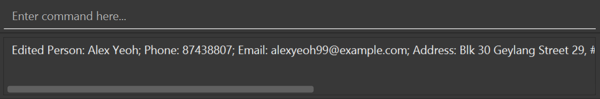 <br>
_Command Panel_ <div/>
- User commands can be entered in the top section labeled `Enter command here...`
- Bottom section displays the result of the command. If command was unsuccessful, displays an error instead.

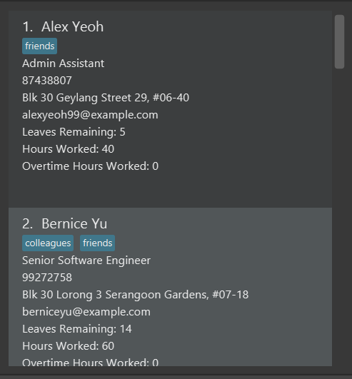 <br>
_List Panel_ <div/>
- Displays the employee list together with its relevant particulars. 

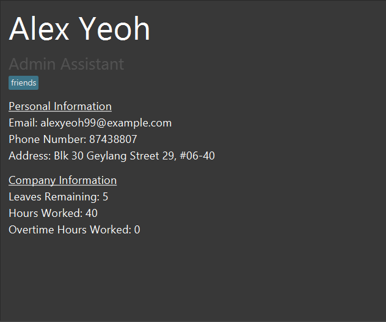 <br>
_Display Panel_ <div/>
- Displays all of a specified employee's information.
- On start-up of the application, on default, it displays the first employee in the list.
    If the employee list is empty, it displays an example person with example attributes. The example is purely visual, and does not exist in the employee list.

--------------------------------------------------------------------------------------------------------------------

## Features

<div markdown="block" class="alert alert-info">

**:information_source: Notes about the command format:**<br>

* Words in `UPPER_CASE` are the parameters to be supplied by the user.<br>
  e.g. in `add n/NAME`, `NAME` is a parameter which can be used as `add n/John Doe`.

* Items in square brackets are optional.<br>
  e.g `n/NAME [t/TAG]` can be used as `n/John Doe t/friend` or as `n/John Doe`.

* Items with `…`​ after them can be used multiple times including zero times.<br>
  e.g. `[t/TAG]…​` can be used as ` ` (i.e. 0 times), `t/friend`, `t/friend t/family` etc.

* Parameters can be in any order.<br>
  e.g. if the command specifies `n/NAME p/PHONE_NUMBER`, `p/PHONE_NUMBER n/NAME` is also acceptable.

* If a parameter is expected only once in the command but you specified it multiple times, only the last occurrence of the parameter will be taken.<br>
  e.g. if you specify `p/12341234 p/56785678`, only `p/56785678` will be taken.

* Extraneous parameters for commands that do not take in parameters (such as `help`, `list`, `exit` and `clear`) will be ignored.<br>
  e.g. if the command specifies `help 123`, it will be interpreted as `help`.

</div>

### General Admin Features

#### Viewing help : `help`

Shows a message explaining how to access the help page.


Format: `help`


#### Adding an employee: `add`

Adds an employee to the employee book.

Format: `add  n/NAME p/PHONE_NUMBER e/EMAIL a/ADDRESS r/ROLE l/LEAVEBALANCE s/HOURLYSALARY hw/HOURSWORKED o/OVERTIME [t/TAG]…​`

* Follow the requirements for the respective fields listed in the table below:

    Field | Requirements | Examples
    --------------|---------------|---------
    `NAME` | Contain alphanumeric characters and spaces only.| `Alice Pauline`
    `PHONE_NUMBER` | Contain numbers only, at least 3 digits long.| `98102832`, `123`
    `EMAIL` | Be in the format of *local-part@domain*. *local-part* should contain only alphanumeric characters certain special characters (`+_.-`). *domain* start and end with alphanumeric characters, must be at least 2 characters long can contain hyphens.| `alice_pauline@example.com`, `benson+miller@gg.com`
    `ADDRESS`| Can take any value.| `123 Alice Street`, `College of Alice & Peter Tan #01-124`
    `ROLE`| Start with alphabet, followed by alphanumeric characters or certain special characters (`-&/()[]`). Only 2 sets of brackets are allowed in total. | `Team Lead (UI/UX Design)`, `R&D Manager`
    `LEAVEBALANCE`| Non-negative integers only. |`12`,`0`
    `HOURLYSALARY`| Non-negative numbers with two or less decimal places only.| `12.98`,`0.33`
    `HOURSWORKED`| Positive integers only. | `12`,`1`
    `OVERTIME`| Non-negative integers only. | `12`,`0`
    `TAG`| Contain alphanumeric characters only. | `friend`, `1st superior`


<div markdown="span" class="alert alert-primary">:bulb: **Tip:**
An employee can have any number of tags (including 0)
</div>

Examples:
* `add n/John Doe p/98765432 e/johnd@example.com a/John street, block 123, #01-01 r/Admin Assistant l/14 s/9.50 hw/40 o/0`
* `add n/Betsy Crowe t/friend r/Designer s/25 hw/60  l/21  e/betsycrowe@example.com a/Newgate Prison p/1234567 o/0 t/criminal`
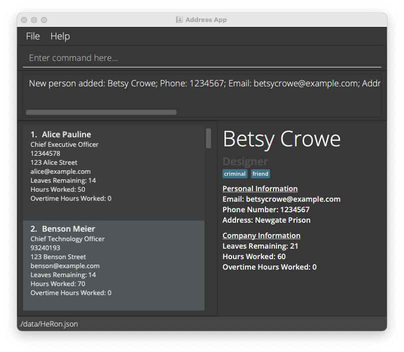

#### Listing all employees : `list`

Shows a list of all employees in the employee book.

Format: `list`

#### Viewing employee data: `view`

View the data of the specified employee at the InfoPanel.

Format: `view INDEX`
* Displays the data of the employee at the specified `INDEX`.
* The index refers to the index number shown in the displayed employee list.
* The index **must be a positive integer** 1, 2, 3, ...​

Example:
* `list` followed by `view 3` displays the information of the 3rd employee in the employee list.
* `find r/Financial Manager` followed by `view 1` displays the information of the 1st employee in the list of employees that have the Financial Manager role.

#### Editing an employee : `edit`

Edits an existing employee in the employee book.

Format: `edit INDEX [n/NAME] [p/PHONE] [e/EMAIL] [a/ADDRESS] [r/ROLE] [l/LEAVEBALANCE] [s/HOURLYSALARY] [hw/HOURS_WORKED] [o/OVERTIME] [t/TAG]…​`

* Edits the employee at the specified `INDEX`. The index refers to the index number shown in the displayed employee list. The index **must be a positive integer** 1, 2, 3, …​
* At least one of the optional fields must be provided.
* Existing values will be updated to the input values.
* When editing tags, the existing tags of the employee will be removed i.e adding of tags is not cumulative.
* You can remove all the employee’s tags by typing `t/` without
    specifying any tags after it.
* The values of LEAVEBALANCE, HOURS_WORKED and OVERTIME **must be non-negative integers.**
* The value of HOURLYSALARY **must be a non-negative number with up to 2 decimal places.**
* **NOTE:** The edit command is unable to directly edit the dates of leaves taken by employees.
Refer to the `addLeaves` and `removeLeaves` commands below instead to edit the dates.

Examples:
*  `edit 1 p/91234567 e/johndoe@example.com l/15` Edits the phone number, email address and leaves of the 1st employee to be `91234567`, `johndoe@example.com` and `15` respectively.
*  `edit 2 n/Betsy Crower t/` Edits the name of the 2nd employee to be `Betsy Crower` and clears all existing tags.

#### Locating specific employees: `find`

Find employees using specified fields, checking if their information field contains any of the given keywords / queries.

Format: `find [KEYWORDS]... [n/NAME] [p/PHONE] [e/EMAIL] [a/ADDRESS] [r/ROLE] [l/LEAVEBALANCE] [s/HOURLYSALARY] [hw/HOURS_WORKED] [o/OVERTIME] [t/TAG]...`

* At least one field should be specified.
* The order of the fields do not matter except for the `[KEYWORD]` field, which must come right after `find`.  
* The filters work differently for each field and can be generalised to 3 types of queries, described below. A single find command can contain all 3 types of queries at once.
  * **Type 1 Query: Keyword Matching**
    * Fields: `n/NAME`, `p/PHONE`, `e/EMAIL`, `a/ADDRESS`, `r/ROLE`, `t/TAG`
      * These fields will find all people who contain the given keywords in their respective fields. They are not case-sensitive.
      * The exception is the `p/PHONE` field, which only finds exact matches.
      
    * For example, `find p/91234567 e/alice bob r/Admin` will find anyone who satisfies all the following 3 criteria:
      1. has the phone number 91234567, 
      2. whose email contains `alice` or `bob`, and 
      3. whose role contains `Admin`.
      
  * **Type 2 Query: Value Based Comparison**  
    * Fields: `hw/HOURS_WORKED`, `l/LEAVEBALANCE`, `s/HOURLYSALARY`, `o/OVERTIME`
      * These fields must be specified with a comparison and a value to compare the respective field to. Valid comparisons are
        * `>`: more than
        * `>=`: more than or equal to
        * `=`: equal to
        * `<`: less than
        * `<=`: less than or equal to
        
    * For example, `find hw/>=10 l/<7` will find anyone who satisfies the both of the following 2 criteria:
      1. has worked more than or exactly 10 hours, and
      2. has less than 7 days of leave left (e.g. 6 and below)
          
    * You cannot enter more than 1 comparison or value to compare to. For example, `find hw/<10 >5` is not valid.
      
  * **Type 3 Query: Condition Based Filter**
    * There are no fields attached to this query. Instead, specific keywords are available for use.
      * These keywords must be used right after `find` and cannot be used after a field is specified (for example `n/`).
      * Keywords available include:
        * `unpaid`
        * More to be added.
    * For example, `find unpaid` will find all employees who are considered unpaid
    
* For each field, you can search using multiple keywords by separating each keyword with a space, in the same field.
  * For example, `find n/John Mike` will return all employees whose name contains either John or Mike.

Examples:
* `find unpaid n/John Mike r/admin l/<=5 o/>3` finds all employees who satisfy all the following criteria:
  1. is considered unpaid in the system,
  2. whose name is either John or Mike,
  3. whose role contains the word `admin`,
  4. has 5 or less than 5 leaves, and
  5. has strictly more than 3 days of overtime
  
* (To be updated) `find n/alex david l/<3` returns `Alex Yeoh`, `David Li` as long as they have less than 3 leaves left.<br>
   
  
#### Deleting an employee : `delete`

Deletes the specified employee from the application.

Format: `delete INDEX`

* Deletes the employee at the specified `INDEX`.
* The index refers to the index number shown in the displayed employee list.
* The index **must be a positive integer** 1, 2, 3, …​
* The index cannot exceed the length of the employee list.

Examples:
* `list` followed by `delete 2` deletes the 2nd employee in the employee book.
* `find n/Betsy` followed by `delete 1` deletes the 1st employee in the results of the `find` command.

#### Clearing all entries : `clear`

Clears all entries from the employee book.

Format: `clear`

#### Exiting the program : `exit`

Exits the program.

Format: `exit`

### Leave-related Features

#### Add number of leaves for an employee : `addLeaveBalance`

Adds the specified number of leaves to the current leave balance (number of days of leave left) of a chosen employee.

Format: `addLeaveBalance INDEX l/LEAVES`

* Adds the specified number to the number of leaves of the employee at the specified `INDEX`.
* The index refers to the index number shown in the displayed employee list.
* The index **must be a positive integer** 1, 2, 3, …
* The number of leaves **must be a positive integer** 1, 2, 3, …

Examples:
* `list` followed by `addLeaveBalance 3 l/4` adds 4 days of leave to the 3rd employee in the employee book.
* `find n/Sam` followed by `addLeaveBalance 1 l/1` adds 1 day of leave to the 1st employee in the results of the `find` command.

#### Subtract number of leaves for an employee : `subtractLeaveBalance`

Subtracts the specified number of leaves from the current leave balance (number of days of leave left) of a chosen employee.

Format: `subtractLeaveBalance INDEX l/LEAVES`

* Subtracts the specified number from the number of leaves of the employee at the specified `INDEX`.
* The index refers to the index number shown in the displayed employee list.
* The index **must be a positive integer** 1, 2, 3, …
* The number of leaves **must be a positive integer** 1, 2, 3, …
* The number of leaves to be removed **cannot be greater than the amount of leaves in the employee's leave balance.** 

Examples:
* `list` followed by `subtractLeaveBalance 2 l/1` removes 1 day of leave from the 2nd employee in the employee book.
* `find n/Anthony` followed by `subtractLeaveBalance 4 l/2` removes 2 days of leave from the 4th employee in the results of the `find` command.

#### Assign a leave with a date to an employee : `assignLeave`

Assigns a leave that is associated with a date to a chosen employee.

Format: `assignLeave INDEX d/DATE`

* Assigns a leave to the employee at the specified `INDEX`, while subtracting 1 leave from the employee's leave balance.
* The employee must have **at least 1 leave** in their leave balance.   
* The index refers to the index number shown in the displayed employee list.
* The index **must be a positive integer** 1, 2, 3, …
* The date **must be valid** and of the form **YYYY-MM-DD**.

Examples:
* `list` followed by `assignLeave 2 d/2021-11-10` assigns a leave with the date 10th November 2021 to the 2nd employee in the employee book.
* `find n/Anthony` followed by `assignLeave 1 d/2021-01-08` assigns a leave with the date 8th January 2021 to the 1st employee in the results of the `find` command.

### Payroll-related Features

#### Add number of hours worked/overtime to an employee : `addHoursWorked`

Adds the specified number of hours worked or overtime to a chosen employee.

Format: `addHoursWorked INDEX [hw/HOURS_WORKED] [o/OVERTIME]`

* At least one field (HOURS_WORKED or OVERTIME) should be specified.
* Adds the specified number of hours worked/overtime to the employee at the specified `INDEX`.
* The index refers to the index number shown in the displayed employee list.
* The index **must be a positive integer** 1, 2, 3, …
* The number of hours worked/overtime **must be a positive integer** 1, 2, 3, …

Examples:
* `list` followed by `addHoursWorked 5 hw/5 o/5` adds 5 hours worked and 5 hours of overtime to the 5th employee in the employee book.
* `find n/Sam` followed by `addHoursWorked 2 o/5` adds 5 hours of overtime to the 2nd employee in the results of the `find` command.

#### Remove number of hours worked/overtime from an employee : `removeHoursWorked`

Removes the specified number of hours worked or overtime from a chosen employee.

Format: `removeHoursWorked INDEX [hw/HOURS_WORKED] [o/OVERTIME]`

* At least one field (HOURS_WORKED or OVERTIME) should be specified.
* Removes the specified number of hours worked/overtime from the employee at the specified `INDEX`.
* The index refers to the index number shown in the displayed employee list.
* The index **must be a positive integer** 1, 2, 3, …
* The number of hours worked/overtime **must be a positive integer** 1, 2, 3, …
* The number of hours worked/overtime to be removed **cannot be greater than the employee's current number of hours worked/overtime.**

Examples:
* `list` followed by `removeHoursWorked 2 hw/5 o/3` removes 5 hours worked and 3 hours of overtime from the 2nd employee in the employee book.
* `find n/Sam` followed by `removeHoursWorked 1 o/2` removes 2 hours of overtime from the 1st employee in the results of the `find` command.

#### Start Payroll : `startPayroll`

Calculates the payroll of all employees and mark them as awaiting the payment.

The payroll formula is: `HOURSWORKED * HOURLYSALARY + OVERTIME * HOURLYSALARY * OVERTIMEPAYRATE`,<br>
where `OVERTIMEPAYRATE` is the added pay rate for overtime as compared to normal work hours.<br>
It can be viewed through the `viewOvertimePayRate` command or changed through the `setOvertimePayRate` command.

Format: `startPayroll`
* Calculates the payroll of **all employees regardless of current viewing list** based on the formula above.
* After that, marks all employees as awaiting payment of the calculated amount.
  This will produce red labels under each employee data stating 'NOT PAID' and the amount they are owed.
* Finally, display the list of all employees.
* This command is typically followed up by `pay` commands to mark employees as paid, 
  after their salaries are given in real life.

Example:
* Before `startPayroll` command, currently viewing a filtered list.
  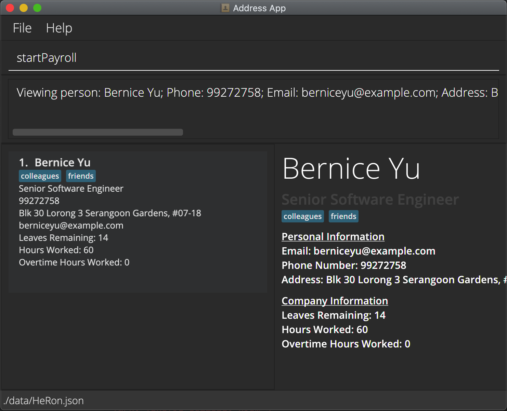
  

* After `startPayroll` command, payroll have been calculated and currently viewing the full list of employees.
  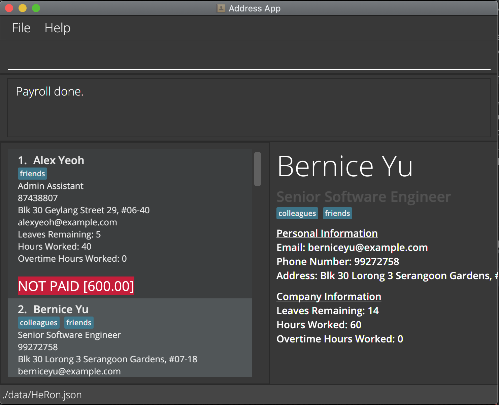
  
Notes:
* All employees must not have any pay pending from the previous payroll. Otherwise, an error will be shown:
  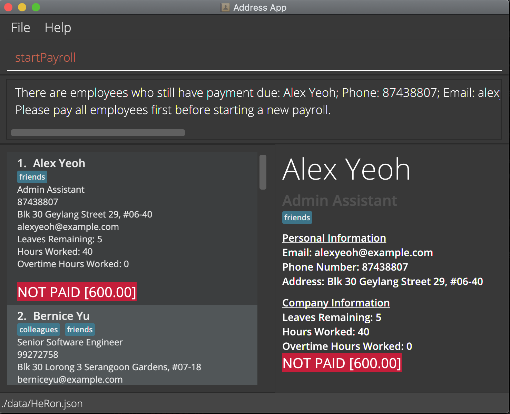
* To start a new payroll, first make sure to pay all employees using the `pay` command.

#### Paying employee : `pay`

Marks the specified employee as paid.

Format: `pay INDEX`
* Simulates the paying of an employee by clearing the salary owed to the employee by setting it back to 0. This clears the red
  `NOT PAID` label under the employee's data.
* The number of hours worked and overtime hours of the employee will be reset to 0 as well.
* This command is to typically used after the `startPayroll` command, which sets the pay owed to the respective employees.
  The pay command can then be followed after to clear the pay owed.
* The index refers to the index number shown in the displayed employee list.
* The index **must be a positive integer** 1, 2, 3, …​

Example:
* `pay 1` marks the 1st employee in the Employee list as paid clearing the pay owed, number of hours worked and overtime hours of the employee.
  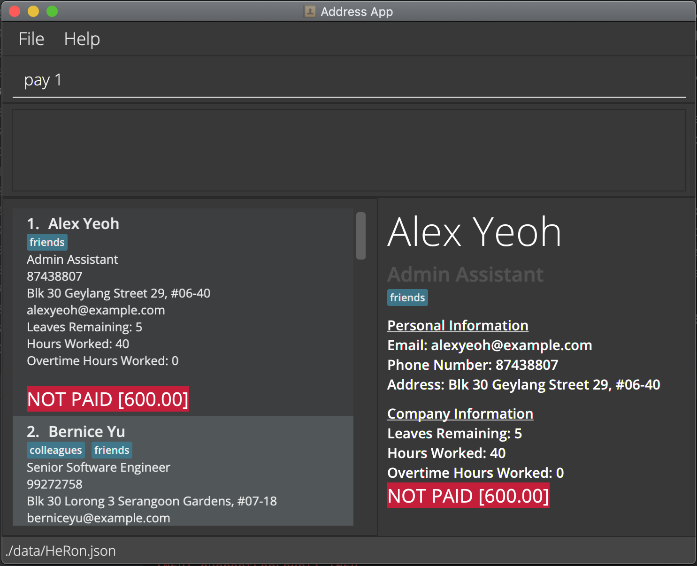<br><br>
  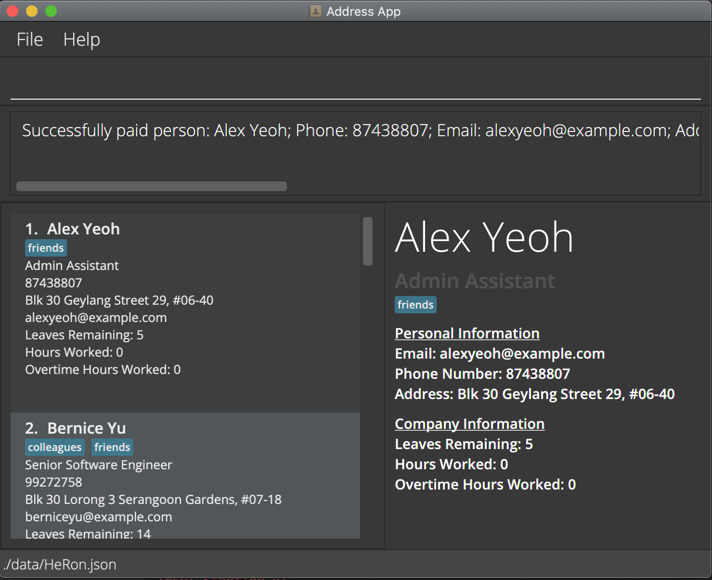

#### View the Overtime Pay Rate : `viewOvertimePayRate`

Displays the current overtime pay rate set in the application.

Format: `viewOvertimePayRate`

* Displays the current overtime pay rate in the feedback panel.
  
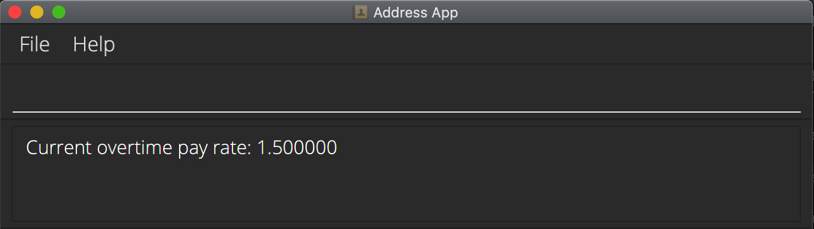

#### Set a new Overtime Pay Rate : `setOvertimePayRate`

Sets a new overtime pay rate to be used in payroll calculations.

Format: `setOvertimePayRate OVERTIMEPAYRATE`

* Sets the overtime pay rate in the application to `OVERTIMEPAYRATE`.
* `OVERTIMEPAYRATE` should have a value of at least 1.

Examples:
* `setOvertimePayRate 2.0` sets the new overtime pay rate to be 2x.
  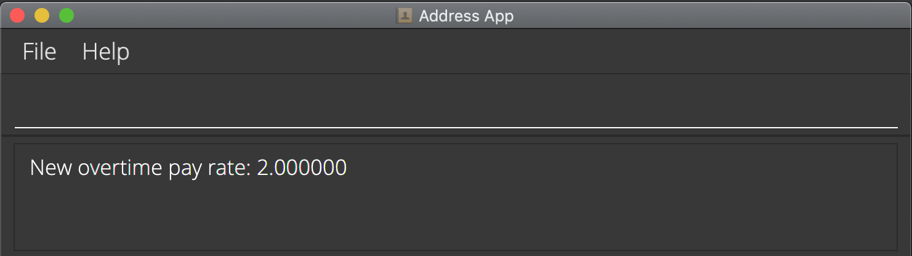
  

* `setOvertimePayRate 0.5` would be invalid as `OVERTIMEPAYRATE` must be at least 1. An error message would be shown.
  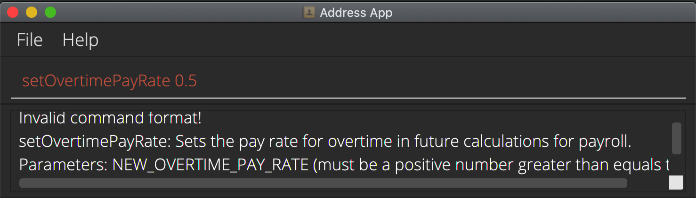

### Data-related Features

#### Import Data from CSV files: `import`

Imports the data from a specified `.csv` file.

Format: `import FILEPATH`
* Imports relevant data from the specified filepath, which can be absolute or relative (to the `.jar` application).
* Only one `FILEPATH` should be specified.
* A header row is required to indicate the purpose of the various fields, and it must be the first row in the `.csv` file.
* Ensure that the header rows of the respective fields in the `.csv` file are labelled according to the naming convention in the table below.
* Ensure that each field follows the specifications required, which can be found [here](#Adding an Employee).
* Ensure that the number of columns in each entry matches the number of headers.
* If multiple tags are present for an entry, they should be seperated by `/`.
* No specific ordering of the columns is required.
* If any compulsory fields are missing, the app only alerts the user of the first instance of a missing field.

#####Header Naming Conventions and Requirements

Field | Rename to ... (Case-Insensitive) | Compulsory for Import? 
--------------|---------------|------------------------
`NAME`|Name|Yes|
`PHONE_NUMBER` |Contact Number|Yes
`ADDRESS` |Residential Address|Yes
`EMAIL` |Email|Yes
`ROLE` |Role|Yes
`LEAVEBALANCE` |Leave Balance|No
`HOURLYSALARY` |Salary|No
`HOURSWORKED` |Hours Worked|No
`OVERTIME` |Overtime|No
`TAGS`|Tags|No

Example:`import ./toBeImported` should have the following behaviours under the following situations.
* Successful Import
  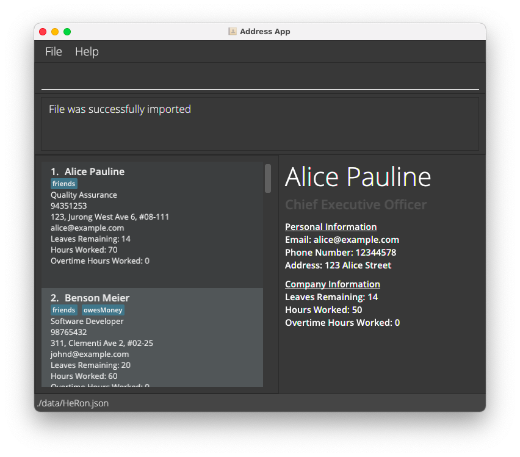
* Multiple entries missing compulsory fields.
  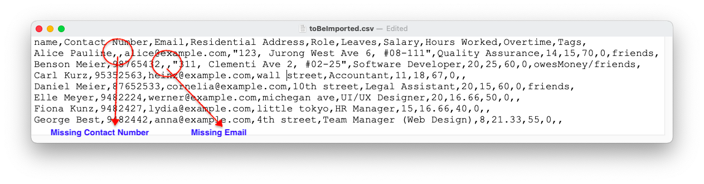
  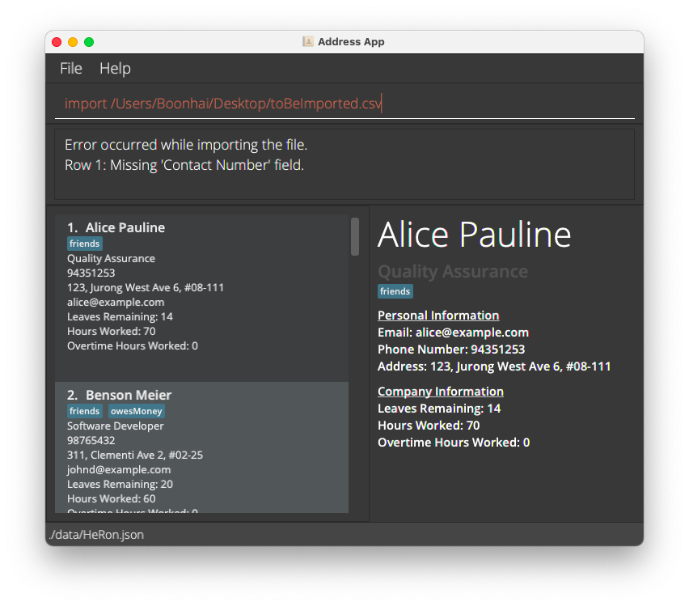
* Multiple Tags present in entry.
  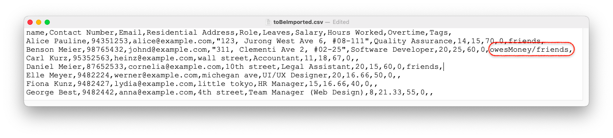
  

#### Saving the data

HeRon data are saved in the hard disk automatically after any command that changes the data. There is no need to save manually.

#### Editing the data file

HeRon data are saved as a JSON file `[JAR file location]/data/HeRon.json`. Advanced users are welcome to update data directly by editing the data file.

<div markdown="span" class="alert alert-warning">:exclamation: **Caution:**
If your changes to the data file makes its format invalid, HeRon will discard all data and start with an empty data file at the next run.
</div>

_Details coming soon ..._

--------------------------------------------------------------------------------------------------------------------

## FAQ - Frequently Asked Questions

**Q**: How do I transfer my data to another Computer?<br>
**A**: Install the app in the other computer and overwrite the empty data file it creates with the file that contains the data of your previous HeRon home folder.

--------------------------------------------------------------------------------------------------------------------

## Command summary

List of available commands with their respective format and example usages for quick references.

Action | Format, Examples
--------|------------------
**Help** | `help`
**Add** | `add n/NAME p/PHONE_NUMBER e/EMAIL a/ADDRESS r/ROLE l/LEAVEBALANCE s/HOURLYSALARY hw/HOURSWORKED o/OVERTIME[t/TAG]…​` <br> e.g., `add n/John Doe p/98765432 e/johnd@example.com a/John street, block 123, #01-01 r/Admin Assistant l/14 s/9.50 hw/40 o/0 t/friend t/colleague`
**List** | `list`
**View** | `view INDEX`
**Edit** | `edit INDEX [n/NAME] [p/PHONE_NUMBER] [e/EMAIL] [a/ADDRESS] [r/ROLE] [l/LEAVES] [s/HOURLYSALARY] [hw/HOURS_WORKED] [o/OVERTIME] [t/TAG]…​`<br> e.g.,`edit 2 n/James Lee e/jameslee@example.com l/15`
**Find** | `find [KEYWORDS]... [n/NAME] [p/PHONE] [e/EMAIL] [a/ADDRESS] [r/ROLE] [l/LEAVES] [s/SALARY] [hw/HOURS_WORKED] [o/OVERTIME] [t/TAG]...`<br> e.g., `find n/Alex r/Admin Assistant`
**Delete** | `delete INDEX`<br> e.g., `delete 3`
**Clear** | `clear`
**Exit** | `exit`
**Add to Leave Balance** | `addLeaveBalance INDEX l/LEAVES` <br> e.g., `addLeaves 1 l/2`
**Subtract from Leave Balance** | `subtractLeaveBalance INDEX l/LEAVES` <br> e.g., `removeLeaves 4 l/1`
**Assign Leave** |  `assignLeave INDEX d/DATE` <br> e.g., `assignLeaves d/2021-10-30`
**Add Hours Worked/Overtime** | `addHoursWorked INDEX [hw/HOURS_WORKED] [o/OVERTIME]` <br> e.g., `addHoursWorked 1 hw/2 o/3`
**Remove Hours Worked/Overtime** | `removeHoursWorked INDEX [hw/HOURS_WORKED] [o/OVERTIME]` <br> e.g., `removeHoursWorked 4 hw/1 o/2`
**Start Payroll** | `startPayroll`
**Pay Employee** | `pay INDEX`<br> e.g., `pay 3`
**View Overtime Pay Rate** | `viewOvertimePayRate`
**Set a new Overtime Pay Rate** | `setOvertimePayRate OVERTIMEPAYRATE`<br> e.g., `setOvertimePayRate 2.0`
**Import** | `import FILEPATH`
