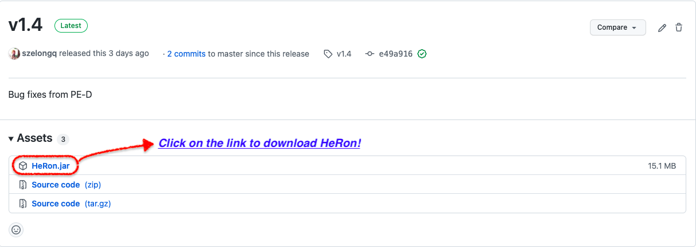
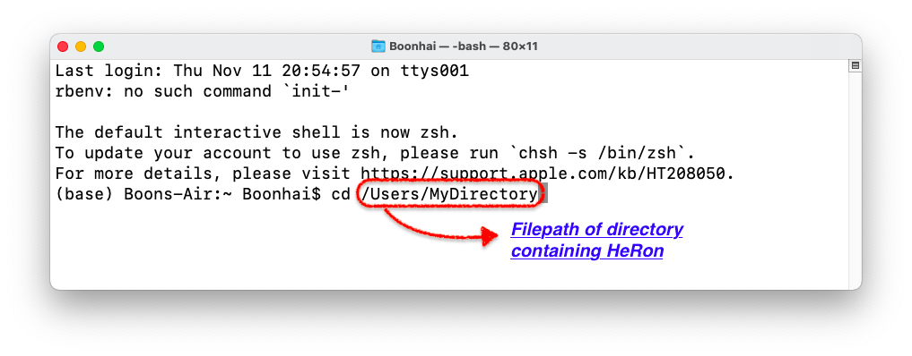
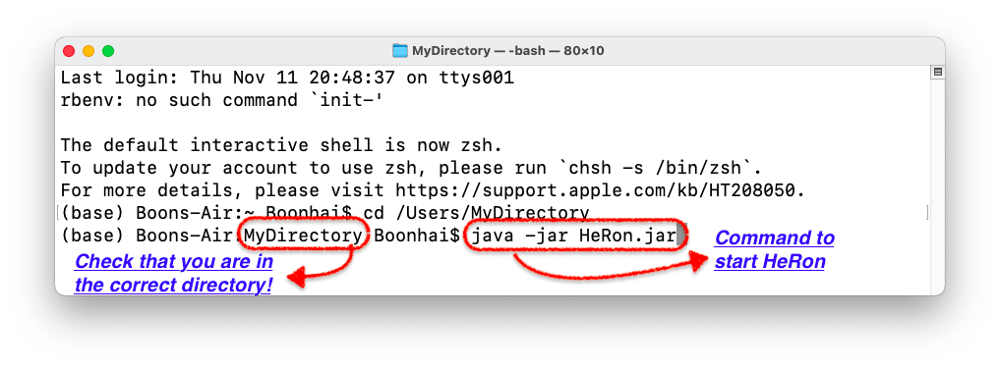
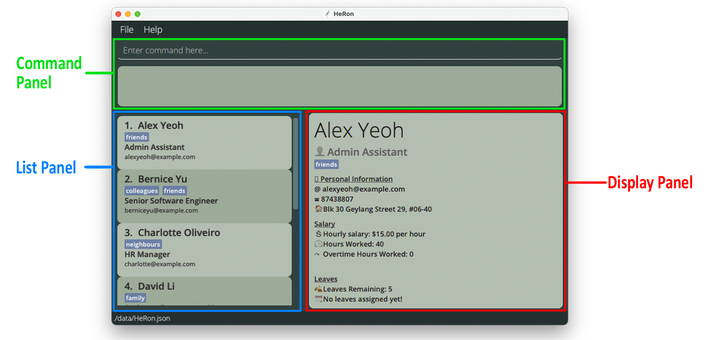

HeRon is a desktop application for HR managers of Small-Medium Enterprises (SMEs) to assist them in managing HR administrative tasks such as tracking leaves and offs, calculating pay and updating payroll information. It is optimized for use via a Command Line Interface (CLI) while still having the benefits of a Graphical User Interface (GUI). If you are a fast typer, HeRon can get your tasks done faster as compared to traditional GUI apps.

This User Guide will bring you through the features that HeRon has to offer, as well as the commands to make use of them.

If you are... | What to do next
--------|------------------
**a new user** | You can follow the [Quick Start Guide](#quick-start) to set up HeRon and get to work right away.
**a returning user** | You can take a look at the [Command Summary](#command-summary) if you need to jog your memory, or use the table of contents below if you want to take a look at a specific command.

--------------------------------------------------------------------------------------------------------------------

<div style="page-break-after: always;"></div>

<h2>Table of Contents</h2>

* Table of Contents
{:toc}

--------------------------------------------------------------------------------------------------------------------

<div style="page-break-after: always;"></div>

## Quick start

1. Ensure that you have Java 11 or above installed in your computer. If you do not have Java 11, you can install it [here](https://www.oracle.com/java/technologies/downloads/).

2. Download the latest `HeRon.jar` from [here](https://github.com/AY2122S1-CS2103T-F11-3/tp/releases). You should see the following on the download page. <br>

   

3. Copy the file to the folder you want to use as the _home folder_ for your HeRon.

4. Start the app. 
   1. If you are using Windows, you can double-click on HeRon.jar in the folder you used in Step 3. 
   2. If you are using MacOS or Linux, open up your terminal and navigate to the folder containing HeRon. Use the command ```java -jar HeRon.jar``` to start up the app. In the following example, HeRon is located in `Users` -> `MyDirectory`. <br>
   
   

5. The GUI similar to the below should appear in a few seconds. Note how the app contains some sample data.<br>
   

6. Type the command in the command box and press Enter to execute it. e.g. typing **`help`** and pressing Enter will open the help window.<br>

   Some example commands you can try:

   * `import ./toBeImported.csv` : Imports the .csv file named `toBeImported.csv` in the same directory as the application into HeRon. This removes the current existing data and replaces it with the data in the .csv file.

   * `add n/John Doe p/98765432 e/johnd@example.com a/John street, block 123, #01-01 r/Admin Assistant l/14 s/9.50 hw/40 o/0` : Adds an employee named `John Doe` with the above details to HeRon.

   * `delete 3` : Deletes the 3rd employee shown in the current list.

   * `find n/John`: Finds all employees with `John` in their name.
   
   * `view 2`: View the 2nd employee shown in the current list.
   
   * `list` : Lists all contacts.

   * `exit` : Exits the app.
  
7. Refer to the [Entering Commands](#entering-commands) section for more information on the input commands used in HeRon, and the [Command](#command) section for more information on what each command does.

--------------------------------------------------------------------------------------------------------------------
## Interface Layout
 <br>

### Command Panel <br>
 <br>
- You can enter your commands into the Command Box
- The Result Display shows the result of the command that has been executed. If the command was unsuccessful, it displays an error instead.

<div style="page-break-after: always;"></div>

### List Panel <br>
 <br>
- Displays the employee list together with its relevant particulars.
- Employees are listed as cards that contain the name, role, email and tags of the employee.

<div style="page-break-after: always;"></div>

### Display Panel <br>
 <br>
- Displays all of a specified employee's information.
- On start-up of the application, it displays the first employee in the list.
    If the employee list is empty, no employee information would be shown in this panel.

--------------------------------------------------------------------------------------------------------------------
<div style="page-break-after: always;"></div>

## Entering Commands
Commands can be inputted into the Command Box to get HeRon to perform an operation.
Commands can be divided into separate components, each serving different purposes. Depending on the format of the command,
they may or may not use all components. Below shows an example of a command with its various components:


<div markdown="block" class="alert alert-info">

**Please read this information panel for more information on commands before proceeding.**

**:information_source: Notes about the command format:**<br>

* Words in `UPPER_CASE` are the fields to be supplied by the user.<br>
  e.g. in `add n/NAME`, `NAME` is a field which can be used as `add n/John Doe`.

* Items in square brackets `i.e. []` are optional.<br>
  e.g `n/NAME [t/TAG]` can be used as `n/John Doe t/friend` or as `n/John Doe`.

* Items with `…`​ after them can be used multiple times including zero times.<br>
  e.g. `[t/TAG]…​` can be used as ` ` (i.e. 0 times), `t/friend`, `t/friend t/family` etc.

* Fields can be in any order.<br>
  e.g. if the command specifies `n/NAME p/PHONE_NUMBER`, `p/PHONE_NUMBER n/NAME` is also acceptable.

* If a field is expected only once in the command but is specified multiple times, only the last occurrence of the field will be taken.<br>
  e.g. if you specify `p/12341234 p/56785678`, only `p/56785678` will be taken.

* Extraneous fields for commands that do not take in fields (such as `help`, `list`, `exit` and `clear`) will be ignored.<br>
  e.g. if the command specifies `help 123`, it will be interpreted as `help`.

</div>

### Command Format Table

The following table describes the input format of each field as well as any requirements
for all commands in HeRon.

Field | Requirements | Examples
--------------|---------------|---------
`INDEX` | Refers to the number next to an employee's name in the displayed employee list.| `1`,`3`
`NAME` | Contain alphanumeric characters and spaces only. | `Alice Pauline`, `Benson Meier`
`PHONE_NUMBER` | Contain numbers only, at least 3 digits long. | `98102832`, `123`
`EMAIL` | Be in the format of *local-part@domain*. *local-part* should contain only alphanumeric characters and/or certain special characters (`+_.-`), and cannot start or end with any special characters. *domain* should start and end with alphanumeric characters, must be at least 2 characters long, and can contain hyphens. | `alice_pauline@example.com`, `benson-miller@gg.com`
`ADDRESS`| Can take any value.| `123 Alice Street`, `College of Alice Tan #01-124`
`ROLE`| Start with alphabet, followed by alphanumeric characters or certain special characters (`-&/()[]`). Only 2 sets of brackets are allowed. | `Team Lead (UI/UX Design)`, `R&D Manager`
`NUMBER_OF_LEAVES`| Whole numbers from 0 to 365. |`12`, `0`
`DATE` | A valid date in the form YYYY-MM-DD. | `2020-03-10`, `2021-11-02`
`HOURLY_SALARY`| Numbers from 0 to 1000 with two or less decimal places only.| `12.98`, `0.33`
`HOURS_WORKED`| Whole numbers from 1 to 744.| `12`, `1`
`OVERTIME`| Whole numbers from 0 to 744. | `12`, `0`
`TAG`| Contain alphanumeric characters only. | `friend`, `supervisor`
`OVERTIME_PAY_RATE`| Numbers from 1 to 10 with five or less decimal places only. | `1.5`, `2.0`, `3.45678`

<div markdown="span" class="alert alert-primary">:bulb: **Tip:**
An employee can have any number of tags (including 0)
</div>

--------------------------------------------------------------------------------------------------------------------

## Commands

### General Admin Commands

#### Import Data from CSV files: `import`

HeRon assists you in starting by making it easy to migrate from other software, such as Excel. To transfer your existing data, convert it into a Comma Separated Value (.csv) file. If you require help in exporting your spreadsheet in Excel to a .csv file, you can refer to this [guide](https://support.microsoft.com/en-us/office/save-a-workbook-to-text-format-txt-or-csv-3e9a9d6c-70da-4255-aa28-fcacf1f081e6_) by Microsoft.

This command then allows you to migrate the data in the csv file that you have, replacing the existing data in HeRon.

**Format:** `import FILEPATH`
* Filepath Requirements
  * You should only specify **ONE** `FILEPATH`, which can be absolute or relative.
  * Write the filepath following your devices' Operating System. (e.g. `\My Folder\myData.csv` for Windows; `/My Folder/myData.csv` for MacOS/Linux).
<br><br>
* Formatting Requirements
  * Use the first row in the .csv file as the header row to indicate the purpose of the various fields.
  * Ensure that the header rows of the respective fields are labelled according to the naming convention in the table below.
  * There is no specific requirement for ordering of the columns.
  * Ensure that the number of fields in each entry matches the number of headers.
<br><br>
* Data Requirements
  * Ensure all entries have data in the compulsory fields, listed in the table below.
  * Ensure that each field follows the specifications required, which you can find in the [Command Format Table](UserGuide.md#command-format-table).
  * HeRon prevents you from importing data if an entry has the same `Name`, `Email` or `Contact Number` as another entry.
  * Separate your data's tag field with `/` if multiple tags are present.
  * If you provide a value for a non-compulsory field for at least one entry, you must also provide the respective values for all other entries. On the other hand, if you do not provide data for the field, it would be set to the default value for all entries.

<div markdown="block" class="alert alert-info">
:information_source: Take note: If there are multiple instances of duplicated/missing/incorrect data, HeRon will only notify you of the first row has errors present.
</div>

**Field Naming Requirements and Default Values**

Field | Rename to ... (Case-Insensitive) | Compulsory for Import? | Default Value
--------------|---------------|------------------------ | --------
`NAME`|Name|**Yes**| N.A.
`PHONE_NUMBER` |Contact Number|**Yes**| N.A.
`ADDRESS` |Residential Address|**Yes**| N.A.
`EMAIL` |Email|**Yes**| N.A.
`ROLE` |Role|**Yes**| N.A.
`NUMBER_OF_LEAVES` |Leave Balance|No | 0
`HOURLY_SALARY` |Salary|No | 0.00
`HOURS_WORKED` |Hours Worked|No | 0
`OVERTIME` |Overtime|No | 0
`TAGS`|Tags|No| Empty Set of Tags

**Example:** You should see the following behaviours for the command, `import ./toBeImported`.
* Successful Import
  

* Multiple entries missing compulsory fields.
  
  

<div style="page-break-after: always;"></div>

* Multiple Tags present in entry.
  
  

#### Viewing employee data: `view`

This command allows you to view the data of the specified employee at the InfoPanel.

**Format:** `view INDEX`
* Displays the data of the employee at the specified `INDEX`.
* The index refers to the number next to an employee's name in the displayed employee list.

**Example:**
* `list` followed by `view 3` displays the information of the 3rd employee in the employee list.
* `find r/Financial Manager` followed by `view 1` displays the information of the 1st employee in the list of employees that have the Financial Manager role.

<div style="page-break-after: always;"></div>

#### Adding an employee: `add`

This command allows you to add a new employee into HeRon, as long as the all details of the employee is given and follow the requirements.

<div markdown="block" class="alert alert-info">
:information_source: Take note: You cannot add an employee with the same Name, Email or Phone Number used by another existing employee in HeRon.
</div>

**Format:** `add  n/NAME p/PHONE_NUMBER e/EMAIL a/ADDRESS r/ROLE l/NUMBER_OF_LEAVES s/HOURLY_SALARY hw/HOURS_WORKED o/OVERTIME [t/TAG]…​`

* Follow the requirements for the respective fields listed in the [Command Format Table](#command-format-table) above.

**Examples:**
* `add n/John Doe p/98765432 e/johnd@example.com a/John street, block 123, #01-01 r/Admin Assistant l/14 s/9.50 hw/40 o/0`
* `add n/Betsy Crowe r/Designer s/25 hw/60  l/21  e/betsycrowe@example.com a/Newgate Prison p/1234567 o/0 t/criminal t/friend`
  
  _Result of adding a new employee Betsy successfully to HeRon_ <br>

<div style="page-break-after: always;"></div>

#### Editing an employee : `edit`

Edits an existing employee in HeRon.

**Format:** `edit INDEX [n/NAME] [p/PHONE] [e/EMAIL] [a/ADDRESS] [r/ROLE] [l/NUMBER_OF_LEAVES] [s/HOURLY_SALARY] [hw/HOURS_WORKED] [o/OVERTIME] [t/TAG]…​`

* Edits the employee at the specified `INDEX`.
  The index refers to the number next to an employee's name in the displayed employee list.
* At least one of the optional fields must be provided.
* Existing values will be updated to the input values.
* When editing tags, the existing tags of the employee will be removed i.e adding of tags is not cumulative.
* You can remove all the employee’s tags by typing `t/` without
  specifying any tags after it.
* The values you provide to the command must be valid. For information on which values are valid, you may refer to the [Command Table Format](UserGuide.md#command-format-table) for more information.

<div markdown="block" class="alert alert-info">
:information_source: Take note: The edit command is unable to directly edit the dates of leaves taken by employees.
Refer to the `assignLeave` and `removeLeavesBefore` commands below instead to edit the dates.
</div>

**Examples:**
* `edit 1 p/91234567 e/johndoe@example.com l/15` Edits the phone number, email address and leaves of the 1st employee to be `91234567`, `johndoe@example.com` and `15` respectively.
* `edit 2 n/Betsy Crower t/` Edits the name of the 2nd employee to be `Betsy Crower` and clears all existing tags.

#### Deleting an employee : `delete`

This command allows you to delete a specific employee from the application.


**Format:** `delete INDEX`

* Deletes the employee at the specified `INDEX`.
* The index refers to the number next to an employee's name in the displayed employee list.

**Examples:**
* `list` followed by `delete 2` deletes the 2nd employee in HeRon.
* `find n/Betsy` followed by `delete 1` deletes the 1st employee in the results of the `find` command.

<div style="page-break-after: always;"></div>

#### Locating specific employees: `find`

Find employees using specified fields, checking if their information field contains any of the given keywords / queries.

**Format:** `find [STATUS] [n/NAME] [p/PHONE] [e/EMAIL] [a/ADDRESS] [r/ROLE] [l/NUMBER_OF_LEAVES] [d/DATE] [s/HOURLY_SALARY] [hw/HOURS_WORKED] [o/OVERTIME] [t/TAG]...`

* At least one field should be specified.
* The order of the fields do not matter except for the `[STATUS]` field, which must come right after `find`.
* To search a field with multiple values, separate each value with a space after their respective tag.
  * Example: Use `find n/Alice Charlotte` to search for `Alice` or `Charlotte` in the `name` field.
* The filters work differently for each field and can be generalised to 4 types of queries, described below. A single find command can contain all 4 types of queries at once.<br>
  <br>
  * **Type 1 Query: Keyword Matching**
    * Fields: `n/NAME`, `p/PHONE`, `e/EMAIL`, `a/ADDRESS`, `r/ROLE`, `t/TAG`
      * These fields will find all employees who contain the given keywords in their respective fields. They are not case-sensitive.
      * The exceptions are:
        * `p/PHONE` field, which only find exact matches.
        * `n/NAME` field, which can find matches when a complete part (first/middle/last) of a name is given. (e.g. For name "Charlotte Oliverio", both `n/Charlotte` and `n/Oliverio` works, but `n/Char` or `n/Oliver` will not)
    * For example, `find p/91234567 e/alice bob r/Admin` will find anyone who satisfies all the following 3 criteria:
      1. has the phone number 91234567,
      2. whose email contains `alice` or `bob`, and
      3. whose role contains `Admin`.<br>
  <br>
  * **Type 2 Query: Value Based Comparison**
    * Fields: `hw/HOURS_WORKED`, `l/NUMBER_OF_LEAVES`, `s/HOURLY_SALARY`, `o/OVERTIME`
      * These fields must be specified with a comparison and a value to compare the respective field to. Valid comparisons are
        * `>`: more than
        * `>=`: more than or equal to
        * `=`: equal to
        * `<`: less than
        * `<=`: less than or equal to

    * For example, `find hw/>=10 l/<7` will find anyone who satisfies the both of the following 2 criteria:
      1. has worked more than or exactly 10 hours, and
      2. has less than 7 days of leave left (e.g. 6 and below)

    * You cannot enter more than 1 comparison or value to compare to. For example, `find hw/<10 >5` is not valid.<br>
  <br>
  * **Type 3 Query: Status Based Filter**
    * There are no fields attached to this query. Instead, specific keywords are available for use.
      * These status keywords must be used right after `find` and cannot be used after a field is specified (for example `n/`).
      * Keywords available include:
        * `unpaid`
        * More to be added.
    * For example, `find unpaid` will find all employees who are considered unpaid.<br>
  <br>
  * **Type 4 Query: Date Based Comparison**
    * Fields: `d/DATE`
      * This field will find all people who have taken a leave on a given date or within a range of dates. (start and end dates inclusive)
      * There are two ways to search using dates: individual dates or date ranges.
        * For individual dates, simply type in a date of the form YYYY-MM-DD.
        * For date ranges, simply type in two dates in the form YYYY-MM-DD:YYYY-MM-DD.
      * Both individual dates and date ranges can be combined into one query.
    * For example, `find d/2021-10-10 2021-11-01:2021-11-05` will find anyone who satisfies **either** of the following 2 criteria:
      1. has taken a leave on October 10th 2021, or
      2. has taken a leave between the dates November 1st 2021 and November 5th 2021, start and end dates inclusive.

<div style="page-break-after: always;"></div>

**Examples:**
* `find unpaid n/John Mike r/admin l/<=5 o/>3` finds all employees who satisfy all the following criteria:
  1. is considered unpaid in the system,
  2. whose name is either John or Mike,
  3. whose role contains the word `admin`,
  4. has 5 or less than 5 leaves, and
  5. has strictly more than 3 days of overtime
* `find unpaid n/carl Elle l/<3` returns `Carl Kurz`, `Elle Meyer` as long as they have less than 3 leaves left and are still unpaid.<br>
  

<div style="page-break-after: always;"></div>

#### Listing all employees : `list`

This command shows the list of all employees in HeRon.

**Format:** `list`

#### Clearing all employees : `clear`

This command clears all employees from the employee list. Upon clearing, it should display the screen shown below.


**Format:** `clear`

<div style="page-break-after: always;"></div>

### Leave-related Commands

The following table describes the input format of each field as well as any requirements
for all Leave-related commands in HeRon.

Field | Requirements | Examples
      --------------|---------------|---------
`INDEX` | Refers to the number next to an employee's name in the displayed employee list.| `1`, `3`
`NUMBER_OF_LEAVES`| Whole numbers from 1 to 365. |`12`, `1`, `365`
`DATE` | A valid date in the form YYYY-MM-DD. | `2020-03-10`, `2021-11-02`

#### Add number of leaves for an employee : `addLeaveBalance`

This command allows you to increase an employee's leave balance (number of days of leave the employee has left).

**Format:** `addLeaveBalance INDEX l/NUMBER_OF_LEAVES`

* You can specify a number of leaves to add to the employee's leave balance at the specified `INDEX` number.
* The index refers to the number next to an employee's name in the displayed employee list.
* The number of leaves to be added **must be between 1 and 365**: 1, 2, 3, …, 365
* The number of leaves to be added also **cannot cause the employee's total leave balance to exceed 365 leaves.**

Examples:
* `list` followed by `addLeaveBalance 3 l/4` adds 4 days of leave to the 3rd employee in HeRon.
* `find n/Sam` followed by `addLeaveBalance 1 l/1` adds 1 day of leave to the 1st employee in the results of the `find` command.

#### Deduct number of leaves from an employee : `deductLeaveBalance`

This command allows you to decrease an employee's
leave balance (number of days of leave the employee has left).

**Format:** `deductLeaveBalance INDEX l/NUMBER_OF_LEAVES`

* You can specify a number of leaves to deduct from the employee's leave balance at the specified `INDEX` number.
* The index refers to the number next to an employee's name in the displayed employee list.
* The number of leaves to be deducted **must be between 1 and 365**: 1, 2, 3, …, 365
* You **cannot deduct more leaves than what the employee has in their leave balance.**

<div style="page-break-after: always;"></div>

**Examples:**
* `list` followed by `deductLeaveBalance 2 l/1` removes 1 day of leave from the 2nd employee in HeRon.
* `find n/Anthony` followed by `deductLeaveBalance 4 l/2` removes 2 days of leave from the 4th employee in the results of the `find` command.

#### Assign a leave with a date to an employee : `assignLeave`

If an employee has applied for a leave on a given date,
this command allows you to assign a leave with a date to that employee
to allow you to keep track of it.

**Format:** `assignLeave INDEX d/DATE`

* You can assign a leave to the employee at the specified `INDEX`, which automatically deducts 1 leave from the employee's leave balance.
* The index refers to the number next to an employee's name in the displayed employee list.
* The employee must have **at least 1 leave** in their leave balance.
  <br>(To add leaves to an employee, [use the `addLeaveBalance` command.](UserGuide.md#add-number-of-leaves-for-an-employee--addleavebalance))
* The given date **must be valid** and of the form **YYYY-MM-DD**.

**Examples:**
* `list` followed by `assignLeave 2 d/2021-11-10` assigns a leave with the date 10th November 2021 to the 2nd employee in HeRon.
* `find n/Anthony` followed by `assignLeave 1 d/2021-01-08` assigns a leave with the date 8th January 2021 to the 1st employee in the results of the `find` command.

#### Remove all leaves occurring before a given date from employees : `removeLeavesBefore`

If you need to remove outdated leave information from your employees,
this command allows you to remove all assigned leave dates
on and before a specified date from all employees in the list.

**Format:** `removeLeavesBefore d/DATE`

* You can remove all assigned leaves occurring on and before a specified date from all employees in the displayed list.
* The date **must be valid** and of the form **YYYY-MM-DD**.
* This operation will only act on employees in the current filtered list.

**Examples:**
* `list` followed by `removeLeavesBefore d/2021-11-10` removes all leaves occurring on and before 2021-11-10 for all employees.
* `find n/Anthony` followed by `removeLeavesBefore 1 d/2021-01-08` removes all leaves occurring on and before 2021-01-08
  for all employees that have 'Anthony' in their names.

<div style="page-break-after: always;"></div>

### Payroll-related Commands

The following table describes the input format of each field as well as any requirements
for all Payroll-related commands in HeRon.

Field | Requirements | Examples
      --------------|---------------|---------
`INDEX` | Refers to the number next to an employee's name in the displayed employee list.| `1`, `3`
`HOURLY_SALARY`| Numbers from 0 to 1000 with two or less decimal places only.| `12.98`, `0.33`
`HOURS_WORKED`| Whole numbers from 1 to 744.| `12`, `1`
`OVERTIME`| Whole numbers from 0 to 744. | `12`, `0`
`OVERTIME_PAY_RATE`| Numbers from 1 to 10 with five or less decimal places only. | `1.5`, `2.0`, `3.45678`

#### Add number of hours worked/overtime to an employee : `addHoursWorked`

This command allows you to increase an employee's
work hours or overtime hours.

**Format:** `addHoursWorked INDEX [hw/HOURS_WORKED] [o/OVERTIME]`

* You can specify a number of work/overtime hours to add to the employee at the specified `INDEX` number.
* You must include at least one field (HOURS_WORKED or OVERTIME) when using the command.
* You can add work hours as well as overtime hours in the same command.
* The index refers to the number next to an employee's name in the displayed employee list.
* The number of work/overtime hours to be added **must be between 1 and 744**: 1, 2, 3, …, 744
* The number of work/overtime hours to be added also **cannot cause the employee's total hours worked/overtime to exceed 744.**

<div markdown="block" class="alert alert-info">
:information_source: Take note: The limit of 744 is applied separately to hours worked and overtime,
  for example an employee's hours worked and overtime can both be set to 744.
</div>

**Examples:**
* `list` followed by `addHoursWorked 5 hw/5 o/5` adds 5 hours worked and 5 hours of overtime to the 5th employee in HeRon.
* `find n/Sam` followed by `addHoursWorked 2 o/5` adds 5 hours of overtime to the 2nd employee in the results of the `find` command.

<div style="page-break-after: always;"></div>

#### Deduct number of hours worked/overtime from an employee : `deductHoursWorked`

This command allows you to decrease an employee's
work hours or overtime hours.

**Format:** `deductHoursWorked INDEX [hw/HOURS_WORKED] [o/OVERTIME]`

* You can specify a number of work/overtime hours to deduct from the employee at the specified `INDEX`.
* You must include at least one field (HOURS_WORKED or OVERTIME) when using the command.
* You can deduct work hours as well as overtime hours in the same command.  
* The index refers to the number next to an employee's name in the displayed employee list.
* The number of work/overtime hours to be deducted **must be between 1 and 744**: 1, 2, 3, …, 744
* You **cannot deduct more work/overtime hours than what the employee has.**

**Examples:**
* `list` followed by `deductHoursWorked 2 hw/5 o/3` removes 5 hours worked and 3 hours of overtime from the 2nd employee in HeRon.
* `find n/Sam` followed by `deductHoursWorked 1 o/2` removes 2 hours of overtime from the 1st employee in the results of the `find` command.

#### View the Overtime Pay Rate : `viewOvertimePayRate`

This command tells you the current overtime pay rate set in the application.

**Format:** `viewOvertimePayRate`

* Shows the current overtime pay rate in the Result Display.

#### Set a new Overtime Pay Rate : `setOvertimePayRate`

This command sets a new overtime pay rate to be used in payroll calculations.

<div markdown="block" class="alert alert-info">
:information_source: Take note:
* You can only set the overtime pay rate to be a number from 1 to 10, and
* You can only enter up to 5 decimal places for the overtime pay rate.
</div>

**Format:** `setOvertimePayRate OVERTIME_PAY_RATE`

* This command sets the overtime pay rate in HeRon to `OVERTIME_PAY_RATE`.

**Examples:**
* `setOvertimePayRate 2.0` sets the new overtime pay rate to be 2.
* `setOvertimePayRate 0.5` would be invalid as `OVERTIME_PAY_RATE` must be at least 1.
* `setOvertimePayRate 1.000000` would also be invalid as there are more than 5 decimal places.

<div style="page-break-after: always;"></div>

#### Start Payroll : `startPayroll`

This command calculates the payroll for all employees and marks them as unpaid.

<div markdown="block" class="alert alert-info">
:information_source: Take note: Before using the command:
* You should not have any unpaid employees (in other words, no red 'NOT PAID' labels). Otherwise, an error will be thrown
  and no action will be taken.
* If you wish to start a new payroll, make sure to pay all employees using the [`pay`](#paying-employees--pay) command.
</div>

The formula for the pay of an employee is: <br>
<p align="center" markdown="1">

    `(HOURLY_SALARY x HOURS_WORKED) + (HOURLY_SALARY x OVERTIME x OVERTIME_PAY_RATE)`,

</p>

where `OVERTIME_PAY_RATE` is the added pay rate for overtime worked.<br>
It can be viewed through the [`viewOvertimePayRate`](#view-the-overtime-pay-rate--viewovertimepayrate) command 
or changed through the [`setOvertimePayRate`](#set-a-new-overtime-pay-rate--setovertimepayrate) command.

For example, if an employee has an hourly salary of $12/hr, 60 hours worked, 5 hours of overtime worked and 
the overtime pay rate is 1.5x, their pay would be:<br>
<p align="center"> ($12/hr x 60hrs) + ($12/hr x 5hrs x 1.5) = $720 + $90 = $810 </p>

**Format:** `startPayroll`
* This command will calculate the payroll and then show you the list of **all employees in HeRon, 
  regardless of the list you are currently viewing**.
* After that, for every employee who is owed some pay, they will have red labels saying `NOT PAID` and 
  how much they are owed.
* The number of Hours Worked and Overtime Hours Worked for the employee will also be **reset to 0**,
  so that you can continue to add hours towards the next payroll.
* After calculating the payroll, you can use the [`pay`](#paying-employees--pay) command to mark employees as paid,
  after their pay are given in real life.

<div style="page-break-after: always;"></div>

**Example:**
* Before you use the `startPayroll` command, you might be viewing a filtered list.
  

<div style="page-break-after: always;"></div>
  
* After entering the `startPayroll` command, the payroll will be calculated and you will then be viewing 
  the full list of employees. Each employee will have a red `NOT PAID` label.
  

<div style="page-break-after: always;"></div>

#### Paying employee(s) : `pay`

This command has two formats:
* Format 1: `pay INDEX` - marks the employee at `INDEX` as paid.
* Format 2: `pay all` - marks all employees in the current list as paid

**Format 1:** `pay INDEX` - for marking a specific employee as paid
* This command marks the employee at `INDEX` as paid by removing the red `NOT PAID` label under the employee's data.
* The index refers to the number next to an employee's name in the displayed employee list.
* You can use this command after the [`startPayroll`](#start-payroll--startpayroll) command, 
  which calculates the payroll and marks all employees as unpaid.

**Example:**
* `pay 1` marks the 1st employee in the list as paid, removing the red `NOT PAID` label.
  
  _Alex is marked as unpaid in HeRon after a `startPayroll` command_ <br>

<div style="page-break-after: always;"></div>

  
  _After executing `pay 1`, Alex (being the 1st employee in this list) is marked as paid, 
  and the red `NOT PAID` label is removed_ <br>

**Format 2:** `pay all` - for marking all employees in the current list as paid
* This command marks all unpaid employees in the current list as paid by removing the red `NOT PAID` labels under 
  the employees' data.
* You can use this command after the [`startPayroll`](#start-payroll--startpayroll) command,
  which calculates the payroll and marks all employees as unpaid.
* If there are employees that are already paid in the list, they will be skipped and will be listed in 
  the feedback panel.


<div style="page-break-after: always;"></div>

### Miscellaneous Commands


#### Viewing help : `help`

Shows a message explaining how to access the help page.


**Format:** `help`

#### Exiting the program : `exit`

Exits the program.

**Format:** `exit`

--------------------------------------------------------------------------------------------------------------------

## Data Management

### Saving the data

HeRon data are saved in the hard disk automatically after any command that changes the data. There is no need to save manually.

### Editing the data file

HeRon data are saved as a JSON file `[JAR file location]/data/HeRon.json`. Advanced users are welcome to update data directly by editing the data file.

<div markdown="span" class="alert alert-warning">:exclamation: **Caution:**
If your changes to the data file makes its format invalid, HeRon will discard all data and start with an empty data file at the next run.
</div>

--------------------------------------------------------------------------------------------------------------------

## FAQ - Frequently Asked Questions

**Q**: How do I transfer my data to another computer?<br>
**A**: Install the app in the other computer and overwrite the empty data file it creates with the file that contains the data of your previous HeRon home folder.

--------------------------------------------------------------------------------------------------------------------

## Command summary

List of available commands with their respective format and example usages for quick references.

Action | Format, Examples
--------|------------------
**Import a CSV file of employee data** | `import FILEPATH` <br> e.g., `import ./myData.csv`
**View the details of a single employee** | `view INDEX`
**Add an employee to the employee list** | `add n/NAME p/PHONE_NUMBER e/EMAIL a/ADDRESS r/ROLE l/NUMBER_OF_LEAVES s/HOURLY_SALARY hw/HOURS_WORKED o/OVERTIME [t/TAG]…​` <br> e.g., `add n/John Doe p/98765432 e/johnd@example.com a/John street, block 123, #01-01 r/Admin Assistant l/14 s/9.50 hw/40 o/0 t/friend t/colleague`
**Edit the details of a single employee** | `edit INDEX [n/NAME] [p/PHONE_NUMBER] [e/EMAIL] [a/ADDRESS] [r/ROLE] [l/NUMBER_OF_LEAVES] [s/HOURLY_SALARY] [hw/HOURS_WORKED] [o/OVERTIME] [t/TAG]…​`<br> e.g.,`edit 2 n/James Lee e/jameslee@example.com l/15`
**Delete an employee from the employee list** | `delete INDEX`<br> e.g., `delete 3`
**Find employees that match given criteria** | `find [STATUS]... [n/NAME] [p/PHONE] [e/EMAIL] [a/ADDRESS] [r/ROLE] [l/NUMBER_OF_LEAVES] [d/DATE] [s/HOURLY_SALARY] [hw/HOURS_WORKED] [o/OVERTIME] [t/TAG]...`<br> e.g., `find n/Alex r/Admin Assistant`
**View the full list of employees** | `list`
**Clear the entire employee list** | `clear`
**Add to Leave Balance** | `addLeaveBalance INDEX l/NUMBER_OF_LEAVES` <br> e.g., `addLeaveBalance 1 l/2`
**Deduct from Leave Balance** | `deductLeaveBalance INDEX l/NUMBER_OF_LEAVES` <br> e.g., `deductLeaveBalance 4 l/1`
**Assign Leave** |  `assignLeave INDEX d/DATE` <br> e.g., `assignLeave 1 d/2021-10-30`
**Filter and Remove Leaves before a Date** |  `removeLeavesBefore d/DATE` <br> e.g., `removeLeavesBefore d/2021-10-30`
**Add Hours Worked/Overtime** | `addHoursWorked INDEX [hw/HOURS_WORKED] [o/OVERTIME]` <br> e.g., `addHoursWorked 1 hw/2 o/3`
**Deduct Hours Worked/Overtime** | `deductHoursWorked INDEX [hw/HOURS_WORKED] [o/OVERTIME]` <br> e.g., `deductHoursWorked 4 hw/1 o/2`
**View Overtime Pay Rate** | `viewOvertimePayRate`
**Set a new Overtime Pay Rate** | `setOvertimePayRate OVERTIME_PAY_RATE`<br> e.g., `setOvertimePayRate 2.0`
**Start Payroll** | `startPayroll`
**Pay Employee(s)** | `pay INDEX` <br> e.g., `pay 3` <br> OR <br>`pay all`
**Open the help menu** | `help`
**Exit HeRon** | `exit`


