HeRon is a desktop application for HR managers of Small-Medium Enterprises (SMEs) to assist them in managing HR administrative tasks such as tracking leaves and offs, calculating pay and updating payroll information. It is optimized for use via a Command Line Interface (CLI) while still having the benefits of a Graphical User Interface (GUI). If you are a fast typer, HeRon can get your tasks done faster as compared to traditional GUI apps.

This User Guide will bring you through the features that HeRon has to offer, as well as the commands to make use of them.


* Table of Contents
{:toc}

--------------------------------------------------------------------------------------------------------------------
<div style="page-break-after: always;"></div>

## Quick start

1. Ensure you have Java 11 or above installed in your computer. If you do not have Java 11, you can install it [here](https://www.oracle.com/java/technologies/downloads/).

2. Download the latest `HeRon.jar` from [here](https://github.com/AY2122S1-CS2103T-F11-3/tp/releases).

3. Copy the file to the folder you want to use as the _home folder_ for your HeRon.

4. Start the app.
   1. If you are using Windows, you can double-click on HeRon.jar in the folder you used in Step 3.
   2. If you are using MacOS or Linux, open up your terminal and navigate to the folder containing HeRon. Use the command ```java -jar HeRon.jar``` to start up the app.

5. The GUI similar to the below should appear in a few seconds. Note how the app contains some sample data.<br>
   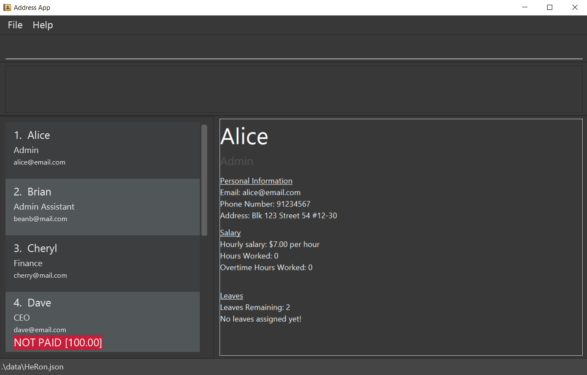
   
    <div style="page-break-after: always;"></div>
   
6. Type the command in the command box and press Enter to execute it. e.g. typing **`help`** and pressing Enter will open the help window.<br>
   Some example commands you can try:

   * `list` : Lists all contacts.

   * `import ./toBeImported.csv` : Imports the .csv file named `toBeImported.csv` the same directory as the application into HeRon.

   * `add n/John Doe p/98765432 e/johnd@example.com a/John street, block 123, #01-01 r/Admin Assistant l/14 s/9.50 hw/40 o/0` : Adds a contact named `John Doe` with the above details to HeRon.

   * `delete 3` : Deletes the 3rd contact shown in the current list.

   * `clear` : Deletes all contacts.

   * `exit` : Exits the app.

7. Refer to the [Features](#features) below for details of each command.

--------------------------------------------------------------------------------------------------------------------
## Interface Layout
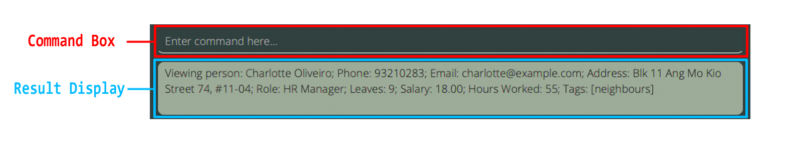 <br>
_Command Panel_ <br>
- User commands can be entered in the top section labeled `Enter command here...`
- Bottom section displays the result of the command. If command was unsuccessful, displays an error instead.

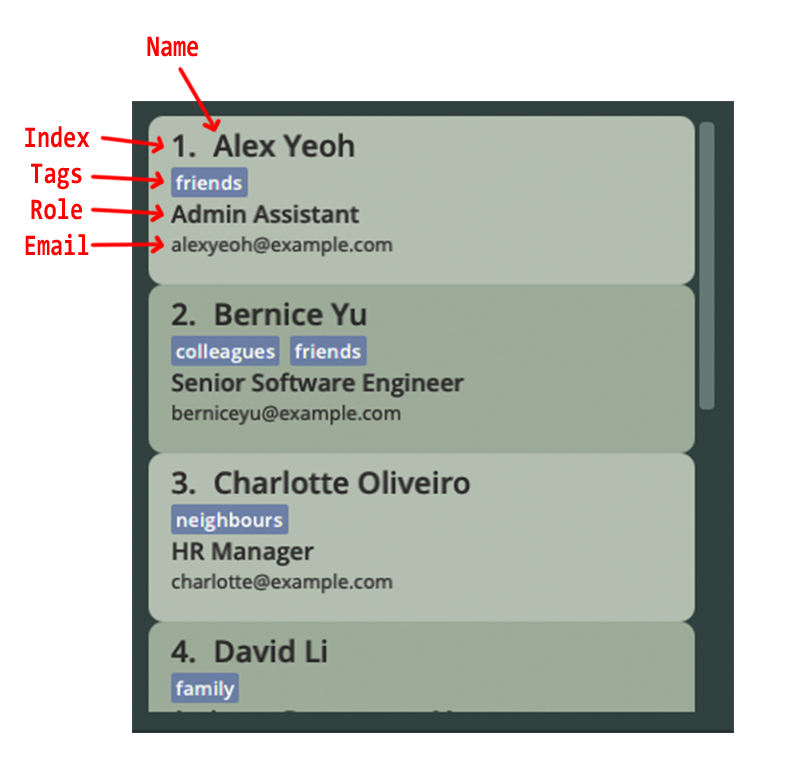 <br>
_List Panel_ <br>
- Displays the employee list together with its relevant particulars.

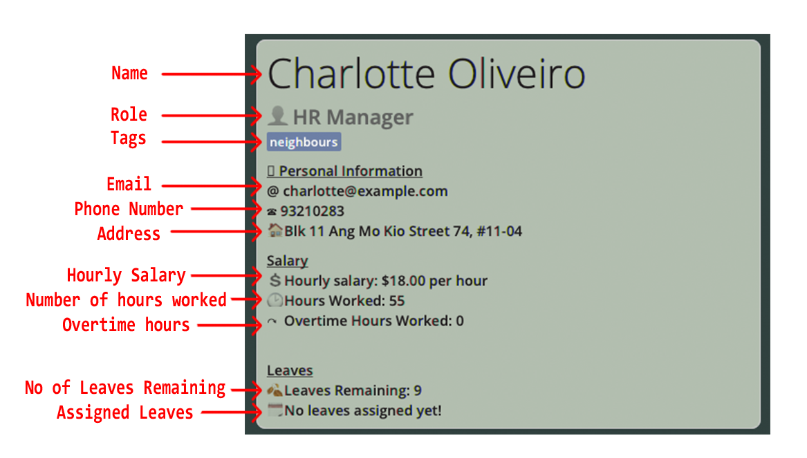 <br>
_Display Panel_ <br>
- Displays all of a specified employee's information.
- On start-up of the application, it displays the first employee in the list.
    If the employee list is empty, no employee information would be shown in this panel.

--------------------------------------------------------------------------------------------------------------------
<div style="page-break-after: always;"></div>

## Features

<div markdown="block" class="alert alert-info">

**Please read this information panel for more information on commands before proceeding.**

**:information_source: Notes about the command format:**<br>

* Words in `UPPER_CASE` are the parameters to be supplied by the user.<br>
  e.g. in `add n/NAME`, `NAME` is a parameter which can be used as `add n/John Doe`.

* Items in square brackets `i.e. []` are optional.<br>
  e.g `n/NAME [t/TAG]` can be used as `n/John Doe t/friend` or as `n/John Doe`.

* Items with `…`​ after them can be used multiple times including zero times.<br>
  e.g. `[t/TAG]…​` can be used as ` ` (i.e. 0 times), `t/friend`, `t/friend t/family` etc.

* Parameters can be in any order.<br>
  e.g. if the command specifies `n/NAME p/PHONE_NUMBER`, `p/PHONE_NUMBER n/NAME` is also acceptable.

* If a parameter is expected only once in the command but is specified multiple times, only the last occurrence of the parameter will be taken.<br>
  e.g. if you specify `p/12341234 p/56785678`, only `p/56785678` will be taken.

* Extraneous parameters for commands that do not take in parameters (such as `help`, `list`, `exit` and `clear`) will be ignored.<br>
  e.g. if the command specifies `help 123`, it will be interpreted as `help`.

</div>

### General Admin Features

#### Import Data from CSV files: `import`

Imports the data from a specified `.csv` file.

Format: `import FILEPATH`
* Imports data from the specified filepath, which can be absolute or relative (to the `.jar` application).
* Only one `FILEPATH` should be specified.
* Filepaths should be written following the current Operating System being used. (e.g. `\My Folder\myData.csv` for Windows; `/My Folder/myData.csv` for MacOS/Linux).
* Filepaths with spaces present in directory can be written as per usual (e.g. `./My Folder/toBeImported.csv`).
* A header row is required to indicate the purpose of the various fields, and it must be the first row in the `.csv` file.
* No specific ordering of the columns is required.
* Ensure that the header rows of the respective fields in the `.csv` file are labelled according to the naming convention in the table below, and are present in the data if compulsory.
* If multiple compulsory fields are missing, the app only alerts the user of the first instance of a missing field which is compulsory.
* If there are duplicate `Person` entries, `Email` or `Contact Number`, the import will not be allowed.
* Ensure that each field follows the specifications required, which can be found in the section for [`add` command](UserGuide.md#adding-an-employee-add).
* Ensure that the number of fields in each entry matches the number of headers.
* If multiple tags are present for an entry, they should be separated by `/`.
* For non-compulsory fields, if no value is provided, the field for the entry in HeRon would be set to the default value.
* If a value for a field is provided for at least one entry, then all other entries must also have their respective values for the field provided.

**Field Naming Requirements and Default Values**

Field | Rename to ... (Case-Insensitive) | Compulsory for Import? | Default Value
--------------|---------------|------------------------ | --------
`NAME`|Name|**Yes**| N.A.
`PHONE_NUMBER` |Contact Number|**Yes**| N.A.
`ADDRESS` |Residential Address|**Yes**| N.A.
`EMAIL` |Email|**Yes**| N.A.
`ROLE` |Role|**Yes**| N.A.
`NUMBER_OF_LEAVES` |Leave Balance|No | 0
`HOURLYSALARY` |Salary|No | 0.00
`HOURS_WORKED` |Hours Worked|No | 0
`OVERTIME` |Overtime|No | 0
`TAGS`|Tags|No| Empty Set of Tags

Example:`import ./toBeImported` should have the following behaviours under the following situations.
* Successful Import
  

    <div style="page-break-after: always;"></div>
  
* Multiple entries missing compulsory fields.
  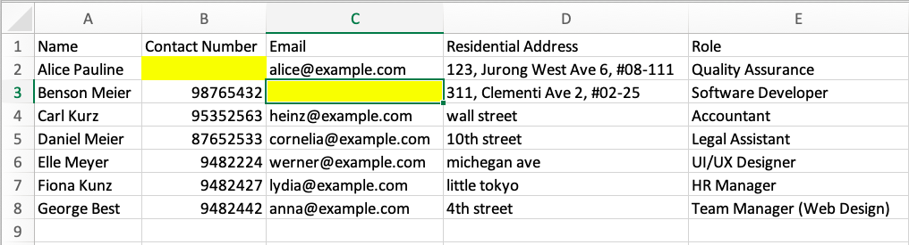
  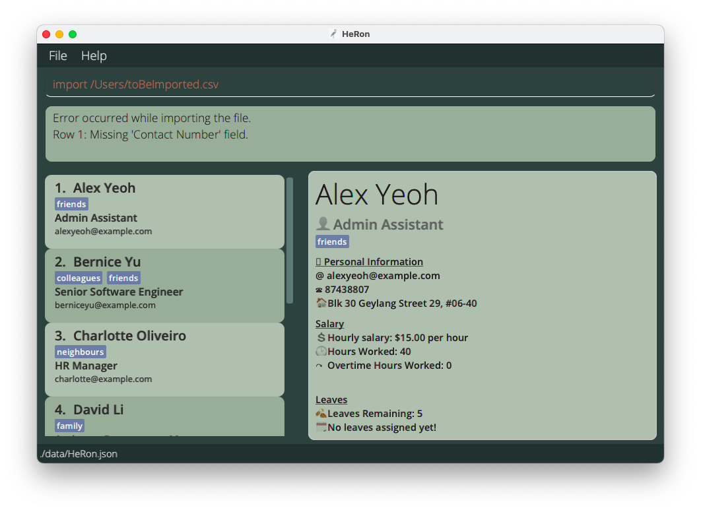
  
    <div style="page-break-after: always;"></div>

* Multiple Tags present in entry.
  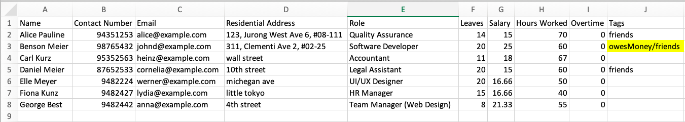
  

#### Viewing employee data: `view`

View the data of the specified employee at the InfoPanel.

Format: `view INDEX`
* Displays the data of the employee at the specified `INDEX`.
* The index refers to the index number shown in the displayed employee list.
* The index **must be a positive integer** 1, 2, 3, ...​

Example:
* `list` followed by `view 3` displays the information of the 3rd employee in the employee list.
* `find r/Financial Manager` followed by `view 1` displays the information of the 1st employee in the list of employees that have the Financial Manager role.

#### Adding an employee: `add`

Adds an employee to HeRon.

Format: `add  n/NAME p/PHONE_NUMBER e/EMAIL a/ADDRESS r/ROLE l/NUMBER_OF_LEAVES s/HOURLYSALARY hw/HOURS_WORKED o/OVERTIME [t/TAG]…​`

* Follow the requirements for the respective fields listed in the table below:

    Field | Requirements | Examples
    --------------|---------------|---------
    `NAME` | Contain alphanumeric characters and spaces only.| `Alice Pauline`, `Benson Meier`
    `PHONE_NUMBER` | Contain numbers only, at least 3 digits long.| `98102832`, `123`
    `EMAIL` | Be in the format of *local-part@domain*. *local-part* should contain only alphanumeric characters and/or certain special characters (`+_.-`), and cannot start or end with any special characters. *domain* should start and end with alphanumeric characters, must be at least 2 characters long, and can contain hyphens.| `alice_pauline@example.com`, `benson-miller@gg.com`
    `ADDRESS`| Can take any value.| `123 Alice Street`, `College of Alice & Peter Tan #01-124`
    `ROLE`| Start with alphabet, followed by alphanumeric characters or certain special characters (`-&/()[]`). Only 2 sets of brackets are allowed in total. | `Team Lead (UI/UX Design)`, `R&D Manager`
    `NUMBER_OF_LEAVES`| Non-negative integers less than or equal to 365. |`12`,`0`
    `HOURLYSALARY`| Non-negative numbers with two or less decimal places only.| `12.98`,`0.33`
    `HOURS_WORKED`| Positive integers less than or equal to 744.| `12`,`1`
    `OVERTIME`| Non-negative integers less than or equal to 744. | `12`,`0`
    `TAG`| Contain alphanumeric characters only. | `friend`, `supervisor`


<div markdown="span" class="alert alert-primary">:bulb: **Tip:**
An employee can have any number of tags (including 0)
</div>

Examples:
* `add n/John Doe p/98765432 e/johnd@example.com a/John street, block 123, #01-01 r/Admin Assistant l/14 s/9.50 hw/40 o/0`
* `add n/Betsy Crowe r/Designer s/25 hw/60  l/21  e/betsycrowe@example.com a/Newgate Prison p/1234567 o/0 t/criminal t/friend`
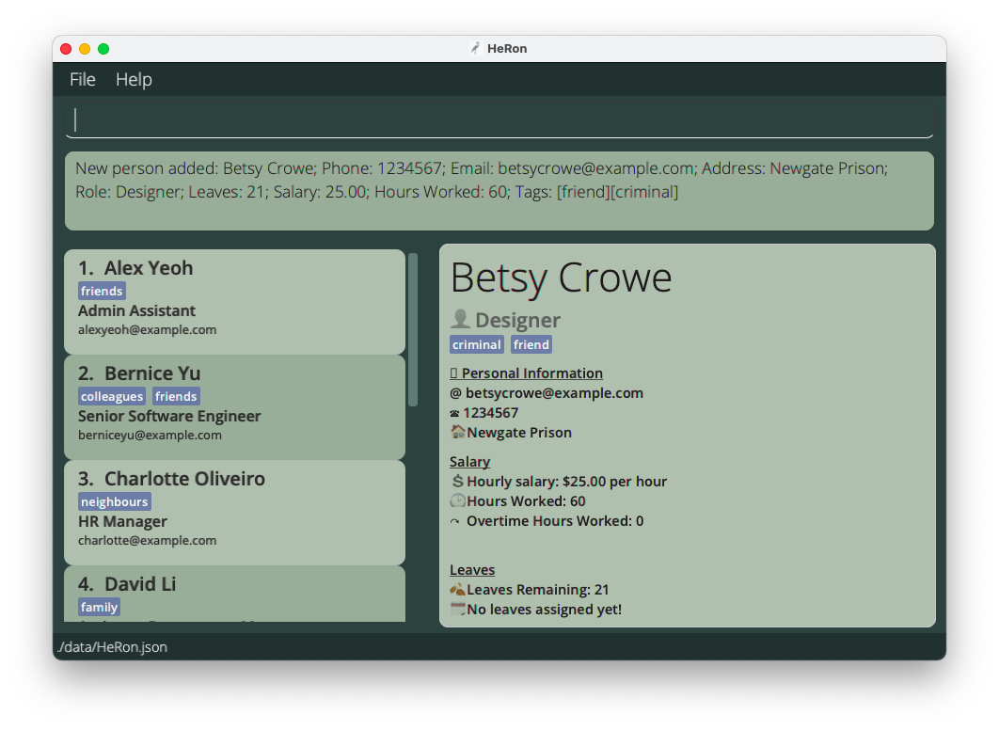
  _Result of adding a new employee Betsy successfully to HeRon_ <br>

#### Editing an employee : `edit`

Edits an existing employee in HeRon.

Format: `edit INDEX [n/NAME] [p/PHONE] [e/EMAIL] [a/ADDRESS] [r/ROLE] [l/NUMBER_OF_LEAVES] [s/HOURLYSALARY] [hw/HOURS_WORKED] [o/OVERTIME] [t/TAG]…​`

* Edits the employee at the specified `INDEX`. The index refers to the index number shown in the displayed employee list. The index **must be a positive integer** 1, 2, 3, …​
* At least one of the optional fields must be provided.
* Existing values will be updated to the input values.
* When editing tags, the existing tags of the employee will be removed i.e adding of tags is not cumulative.
* You can remove all the employee’s tags by typing `t/` without
    specifying any tags after it.
* The values you provide to the command must be valid. For information on which values are valid, you may refer to the table under the [`add` command](UserGuide.md#adding-an-employee-add) for more information.
* **NOTE:** The edit command is unable to directly edit the dates of leaves taken by employees.
Refer to the `assignLeave` and `removeLeavesBefore` commands below instead to edit the dates.

Examples:
*  `edit 1 p/91234567 e/johndoe@example.com l/15` Edits the phone number, email address and leaves of the 1st employee to be `91234567`, `johndoe@example.com` and `15` respectively.
*  `edit 2 n/Betsy Crower t/` Edits the name of the 2nd employee to be `Betsy Crower` and clears all existing tags.
<div style="page-break-after: always;"></div>

#### Deleting an employee : `delete`

Deletes the specified employee from the application.

Format: `delete INDEX`

* Deletes the employee at the specified `INDEX`.
* The index refers to the index number shown in the displayed employee list.
* The index **must be a positive integer** 1, 2, 3, …​
* The index cannot exceed the length of the employee list.

Examples:
* `list` followed by `delete 2` deletes the 2nd employee in HeRon.
* `find n/Betsy` followed by `delete 1` deletes the 1st employee in the results of the `find` command.

#### Locating specific employees: `find`

Find employees using specified fields, checking if their information field contains any of the given keywords / queries.

Format: `find [STATUS] [n/NAME] [p/PHONE] [e/EMAIL] [a/ADDRESS] [r/ROLE] [l/NUMBER_OF_LEAVES] [d/DATE] [s/HOURLYSALARY] [hw/HOURS_WORKED] [o/OVERTIME] [t/TAG]...`

* At least one field should be specified.
* The order of the fields do not matter except for the `[STATUS]` field, which must come right after `find`.
* To search a field with multiple values, separate each value with a space after their respective tag.
  * Example: Use `find n/Alice Charlotte` to search for `Alice` or `Charlotte` in the `name` field.
* The filters work differently for each field and can be generalised to 4 types of queries, described below. A single find command can contain all 4 types of queries at once.
  * **Type 1 Query: Keyword Matching**
    * Fields: `n/NAME`, `p/PHONE`, `e/EMAIL`, `a/ADDRESS`, `r/ROLE`, `t/TAG`
      * These fields will find all people who contain the given keywords in their respective fields. They are not case-sensitive.
      * The exceptions are:
         * `p/PHONE` field, which only find exact matches.
         * `n/NAME` field, which can find matches when a complete part (first/middle/last) of a name is given. (e.g. For name "Charlotte Oliverio", both `n/Charlotte` and `n/Oliverio` works, but `n/Char` or `n/Oliver` will not)
    * For example, `find p/91234567 e/alice bob r/Admin` will find anyone who satisfies all the following 3 criteria:
      1. has the phone number 91234567,
      2. whose email contains `alice` or `bob`, and
      3. whose role contains `Admin`.

  * **Type 2 Query: Value Based Comparison**
    * Fields: `hw/HOURS_WORKED`, `l/NUMBER_OF_LEAVES`, `s/HOURLYSALARY`, `o/OVERTIME`
      * These fields must be specified with a comparison and a value to compare the respective field to. Valid comparisons are
        * `>`: more than
        * `>=`: more than or equal to
        * `=`: equal to
        * `<`: less than
        * `<=`: less than or equal to

    * For example, `find hw/>=10 l/<7` will find anyone who satisfies the both of the following 2 criteria:
      1. has worked more than or exactly 10 hours, and
      2. has less than 7 days of leave left (e.g. 6 and below)

    * You cannot enter more than 1 comparison or value to compare to. For example, `find hw/<10 >5` is not valid.
  
    <div style="page-break-after: always;"></div>

  * **Type 3 Query: Status Based Filter**
    * There are no fields attached to this query. Instead, specific keywords are available for use.
      * These status keywords must be used right after `find` and cannot be used after a field is specified (for example `n/`).
      * Keywords available include:
        * `unpaid`
        * More to be added.
    * For example, `find unpaid` will find all employees who are considered unpaid.

  * **Type 4 Query: Date Based Comparison**
    * Fields: `d/DATE`
      * This field will find all people who have taken a leave on a given date or within a range of dates. (start and end dates inclusive)
      * There are two ways to search using dates: individual dates or date ranges.
        * For individual dates, simply type in a date of the form YYYY-MM-DD.
        * For date ranges, simply type in two dates in the form YYYY-MM-DD:YYYY-MM-DD.
      * Both individual dates and date ranges can be combined into one query.
    * For example, `find d/2021-10-10 2021-11-01:2021-11-05` will find anyone who satisfies **either** of the following 2 criteria:
      1. has taken a leave on October 10th 2021, or
      2. has taken a leave between the dates November 1st 2021 and November 5th 2021, start and end dates inclusive.

* For each field, you can search using multiple keywords by separating each keyword with a space, in the same field.
  * For example, `find n/John Mike` will return all employees whose name contains either John or Mike.
  
<div style="page-break-after: always;"></div>

Examples:
* `find unpaid n/John Mike r/admin l/<=5 o/>3` finds all employees who satisfy all the following criteria:
  1. is considered unpaid in the system,
  2. whose name is either John or Mike,
  3. whose role contains the word `admin`,
  4. has 5 or less than 5 leaves, and
  5. has strictly more than 3 days of overtime
* `find unpaid n/carl Elle l/<3` returns `Carl Kurz`, `Elle Meyer` as long as they have less than 3 leaves left and are still unpaid.<br>
  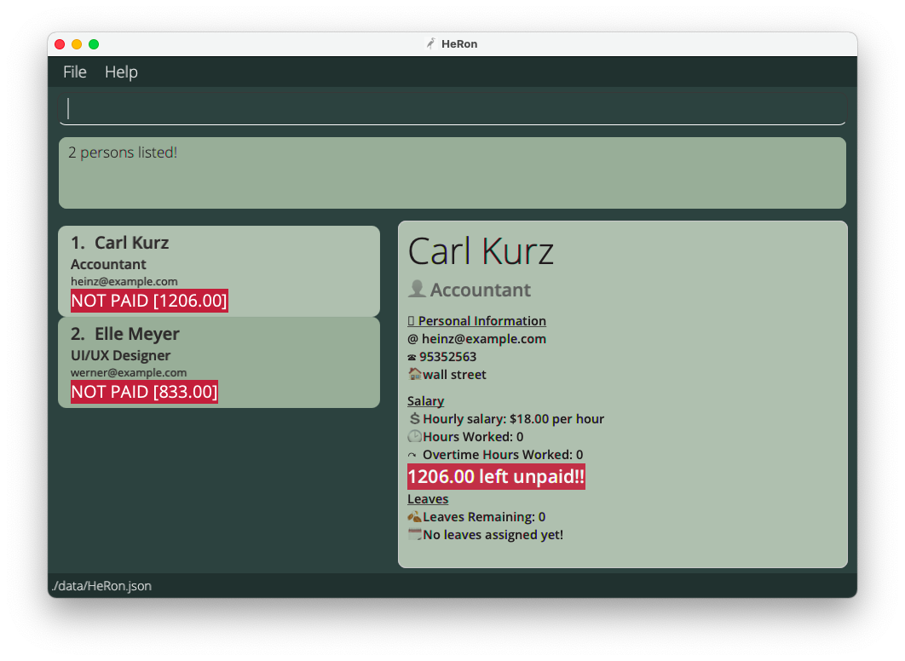

#### Listing all employees : `list`

Shows a list of all employees in HeRon.

Format: `list`
<div style="page-break-after: always;"></div>


#### Clearing all employees : `clear`

Clears all employees from the employee list. Upon clearing, it should display the screen shown below.

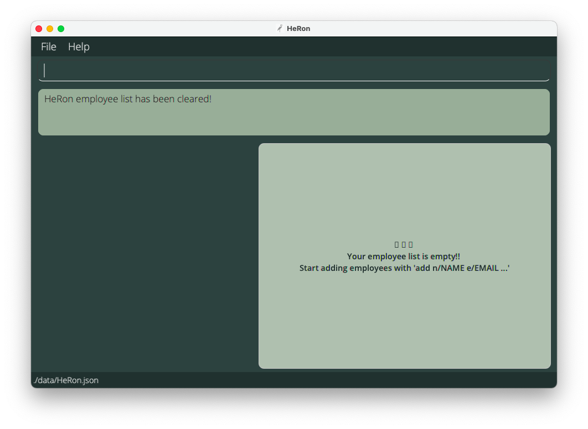

Format: `clear`

### Leave-related Features

#### Add number of leaves for an employee : `addLeaveBalance`

Adds the specified number of leaves to the current leave balance (number of days of leave left) of a chosen employee.

Format: `addLeaveBalance INDEX l/NUMBER_OF_LEAVES`

* Adds the specified number to the number of leaves of the employee at the specified `INDEX`.
* The index refers to the index number shown in the displayed employee list.
* The index **must be a positive integer** 1, 2, 3, …
* The number of leaves **must be a positive integer between 1 and 365** 1, 2, 3, …, 365
* The number of leaves to be added **cannot cause the employee's total leave balance to exceed 365 leaves.**

Examples:
* `list` followed by `addLeaveBalance 3 l/4` adds 4 days of leave to the 3rd employee in HeRon.
* `find n/Sam` followed by `addLeaveBalance 1 l/1` adds 1 day of leave to the 1st employee in the results of the `find` command.

#### Deduct number of leaves from an employee : `deductLeaveBalance`

Deducts the specified number of leaves from the current leave balance (number of days of leave left) of a chosen employee.

Format: `deductLeaveBalance INDEX l/NUMBER_OF_LEAVES`

* Deducts the specified number from the number of leaves of the employee at the specified `INDEX`.
* The index refers to the index number shown in the displayed employee list.
* The index **must be a positive integer** 1, 2, 3, …
* The number of leaves **must be a positive integer between 1 and 365** 1, 2, 3, …, 365
* The number of leaves to be deducted **cannot be greater than the amount of leaves in the employee's leave balance.**

Examples:
* `list` followed by `deductLeaveBalance 2 l/1` removes 1 day of leave from the 2nd employee in HeRon.
* `find n/Anthony` followed by `deductLeaveBalance 4 l/2` removes 2 days of leave from the 4th employee in the results of the `find` command.
<div style="page-break-after: always;"></div>

#### Assign a leave with a date to an employee : `assignLeave`

Assigns a leave that is associated with a date to a chosen employee.

Format: `assignLeave INDEX d/DATE`

* Assigns a leave to the employee at the specified `INDEX`, while deducting 1 leave from the employee's leave balance.
* The employee must have **at least 1 leave** in their leave balance.
* The index refers to the index number shown in the displayed employee list.
* The index **must be a positive integer** 1, 2, 3, …
* The date **must be valid** and of the form **YYYY-MM-DD**.

Examples:
* `list` followed by `assignLeave 2 d/2021-11-10` assigns a leave with the date 10th November 2021 to the 2nd employee in HeRon.
* `find n/Anthony` followed by `assignLeave 1 d/2021-01-08` assigns a leave with the date 8th January 2021 to the 1st employee in the results of the `find` command.

#### Remove all leaves occurring before a given date from employees : `removeLeavesBefore`

Removes all leaves from all employees in the list occurring before a given input date (inclusive).

Format: `removeLeavesBefore d/DATE`

* Removes all leaves from all employees in the list occurring before a given input date (inclusive).
* The date **must be valid** and of the form **YYYY-MM-DD**.
* This operation will only act on employees in the current filtered list.

Examples:
* `list` followed by `removeLeavesBefore d/2021-11-10` removes all leaves occurring on and before 2021-11-10 for all employees.
* `find n/Anthony` followed by `removeLeavesBefore 1 d/2021-01-08` removes all leaves occurring on and before 2021-01-08
   for all employees that have 'Anthony' in their names.
<div style="page-break-after: always;"></div>

### Payroll-related Features

#### Add number of hours worked/overtime to an employee : `addHoursWorked`

Adds the specified number of hours worked or overtime to a chosen employee.

Format: `addHoursWorked INDEX [hw/HOURS_WORKED] [o/OVERTIME]`

* At least one field (HOURS_WORKED or OVERTIME) should be specified.
* Adds the specified number of hours worked/overtime to the employee at the specified `INDEX`.
* The index refers to the index number shown in the displayed employee list.
* The index **must be a positive integer** 1, 2, 3, …
* The number of hours worked/overtime **must be a positive integer between 1 and 744** 1, 2, 3, …, 744
* The number of hours worked/overtime to be added **cannot cause the employee's total hours worked/overtime to exceed 744.** 
  <br> (Note: Limit of 744 is applied separately to hours worked and overtime, e.g hours worked and overtime can both be set to 744)

Examples:
* `list` followed by `addHoursWorked 5 hw/5 o/5` adds 5 hours worked and 5 hours of overtime to the 5th employee in HeRon.
* `find n/Sam` followed by `addHoursWorked 2 o/5` adds 5 hours of overtime to the 2nd employee in the results of the `find` command.

#### Deduct number of hours worked/overtime from an employee : `deductHoursWorked`

Deducts the specified number of hours worked or overtime from a chosen employee.

Format: `deductHoursWorked INDEX [hw/HOURS_WORKED] [o/OVERTIME]`

* At least one field (HOURS_WORKED or OVERTIME) should be specified.
* Deducts the specified number of hours worked/overtime from the employee at the specified `INDEX`.
* The index refers to the index number shown in the displayed employee list.
* The index **must be a positive integer** 1, 2, 3, …
* The number of hours worked/overtime **must be a positive integer between 1 and 744** 1, 2, 3, …, 744
* The number of hours worked/overtime to be removed **cannot be greater than the employee's current number of hours worked/overtime.**

Examples:
* `list` followed by `deductHoursWorked 2 hw/5 o/3` removes 5 hours worked and 3 hours of overtime from the 2nd employee in HeRon.
* `find n/Sam` followed by `deductHoursWorked 1 o/2` removes 2 hours of overtime from the 1st employee in the results of the `find` command.

<div style="page-break-after: always;"></div>

#### View the Overtime Pay Rate : `viewOvertimePayRate`

Displays the current overtime pay rate set in the application.

Format: `viewOvertimePayRate`

* Displays the current overtime pay rate in the feedback panel.

#### Set a new Overtime Pay Rate : `setOvertimePayRate`

Sets a new overtime pay rate to be used in payroll calculations.

Format: `setOvertimePayRate OVERTIMEPAYRATE`

* Sets the overtime pay rate in the application to `OVERTIMEPAYRATE`.
* `OVERTIMEPAYRATE` should have a value between 1 to 10, and have at most 5 decimal places.

Examples:
* `setOvertimePayRate 2.0` sets the new overtime pay rate to be 2x.

* `setOvertimePayRate 0.5` would be invalid as `OVERTIMEPAYRATE` must be at least 1. An error message would be shown.
* `setOvertimePayRate 1.000000` would also be invalid as there are more than 5 decimal places. An error message would be shown.

<div style="page-break-after: always;"></div>

#### Start Payroll : `startPayroll`

Calculates the payroll of all employees and mark them as awaiting the payment.

The payroll formula is: `HOURS_WORKED * HOURLYSALARY + OVERTIME * HOURLYSALARY * OVERTIMEPAYRATE`,<br>
where `OVERTIMEPAYRATE` is the added pay rate for overtime as compared to normal work hours.<br>
It can be viewed through the `viewOvertimePayRate` command or changed through the `setOvertimePayRate` command.

Format: `startPayroll`
* Calculates the payroll of **all employees regardless of current viewing list** based on the formula above.
* After that, marks all employees as awaiting payment of the calculated amount.
<br>This will produce red labels under each employee data stating 'NOT PAID' and the amount they are owed.
* The number of hours worked and overtime hours worked for the employee will be reset to 0 as well
  so that hours counting towards the next payroll can continue to be added.
* Finally, display the list of all employees.
* This command is typically followed up by `pay` commands to mark employees as paid,
  after their salaries are given in real life.

Example:
* Before `startPayroll` command, currently viewing a filtered list.
  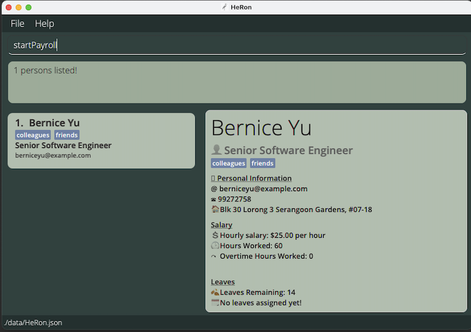


* After `startPayroll` command, payroll have been calculated and currently viewing the full list of employees.
  

<div markdown="block" class="alert alert-info">
**:information_source: Notes:**

* All employees must not have any pay pending from the previous payroll (i.e. no red 'NOT PAID' label). Otherwise, an error will be thrown
  and no action will be taken.
* To start a new payroll, first make sure to pay all employees using the `pay` command.
</div>

<div style="page-break-after: always;"></div>

#### Paying employee(s) : `pay`

Marks the specified employee, or all employees in the current list, as paid.

Format 1: `pay INDEX` - for paying a specific employee
* Simulates the paying of an employee by clearing the salary owed to the employee by setting it back to 0. This clears the red
  `NOT PAID` label under the employee's data.
* This command is typically used after the `startPayroll` command, which sets the pay owed to the respective employees.
  The pay command can then be followed after to clear the pay owed.
* The index refers to the index number shown in the displayed employee list.
* The index **must be a positive integer** 1, 2, 3, …​
* The employee must have payment pending from a `startPayroll` command.

Example:
* `pay 1` marks the 1st employee in the Employee list as paid, clearing the pay owed to the employee and removing
  the red 'NOT PAID' label.
  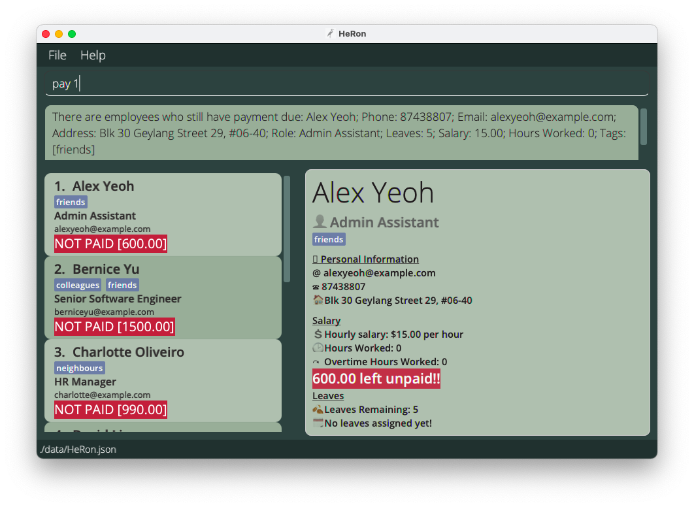
  _Alex is marked as unpaid in HeRon_ <br>
  <br>
  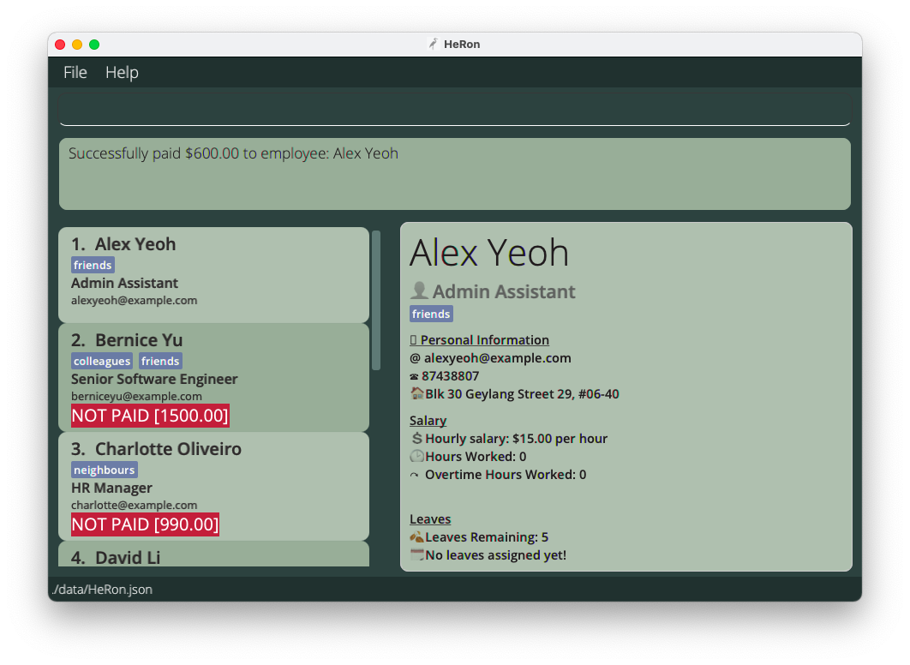
  _After executing `pay 1`, Alex (being the 1st person in this list) is marked as paid_ <br>

Format 2: `pay all` - for paying all employees in the current list
* Simulates paying of employees in the same way as above, but for all employees in the current list instead.
* If there are employees already paid in the list, they will be skipped and will not be paid again.
* There must be at least 1 employee in the list that has not been paid.

<div style="page-break-after: always;"></div>

### Miscellenous Features

#### Viewing help : `help`

Shows a message explaining how to access the help page.

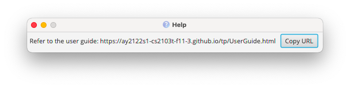

Format: `help`
<div style="page-break-after: always;"></div>

#### Exiting the program : `exit`

Exits the program.

Format: `exit`

### Data Management

#### Saving the data

HeRon data are saved in the hard disk automatically after any command that changes the data. There is no need to save manually.

#### Editing the data file

HeRon data are saved as a JSON file `[JAR file location]/data/HeRon.json`. Advanced users are welcome to update data directly by editing the data file.

<div markdown="span" class="alert alert-warning">:exclamation: **Caution:**
If your changes to the data file makes its format invalid, HeRon will discard all data and start with an empty data file at the next run.
</div>

--------------------------------------------------------------------------------------------------------------------

<div style="page-break-after: always;"></div>

## FAQ - Frequently Asked Questions

**Q**: How do I transfer my data to another computer?<br>
**A**: Install the app in the other computer and overwrite the empty data file it creates with the file that contains the data of your previous HeRon home folder.

--------------------------------------------------------------------------------------------------------------------

## Command summary

List of available commands with their respective format and example usages for quick references.

Action | Format, Examples
--------|------------------
**Help** | `help`
**Add** | `add n/NAME p/PHONE_NUMBER e/EMAIL a/ADDRESS r/ROLE l/NUMBER_OF_LEAVES s/HOURLYSALARY hw/HOURS_WORKED o/OVERTIME [t/TAG]…​` <br> e.g., `add n/John Doe p/98765432 e/johnd@example.com a/John street, block 123, #01-01 r/Admin Assistant l/14 s/9.50 hw/40 o/0 t/friend t/colleague`
**List** | `list`
**View** | `view INDEX`
**Edit** | `edit INDEX [n/NAME] [p/PHONE_NUMBER] [e/EMAIL] [a/ADDRESS] [r/ROLE] [l/NUMBER_OF_LEAVES] [s/HOURLYSALARY] [hw/HOURS_WORKED] [o/OVERTIME] [t/TAG]…​`<br> e.g.,`edit 2 n/James Lee e/jameslee@example.com l/15`
**Find** | `find [STATUS]... [n/NAME] [p/PHONE] [e/EMAIL] [a/ADDRESS] [r/ROLE] [l/NUMBER_OF_LEAVES] [d/DATE] [s/HOURLYSALARY] [hw/HOURS_WORKED] [o/OVERTIME] [t/TAG]...`<br> e.g., `find n/Alex r/Admin Assistant`
**Delete** | `delete INDEX`<br> e.g., `delete 3`
**Clear** | `clear`
**Exit** | `exit`
**Add to Leave Balance** | `addLeaveBalance INDEX l/NUMBER_OF_LEAVES` <br> e.g., `addLeaveBalance 1 l/2`
**Deduct from Leave Balance** | `deductLeaveBalance INDEX l/NUMBER_OF_LEAVES` <br> e.g., `deductLeaveBalance 4 l/1`
**Assign Leave** |  `assignLeave INDEX d/DATE` <br> e.g., `assignLeave 1 d/2021-10-30`
**Filter and Remove Leaves before a Date** |  `removeLeavesBefore d/DATE` <br> e.g., `removeLeavesBefore d/2021-10-30`
**Add Hours Worked/Overtime** | `addHoursWorked INDEX [hw/HOURS_WORKED] [o/OVERTIME]` <br> e.g., `addHoursWorked 1 hw/2 o/3`
**Deduct Hours Worked/Overtime** | `deductHoursWorked INDEX [hw/HOURS_WORKED] [o/OVERTIME]` <br> e.g., `deductHoursWorked 4 hw/1 o/2`
**Start Payroll** | `startPayroll`
**Pay Employee(s)** | `pay INDEX` <br> e.g., `pay 3` <br> OR <br>`pay all`
**View Overtime Pay Rate** | `viewOvertimePayRate`
**Set a new Overtime Pay Rate** | `setOvertimePayRate OVERTIMEPAYRATE`<br> e.g., `setOvertimePayRate 2.0`
**Import** | `import FILEPATH` e.g., `import ./myData.csv`
