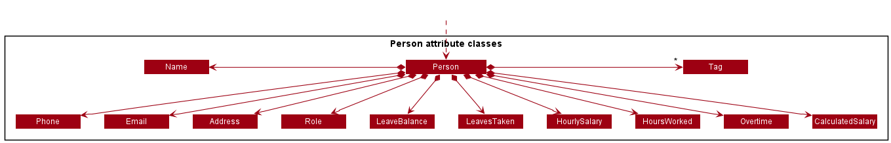

### Project: HeRon

HeRon is a desktop application for HR managers to assist in managing HR administrative tasks such as tracking leaves and offs, calculating pay and updating payroll information.

HeRon is a project adapted from AddressBook - Level 3. It is written in Java, and has about 10 kLoC.

Given below are my contributions to the project.

* **Code contributed**: [RepoSense link](https://nus-cs2103-ay2122s1.github.io/tp-dashboard/?search=danielsimre&sort=groupTitle&sortWithin=title&timeframe=commit&mergegroup=&groupSelect=groupByRepos&breakdown=true&checkedFileTypes=docs~functional-code~test-code~other&since=2021-09-17)

* **Enhancements Implemented**:
  * **New Features**
    * Implemented `LeaveBalance` and `Overtime` and updated `HoursWorked` attributes for `Person`, as well as `addLeaveBalance`, `deductLeaveBalance`, 
      `addHoursWorked` and `deductHoursWorked` commands.
      * What it does: The user is able to modify `LeaveBalance`, `Overtime` and `HoursWorked` without needing to use `edit`.
      * Justification: Without these commands, the user would have to manually look up the details of a given employee,
        manually calculate how many hours worked and overtime hours the person should have, then use the `edit` command to change the values accordingly.
        With these commands, all the user needs to do is input the index of the specified employee, along with how many hours worked/overtime/leaves
        they wish to add or remove.
      * Highlights: The implementation of `addHoursWorked` and `deductHoursWorked` was challenging as
        it could take in either `HoursWorked` and/or `Overtime`, so all of these valid cases needed to be handled.
        Also, for the case where one of the inputs is valid while the other is invalid, the command throws an error that specifies
        which input is causing the error. (If both inputs are invalid, an error is thrown for `HoursWorked`)
        
    * Implemented `LeavesTaken` attribute for `Person`, as well as `assignLeave` and `removeLeavesBefore` commands.
      * What it does: `assignLeave` assigns a leave associated with a date to an employee.
        `removeLeavesBefore` removes all assigned leaves that occur on and before a given input date from all employees in the current list.
      * Justification: This allows the user to keep track of when an employee is taking a leave, to allow
        them to better plan work schedules, while serving as a form of record keeping. `removeLeavesBefore`
        is a command that allows the user to manually clear outdated leave information when they no longer need it
        in a quick and easy manner, as it is applied to many employees at once.
    
  * **Enhancements to existing features**
    * Updated `find` command with the ability to search employees by their assigned leave dates,
      either with an individual date, or a date range. ([#83](https://github.com/AY2122S1-CS2103T-F11-3/tp/pull/83), [#108](https://github.com/AY2122S1-CS2103T-F11-3/tp/pull/108))
      * Justification: This allows users to more easily find employees that have taken leaves on certain dates, in case they need to 
        determine who is not working on a given date or period.
      * Highlights: The find command is able to take a combination of date ranges and individual dates.
        For example, `find d/2021-10-11:2021-10-20 2021-11-11 2021-12-12` gets all employees that have at least 1 date
        from 2021-10-11 to 2021-10-20, or on 2021-11-11 or 2021-12-12.
* **Documentation Contributions**:
  * User Guide:
    * Added documentation for the following commands: 
        * `addLeaveBalance`
        * `deductLeaveBalance`
        * `addHoursWorked`
        * `deductHoursWorked`
        * `assignLeave`
        * `removeLeavesBefore`
        * `find` (Section on `Type 4 Query: Date Based Comparison`)
  * Developer Guide:
    * Added implementation details for:
        * `LeaveBalance`, `addLeaveBalance` and `deductLeaveBalance`
        * `LeavesTaken`, `assignLeave` and `removeLeavesBefore`
    * Added use cases and manual test cases for the following commands:
        * `addLeaveBalance`
        * `deductLeaveBalance`
        * `addHoursWorked`
        * `deductHoursWorked`
        * `assignLeave`
        * `removeLeavesBefore`

* **Project Management**
  * Managed releases `v1.2`, `v1.3.1` and `v1.3.2` on GitHub

* **Team Contributions**
  * Helped to create and distribute issues for each milestone

* **Review Contributions**
  * Pull Requests Reviewed (with non-trivial review comments): 
    [#60](https://github.com/AY2122S1-CS2103T-F11-3/tp/pull/60),
    [#84](https://github.com/AY2122S1-CS2103T-F11-3/tp/pull/84),
    [#87](https://github.com/AY2122S1-CS2103T-F11-3/tp/pull/87),
    [#102](https://github.com/AY2122S1-CS2103T-F11-3/tp/pull/102),
    [#200](https://github.com/AY2122S1-CS2103T-F11-3/tp/pull/200)

* **Contributions to the Developer Guide (Extracts)**
  * Class diagram for `Person` attribute classes
    
  * Sequence diagram for `AddLeaveBalancCommand`
    
  * Sequence diagram for `RemoveLeavesBeforeCommand`
    
